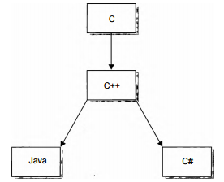

# ГЛАВА 1. Создание C#

C# является основным языком разработки про­
грамм на платформе .NET корпорации
Microsoft. В нем удачно сочетаются испытанные
средства программирования с самыми последними новше­
ствами и предоставляется возможность для эффективного
и очень практичного написания программ, предназначен­
ных для вычислительной среды современных предприятий.
Это, без сомнения, один из самых важных языков програм­
мирования XXI века.

Назначение этой главы — представить C# в его истори­
ческом контексте, упомянув и те движущие силы, которые
способствовали его созданию, выработке его конструктив­
ных особенностей и определили его влияние на другие язы­
ки программирования. Кроме того, в этой главе поясняется
взаимосвязь С# со средой .NET Framework. Как станет ясно
из дальнейшего материала, C# и .NET Framework совместно
образуют весьма изящную среду программирования.

## Генеалогическое дерево C#
Языки программирования не существуют в пустоте. Напротив, они тесно связаны
друг с другом таким образом, что на каждый новый язык оказывают в той или иной
форме влияние его предшественники. Этот процесс сродни перекрестному опылению,
в ходе которого свойства одного языка приспосабливаются к другому языку, полезные
нововведения внедряются в существующий контекст, а устаревшие конструкции уда­
ляются. Таким путем развиваются языки программирования и совершенствуется ис­
кусство программирования. И в этом отношении C# не является исключением.

У языка программирования C# "богатое наследство". Он является прямым наслед­
ником двух самых удачных языков программирования: С и C++. Он также имеет тесные
родственные связи с еще одним языком: Java. Ясное представление об этих взаимосвя­
зях имеет решающее значение для понимания С#. Поэтому сначала определим, какое
место занимает C# среди этих трех языков.

### Язык С - начало современной эпохи программирования
Создание С знаменует собой начало современной эпохи программирования. Язык
С был разработан Деннисом Ритчи (Dennis Ritchie) в 1970-е годы для программирова­
ния на мини-ЭВМ DEC PDP-11 под управлением операционной системы Unix. Несмо­
тря на то что в ряде предшествовавших языков, в особенности Pascal, был достигнут
значительный прогресс, именно С установил тот образец, которому до сих пор следу­
ют в программировании.

Язык С появился в результате революции в структурном программировании
в 1960-е годы. До появления структурного программирования писать большие про­
граммы было трудно, поскольку логика программы постепенно вырождалась в так на­
зываемый "макаронный" код — запутанный клубок безусловных переходов, вызовов и
возвратов, которые трудно отследить. В структурированных языках программирования
этот недостаток устранялся путем ввода строго определенных управляющих операто­
ров, подпрограмм с локальными переменными и других усовершенствований. Благо­
даря применению методов структурного программирования сами программы стали
более организованными, надежными и управляемыми.

И хотя в то время существовали и другие структурированные языки программи­
рования, именно в С впервые удалось добиться удачного сочетания эффективности,
изящества и выразительности. Благодаря своему краткому, но простому синтаксису
в сочетании с принципом, ставившим во главу угла программиста, а не сам язык, С бы­
стро завоевал многих сторонников. Сейчас уже нелегко представить себе, что С ока­
зался своего рода "струей свежего воздуха", которого так не хватало программистам.
В итоге С стал самым распространенным языком структурного программирования
в 1980-е годы.

Но даже у такого достойного языка, как С, имелись свои ограничения. К числу са­
мых труднопреодолимых его ограничений относится неспособность справиться с боль­
шими программами. Как только проект достигает определенного масштаба, язык С
тут же ставит предел, затрудняющий понимание и сопровождение программ при их
последующем разрастании. Конкретный предел зависит от самой программы, про­
граммиста и применяемых инструментальных средств, тем не менее, всегда существует
"порог", за которым программа на С становится неуправляемой.

### Появление ООП и C++
К концу 1970-х годов масштабы многих проектов приблизились к пределам, с ко­
торыми уже не могли справиться методики структурного программирования вообще
и язык С в частности. Для решения этой проблемы было открыто новое направление
в программировании — так называемое объектно-ориентированное программирова­
ние (ООП). Применяя метод ООП, программист мог работать с более "крупными"
программами. Но главная трудность заключалась в том, что С, самый распростра­
ненный в то время язык, не поддерживал ООП. Стремление к созданию объектно-
ориентированного варианта С в конечном итоге привело к появлению C++.

Язык C++ был разработан в 1979 году Бьярне Страуструпом (Bjarne Stroustrup), ра­
ботавшим в компании Bell Laboratories, базировавшейся в Мюррей-Хилл, шт. Нью-
Джерси. Первоначально новый язык назывался "С с классами", но в 1983 году он был
переименован в C++. Язык С полностью входит в состав C++, а следовательно, С служит
основанием, на котором зиждется C++. Большая часть дополнений, введенных Страу­
струпом, обеспечивала плавный переход к ООП. И вместо того чтобы изучать совер­
шенно новый язык, программирующему на С требовалось лишь освоить ряд новых
свойств, чтобы воспользоваться преимуществами методики ООП.

В течение 1980-х годов C++ все еще оставался в тени, интенсивно развиваясь, но к на­
чалу 1990-х годов, когда он уже был готов для широкого применения, его популяр­
ность в области программирования заметно возросла. К концу 1990-х годов он стал
наиболее широко распространенным языком программирования и в настоящее время
по-прежнему обладает неоспоримыми преимуществами языка разработки высоко­
производительных программ системного уровня.

Важно понимать, что разработка C++ не была попыткой создать совершенно новый
язык программирования. Напротив, это была попытка усовершенствовать уже суще­
ствовавший довольно удачный язык. Такой подход к разработке языков программи­
рования, основанный на уже существующем языке и совершенствующий его далее,
превратился в упрочившуюся тенденцию, которая продолжается до сих пор.

### Появление Интернета и Java
Следующим важным шагом в развитии языков программирования стала разработ­
ка Java. Работа над языком Java, который первоначально назывался Oak (Дуб), началась
в 1991 году в компании Sun Microsystems. Главной "движущей силой" в разработке Java
был Джеймс Гослинг (James Gosling), но не малая роль в работе над этим языком при­
надлежит также Патрику Ноутону (Patrick Naughton), Крису Уорту (Chris Warth), Эду
Фрэнку (Ed Frank) и Майку Шеридану (Mike Sheridan).

Java представляет собой структурированный, объектно-ориентированный язык
с синтаксисом и конструктивными особенностями, унаследованными от C++. Ново­
введения в Java возникли не столько в результате прогресса в искусстве программи­
рования, хотя некоторые успехи в данной области все же были, сколько вследствие
перемен в вычислительной среде. До появления на широкой арене Интернета боль­
шинство программ писалось, компилировалось и предназначалось для конкретного
процессора и операционной системы. Как известно, программисты всегда стремились
повторно использовать свой код, но, несмотря на это, легкой переносимости про­
грамм из одной среды в другую уделялось меньше внимания, чем более насущным
задачам. Тем не менее с появлением Интернета, когда в глобальную сеть связывались разнотипные процессоры и операционные системы, застаревшая проблема перено­
симости программ вновь возникла с неожиданной остротой. Для решения проблемы
переносимости потребовался новый язык, и им стал Java.
Самым важным свойством (и причиной быстрого признания) Java является спо­
собность создавать межплатформенный, переносимый код, тем не менее, интересно
отметить, что первоначальным толчком для разработки Java послужил не Интернет,
а потребность в независящем от платформы языке, на котором можно было бы раз­
рабатывать программы для встраиваемых контроллеров. В 1993 году стало очевидно,
что вопросы межплатформенной переносимости, возникавшие при создании кода
для встраиваемых контроллеров, стали актуальными и при попытке написать код для
Интернета. Напомним, что Интернет — это глобальная распределенная вычислитель­
ная среда, в которой работают и мирно "сосуществуют" разнотипные компьютеры.
И в итоге оказалось, что теми же самыми методами, которыми решалась проблема
переносимости программ в мелких масштабах, можно решать аналогичную задачу
в намного более крупных масштабах Интернета.
Переносимость программ на Java достигалась благодаря преобразованию исходно­
го кода в промежуточный, называемый байт-кодом. Этот байт-код затем выполнялся
виртуальной машиной Java (JVM) — основной частью исполняющей системы Java. Та­
ким образом, программа на Java могла выполняться в любой среде, для которой была
доступна JVM. А поскольку JVM реализуется относительно просто, то она сразу же
стала доступной для большого числа сред.
Применением байт-кода Java коренным образом отличается от С и C++, где исхо­
дный код практически всегда компилируется в исполняемый машинный код, кото­
рый, в свою очередь, привязан к конкретному процессору и операционной системе.
Так, если требуется выполнить программу на С или C++ в другой системе, ее придется
перекомпилировать в машинный код специально для данной вычислительной среды.
Следовательно, для создания программы на С или C++, которая могла был выполнять­
ся в различных средах, потребовалось бы несколько разных исполняемых версий этой
программы. Это оказалось бы не только непрактично, но и дорого. Изящным и рен­
табельным решением данной проблемы явилось применение в Java промежуточного
кода. Именно это решение было в дальнейшем приспособлено для целей языка С#.
Как упоминалось ранее, Java происходит от С и C++. В основу этого языка положен
синтаксис С, а его объектная модель получила свое развитие из C++. И хотя код Java не
совместим с кодом С или C++ ни сверху вниз, ни снизу вверх, его синтаксис очень по­
хож на эти языки, что позволяет большому числу программирующих на С или C++ без
особого труда перейти на Java. Кроме того, Java построен по уже существующему об­
разцу, что позволило разработчикам этого языка сосредоточить основное внимание на
новых и передовых его свойствах. Как и Страуструпу при создании C++, Гослингу и его
коллегам не пришлось изобретать велосипед, т.е. разрабатывать Java как совершенно
новый язык. Более того, после создания Java языки С и C++ стали признанной основой,
на которой можно разрабатывать новые языки программирования.

### Создание C#
Несмотря на то что в Java успешно решаются многие вопросы переносимости про­
грамм в среде Интернета, его возможности все же ограничены. Ему, в частности, не­
достает межъязыковой возможности взаимодействия, называемой также многоязыковым
программированием. Это возможность кода, написанного на одном языке, без труда взаимодействовать с кодом, написанным на другом языке. Межъязыковая возможность
взаимодействия требуется для построения крупных, распределенных программных
систем. Она желательна также для создания отдельных компонентов программ, по­
скольку наиболее ценным компонентом считается тот, который может быть исполь­
зован в самых разных языках программирования и в самом большом числе операцио­
нных сред.

Другой возможностью, отсутствующей в Java, является полная интеграция с плат­
формой Windows. Несмотря на то что программы на Java могут выполняться в сре­
де Windows, при условии, что установлена виртуальная машина Java, среды Java
и Windows не являются сильно связанными. А поскольку Windows является самой
распространенной операционной системой во всем мире, то отсутствие прямой под­
держки Windows является существенным недостатком Java.

Для удовлетворения этих и других потребностей программирования корпорация
Microsoft разработала в конце 1990-х годов язык C# как часть общей стратегии .NET.
Впервые он был выпущен в виде альфа-версии в середине 2000 года. Главным разра­
ботчиком C# был Андерс Хейльсберг — один из ведущих в мире специалистов по язы­
кам программирования, который может похвалиться рядом заметных достижений
в данной области. Достаточно сказать, что в 1980-е годы он был автором очень удачной
и имевшей большое значение разработки — языка Turbo Pascal, изящная реализация
которого послужила образцом для создания всех последующих компиляторов.

Язык C# непосредственно связан с С, C++ и Java. И это не случайно. Ведь это три са­
мых широко распространенных и признанных во всем мире языка программирования.
Кроме того, на момент создания C# практически все профессиональные программи­
сты уже владели С, C++ или Java. Благодаря тому что C# построен на столь прочном и
понятном основании, перейти на этот язык из С, C++ или Java не представляло особого
труда. А поскольку и Хейльсбергу не нужно (да и нежелательно) было изобретать ве­
лосипед, то он мог сосредоточиться непосредственно на усовершенствованиях и ново­
введениях в С#.

На рис. 1.1 приведено генеалогическое дерево С#. Предком С# во втором поколении
является С, от которого он унаследовал синтаксис, многие ключевые слова и операто­
ры. Кроме того, C# построен на усовершенствованной объектной модели, определен­
ной в C++. Если вы знаете С или C++, то будете чувствовать себя уютно и с языком С#.

Рис. 1.1. Генеалогическое дерево C#

Родственные связи C# и Java более сложные. Как пояснялось выше, Java также про­
исходит от С и C++ и обладает общим с ними синтаксисом и объектной моделью. Как
и Java, C# предназначен для получения переносимого кода, но C# не происходит непо­
средственно от Java. Напротив, C# и Java — это близкие, но не кровные родственники,
имеющие общих предков, но во многом отличающиеся друг от друга. Впрочем, если
вы знаете Java, то многие понятия C# окажутся вам знакомыми. С другой стороны,
если вам в будущем придется изучать Java, то многие понятия, усвоенные в С#, могут
быть легко распространены и на Java.

В C# имеется немало новых средств, которые будут подробно рассмотрены на
страницах этой книги, но самое важное из них связано со встроенной поддержкой
программных компонентов. В действительности C# может считаться компонентно­
ориентированным языком программирования, поскольку в него внедрена встроен­
ная поддержка написания программных компонентов. Например, в состав C# входят
средства прямой поддержки таких составных частей программных компонентов, как
свойства, методы и события. Но самой важной компонентно-ориентированной осо­
бенностью этого языка, вероятно, является возможность работы в безопасной среде
многоязыкового программирования.

### Развитие C#
С момента выпуска исходной версии 1.0 развитие C# происходило быстро. Вскоре
после версии 1.0 корпорация Microsoft выпустила версию 1.1, в которую было внесено
немало корректив, но мало значительных возможностей. Однако ситуация совершен­
но изменилась после выпуска версии C# 2.0.

Появление версии 2.0 стало поворотным моментом в истории развития С#, по­
скольку в нее было введено много новых средств, в том числе обобщения, частичные
типы и анонимные методы, которые основательно расширили пределы возможностей
и область применения этого языка, а также повысили его эффективность. После вы­
пуска версии 2.0 "упрочилось" положение С#. Ее появление продемонстрировало так­
же приверженность корпорации Microsoft к поддержке этого языка в долгосрочной
перспективе.

Следующей значительной вехой в истории развития C# стал выпуск версии 3.0.
В связи с внедрением многих новых свойств в версии C# 2.0 можно было ожидать не­
которого замедления в развитии С#, поскольку программистам требовалось время для
их освоения, но этого не произошло. С появлением версии 3.0 корпорация Microsoft
внедрила ряд новшеств, совершенно изменивших общее представление о программи­
ровании. К числу этих новшеств относятся, среди прочего, лямбда-выражения, язык
интегрированных запросов (LINQ), методы расширения и неявно типизированные пе­
ременные. Конечно, все эти новые возможности очень важны, поскольку они оказали
заметное влияние на развитие данного языка, но среди них особенно выделяются две:
язык интегрированных запросов (LINQ) и лямбда-выражения. Язык LINQ и лямбда-
выражения вносят совершенно новый акцент в программирование на C# и еще глубже
подчеркивают его ведущую роль в непрекращающейся эволюции языков программи­
рования.

Текущей является версия C# 4.0, о которой и пойдет речь в этой книге. Эта версия
прочно опирается на три предыдущие основные версии С#, дополняя их целым рядом
новых средств. Вероятно, самыми важными среди них являются именованные и нео­
бязательные аргументы. В частности, именованные аргументы позволяют связывать
аргумент с параметром по имени. А необязательные аргументы дают возможность
указывать для параметра используемый по умолчанию аргумент. Еще одним важным
новым средством является тип dynamic, применяемый для объявления объектов, ко­
торые проверяются на соответствие типов во время выполнения, а не компиляции.
Кроме того, ковариантность и контравариантность параметров типа поддерживается
благодаря новому применению ключевых слов in и out. Тем, кто пользуется моделью
СОМ вообще и прикладными интерфейсами Office Automation API в частности, су­
щественно упрощен доступ к этим средствам, хотя они и не рассматриваются в этой
книге. В целом, новые средства, внедренные в версии C# 4.0, способствуют дальнейшей
рационализации программирования и повышают практичность самого языка С#.

Еще два важных средства, внедренных в версии 4.0 и непосредственно связан­
ных с программированием на С#, предоставляются не самим языком, а средой .NET
Framework 4.0. Речь идет о поддержке параллельного программирования с помощью
библиотеки распараллеливания задач (TPL) и параллельном варианте языка интегри­
рованных запросов (PLINQ). Оба эти средства позволяют существенно усовершенство­
вать и упростить процесс создания программ, в которых применяется принцип парал­
лелизма. И то и другое средство упрощает создание многопоточного кода, который
масштабируется автоматически для использования нескольких процессоров, доступ­
ных на компьютере. В настоящее время широкое распространение подучили компью­
теры с многоядерными процессорами, и поэтому возможность распараллеливать вы­
полнение кода среди всех доступных процессоров приобретает все большее значение
практически для всех, кто программирует на С#. В силу этого особого обстоятельства
средства TPL и PLINQ рассматриваются в данной книге.

## Связь C# со средой .NET Framework
Несмотря на то что C# является самодостаточным языком программирования, у него
имеется особая взаимосвязь со средой выполнения .NET Framework. Наличие такой вза­
имосвязи объясняется двумя причинами. Во-первых, C# первоначально предназначался
для создания кода, который должен выполняться в среде .NET Framework. И во-вторых,
используемые в C# библиотеки определены в среде .NET Framework. На практике это
означает, что C# и .NET Framework тесно связаны друг с другом, хотя теоретически C#
можно отделить от среды .NET Framework. В связи с этим очень важно иметь хотя бы
самое общее представление о среде .NET Framework и ее значении для С#.

### О среде NET Framework
Назначение .NET Framework — служить средой для поддержки разработки и вы­
полнения сильно распределенных компонентных приложений. Она обеспечивает со­
вместное использование разных языков программирования, а также безопасность, пе­
реносимость программ и общую модель программирования для платформы Windows.
Что же касается взаимосвязи с С#, то среда .NET Framework определяет два очень
важных элемента. Первым из них является общеязыковая среда выполнения (Common
Language Runtime — CLR). Это система, управляющая выполнением программ. Среди
прочих преимуществ — CLR как составная часть среды .NET Framework поддерживает
многоязыковое программирование, а также обеспечивает переносимость и безопасное
выполнение программ.

Вторым элементом среды .NET Framework является библиотека классов. Эта би­
блиотека предоставляет программе доступ к среде выполнения. Так, если требуется
выполнить операцию ввода-вывода, например вывести что-нибудь на экран, то для
этой цели используется библиотека классов .NET. Для тех, кто только начинает изу­
чать программирование, понятие класса может оказаться незнакомым. Оно подробно
разъясняется далее в этой книге, а пока достаточно сказать, что класс — это объектно-
ориентированная конструкция, помогающая организовать программы. Если про­
грамма ограничивается средствами, определяемыми в библиотеке классов .NET, то
такая программа может выполняться везде, где поддерживается среда выполнения
.NET. А поскольку в C# библиотека классов .NET используется автоматически, то про­
граммы на С# заведомо оказываются переносимыми во все имеющиеся среды .NET
Framework.

## Принцип действия CLR
Среда CLR управляет выполнением кода .NET. Действует она по следующему прин­
ципу. Результатом компиляции программы на C# является не исполняемый код, а
файл, содержащий особого рода псевдокод, называемый Microsoft Intermediate Language,
MSIL (промежуточный язык Microsoft). Псевдокод MSIL определяет набор переноси­
мых инструкций, не зависящих от конкретного процессора. По существу, MSIL опреде­
ляет переносимый язык ассемблера. Следует, однако, иметь в виду, что, несмотря на
кажущееся сходство псевдокода MSIL с байт-кодом Java, это все же разные понятия.

Назначение CLR — преобразовать промежуточный код в исполняемый код по
ходу выполнения программы. Следовательно, всякая программа, скомпилированная
в псевдокод MSIL, может быть выполнена в любой среде, где имеется реализация CLR.
Именно таким образом отчасти достигается переносимость в среде .NET Framework.

Псевдокод MSIL преобразуется в исполняемый код с помощью JIT-компилятора.
Сокращение JIT означает точно в срок и отражает оперативный характер данного ком­
пилятора. Процесс преобразования кода происходит следующим образом. При вы­
полнении программы среда CLR активизирует JIT-компилятор, который преобразует
псевдокод MSIL в собственный код системы по требованию для каждой части про­
граммы. Таким образом, программа на C# фактически выполняется как собственный
код, несмотря на то, что первоначально она скомпилирована в псевдокод MSIL. Это
означает, что такая программа выполняется так же быстро, как и в том случае, когда
она исходно скомпилирована в собственный код, но в то же время она приобретает все
преимущества переносимости псевдокода MSIL.

Помимо псевдокода MSIL, при компилировании программы на С# получаются
также метаданные, которые служат для описания данных, используемых в программе,
а также обеспечивают простое взаимодействие одного кода с другим. Метаданные со­
держатся в том же файле, что и псевдокод MSIL.

## Управляемый и неуправляемый код
Как правило, при написании программы на C# формируется так называемый
управляемый код. Как пояснялось выше, такой код выполняется под управлением среды
CLR, и поэтому на него накладываются определенные ограничения, хотя это и дает ряд
преимуществ. Ограничения накладываются и удовлетворятся довольно просто: компи­
лятор должен сформировать файл MSIL, предназначенный для выполнения в среде
CLR, используя при этом библиотеку классов .NET, — и то и другое обеспечивается
средствами С#. Ко многим преимуществам управляемого кода относятся, в частности,
современные способы управления памятью, возможность программирования на раз­
ных языках, повышение безопасности, поддержка управления версиями и четкая ор­
ганизация взаимодействия программных компонентов.

В отличие от управляемого кода, неуправляемый код не выполняется в среде CLR.
Следовательно, до появления среды .NET Framework во всех программах для Windows
применялся неуправляемый код. Впрочем, управляемый и неуправляемый коды мо­
гут взаимодействовать друг с другом, а значит, формирование управляемого кода в С#
совсем не означает, что на его возможность взаимодействия с уже существующими
программами накладываются какие-то ограничения.

### Общеязыковая спецификация
Несмотря на все преимущества, которые среда CLR дает управляемому коду,
для максимального удобства его использования вместе с программами, написанны­
ми на других языках, он должен подчинятся общеязыковой спецификации (Common
Language Specification — CLS), которая определяет ряд общих свойств для разных
.NET-совместимых языков. Соответствие CLS особенно важно при создании программ­
ных компонентов, предназначенных для применения в других языках. В CLS в качестве
подмножества входит общая система типов (Common Type System — CTS), в которой
определяются правила, касающиеся типов данных. И разумеется, в C# поддерживается
как CLS, так и CTS.