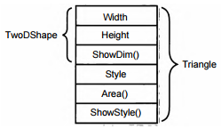

# ГЛАВА 11. Наследование
Наследование является одним из трех основополага­
ющих принципов объектно-ориентированного про­
граммирования, поскольку оно допускает создание
иерархических классификаций. Благодаря наследованию
можно создать общий класс, в котором определяются ха­
рактерные особенности, присущие множеству связанных
элементов. От этого класса могут затем наследовать другие,
более конкретные классы, добавляя в него свои индивиду­
альные особенности.

В языке C# класс, который наследуется, называется
базовым, а класс, который наследует, — производным.
Следовательно, производный класс представляет собой спе­
циализированный вариант базового класса. Он наследует
все переменные, методы, свойства и индексаторы, опреде­
ляемые в базовом классе, добавляя к ним свои собственные
элементы.

## Основы наследования
Поддержка наследования в C# состоит в том, что в объяв­
ление одного класса разрешается вводить другой класс. Для
этого при объявлении производного класса указывается
базовый класс. Рассмотрим для начала простой пример.
Ниже приведен класс TwoDShape, содержащий ширину
и высоту двухмерного объекта, например квадрата, пря­
моугольника, треугольника и т.д.
```
// Класс для двумерных объектов.
class TwoDShape {
    public double Width;
    public double Height;
    public void ShowDim() {
        Console.WriteLine("Ширина и высота равны " +
        Width + " и " + Height);
    }
}
```
Класс TwoDShape может стать базовым, т.е. отправной точкой для создания классов,
описывающих конкретные типы двумерных объектов. Например, в приведенной ниже
программе класс TwoDShape служит для порождения производного класса Triangle.
Обратите особое внимание на объявление класса Triangle.
```
// Пример простой иерархии классов.
using System;

// Класс для двумерных объектов.
class TwoDShape {
    public double Width;
    public double Height;
    public void ShowDim() {
        Console.WriteLine("Ширина и высота равны " +
                        Width + " и " + Height);
    }
}

// Класс Triangle, производный от класса TwoDShape.
class Triangle : TwoDShape {
    public string Style; // тип треугольника
    // Возвратить площадь треугольника.
    public double Area() {
        return Width * Height / 2;
    }
    // Показать тип треугольника.
    public void ShowStyle() {
        Console.WriteLine("Треугольник " + Style);
    }
}

class Shapes {
    static void Main() {
        Triangle t1 = new Triangle();
        Triangle t2 = new Triangle();

        t1.Width = 4.0;
        t1.Height = 4.0;
        t1.Style = "равнобедренный";

        t2.Width = 8.0;
        t2.Height = 12.0;
        t2.Style = "прямоугольный";

        Console.WriteLine("Сведения об объекте t1: ");
        t1.ShowStyle();
        t1.ShowDim();
        Console.WriteLine("Площадь равна " + t1.Area());

        Console.WriteLine();

        Console.WriteLine("Сведения об объекте t2: ");
        t2.ShowStyle();
        t2.ShowDim();
        Console.WriteLine("Площадь равна " + t2.Area());
    }
}
```
При выполнении этой программы получается следующий результат.
```
Сведения об объекте t1:
Треугольник равнобедренный
Ширина и высота равны 4 и 4
Площадь равна 8

Сведения об объекте t2:
Треугольник прямоугольный
Ширина и высота равны 8 и 12
Площадь равна 48
```
В классе Triangle создается особый тип объекта класса TwoDShape (в данном слу­
чае — треугольник). Кроме того, в класс Triangle входят все члены класса TwoDShape,
к которым, в частности, добавляются методы Area() и ShowStyle(). Так, описание
типа треугольника сохраняется в переменной Style, метод Area() рассчитывает и воз­
вращает площадь треугольника, а метод ShowStyle() отображает тип треугольника.
Обратите внимание на синтаксис, используемый в классе Triangle для наследова­
ния класса TwoDShape.
```
class Triangle : TwoDShape {
```
Этот синтаксис может быть обобщен. Всякий раз, когда один класс наследует от
другого, после имени базового класса указывается имя производного класса, отделяе­
мое двоеточием. В C# синтаксис наследования класса удивительно прост и удобен в ис­
пользовании.

В класс Triangle входят все члены его базового класса TwoDShape, и поэтому
в нем переменные Width и Height доступны для метода Area(). Кроме того, объекты
t1 и t2 в методе Main() могут обращаться непосредственно к переменным Width и
Height, как будто они являются членами класса Triangle. На рис. 11.1 схематически
показано, каким образом класс TwoDShape вводится в класс Triangle.



Рис. 11.1. Схематическое представление класса Triangle

Несмотря на то что класс TwoDShape является базовым для класса Triangle, в то
же время он представляет собой совершенно независимый и самодостаточный класс.
Если класс служит базовым для производного класса, то это совсем не означает, что он
не может быть использован самостоятельно. Например, следующий фрагмент кода
считается вполне допустимым.
```
TwoDShape shape = new TwoDShape();
shape.Width = 10;
shape.Height = 20;

shape.ShowDim();
```
Разумеется, объект класса TwoDShape никак не связан с любым из классов, произво­
дных от класса TwoDShape, и вообще не имеет к ним доступа.

Ниже приведена общая форма объявления класса, наследующего от базового класса.
```
class имя_производного_класса : имя_базового_класса {
    // тело класса
}
```
Для любого производного класса можно указать только один базовый класс. В C# не
предусмотрено наследование нескольких базовых классов в одном производном клас­
се. (В этом отношении C# отличается от C++, где допускается наследование нескольких
базовых классов. Данное обстоятельство следует принимать во внимание при переносе
кода C++ в С#.) Тем не менее можно создать иерархию наследования, в которой про­
изводный класс становится базовым для другого производного класса. (Разумеется, ни
один из классов не может быть базовым для самого себя как непосредственно, так и
косвенно.) Но в любом случае производный класс наследует все члены своего базового
класса, в том числе переменные экземпляра, методы, свойства и индексаторы.

Главное преимущество наследования заключается в следующем: как только будет
создан базовый класс, в котором определены общие для множества объектов атрибу­
ты, он может быть использован для создания любого числа более конкретных произ­
водных классов. А в каждом производном классе может быть точно выстроена своя
собственная классификация. В качестве примера ниже приведен еще один класс, про­
изводный от класса TwoDShape и инкапсулирующий прямоугольники.
```
// Класс для прямоугольников, производный от класса TwoDShape.
class Rectangle : TwoDShape {
    // Возвратить логическое значение true, если
    // прямоугольник является квадратом.
    public bool IsSquare() {
        if(Width == Height) return true;
        return false;
    }
    // Возвратить площадь прямоугольника.
    public double Area() {
        return Width * Height;
    }
}
```
В класс Rectangle входят все члены класса TwoDShape, к которым добавлен метод
IsSquare(), определяющий, является ли прямоугольник квадратом, а также метод
Area(), вычисляющий площадь прямоугольника.

## Доступ к членам класса и наследование
Как пояснялось в главе 8, члены класса зачастую объявляются закрытыми, чтобы
исключить их несанкционированное или незаконное использование. Но наследование
класса не отменяет ограничения, накладываемые на доступ к закрытым членам класса.
Поэтому если в производный класс и входят все члены его базового класса, в нем все
равно оказываются недоступными те члены базового класса, которые являются закры­
тыми. Так, если сделать закрытыми переменные класса TwoDShape, они станут недо­
ступными в классе Triangle, как показано ниже.
```
// Доступ к закрытым членам класса не наследуется.
// Этот пример кода не подлежит компиляции.
using System;

// Класс для двумерных объектов.
class TwoDShape {
    double Width; // теперь это закрытая переменная
    double Height; // теперь это закрытая переменная
    public void ShowDim() {
        Console.WriteLine("Ширина и высота равны " +
                        Width + " и " + Height);
    }
}

// Класс Triangle, производный от класса TwoDShape.
class Triangle : TwoDShape {
    public string Style; // тип треугольника
    // Возвратить площадь треугольника.
    public double Area() {
        return Width * Height / 2; // Ошибка, доступ к закрытому
        // члену класса запрещен
    }
    // Показать тип треугольника.
    public void ShowStyle() {
        Console.WriteLine("Треугольник " + Style);
    }
}
Класс Triangle не будет компилироваться, потому что обращаться к перемен­
ным Width и Height из метода Area() запрещено. А поскольку переменные Width и
Height теперь являются закрытыми, то они доступны только для других членов своего
класса, но не для членов производных классов.

**ПРИМЕЧАНИЕ**
Закрытый член класса остается закрытым в своем классе. Он не доступен из кода за
пределами своего класса, включая и производные классы.

На первый взгляд, ограничение на доступ к частным членам базового класса из про­
изводного класса кажется трудно преодолимым, поскольку оно не дает во многих слу­
чаях возможности пользоваться частными членами этого класса. Но на самом деле это
не так. Для преодоления данного ограничения в C# предусмотрены разные способы.
Один из них состоит в использовании защищенных (protected) членов класса, рас­
сматриваемых в следующем разделе, а второй — в применении открытых свойств для
доступа к закрытым данным.

Как пояснялось в предыдущей главе, свойство позволяет управлять доступом к пе­
ременной экземпляра. Например, с помощью свойства можно ввести ограничения на
доступ к значению переменной или же сделать ее доступной только для чтения. Так,
если сделать свойство открытым, но объявить его базовую переменную закрытой, то
этим свойством можно будет воспользоваться в производном классе, но нельзя будет
получить непосредственный доступ к его базовой закрытой переменной.

Ниже приведен вариант класса TwoDShape, в котором переменные Width и Height
превращены в свойства. По ходу дела в этом классе выполняется проверка: являются ли
положительными значения свойств Width и Height. Это дает, например, возможность
указывать свойства Width и Height в качестве координат формы в любом квадранте
прямоугольной системы координат, не получая заранее их абсолютные значения.
```
// Использовать открытые свойства для установки и
// получения значений закрытых членов класса.
using System;

// Класс для двумерных объектов.
class TwoDShape {
    double pri_width; // теперь это закрытая переменная
    double pri_height; // теперь это закрытая переменная

    // Свойства ширины и высоты двумерного объекта.
    public double Width {
        get { return pri_width; }
        set { pri_width = value < 0 ? -value : value; }
    }

    public double Height {
        get { return pri_height; }
        set { pri_height = value < 0 ? -value : value; }
    }

    public void ShowDim() {
        Console.WriteLine("Ширина и высота равны " +
                        Width + " и " + Height);
    }
}

// Класс для треугольников, производный от
// класса TwoDShape.
class Triangle : TwoDShape {
    public string Style; // тип треугольника

    // Возвратить площадь треугольника.
    public double Area() {
        return Width * Height / 2;
    }

    // Показать тип треугольника.
    public void ShowStyle() {
        Console.WriteLine("Треугольник " + Style);
    }
}

class Shapes2 {
    static void Main() {
        Triangle t1 = new Triangle();
        Triangle t2 = new Triangle();

        t1.Width = 4.0;
        t1.Height = 4.0;
        t1.Style = "равнобедренный";

        t2.Width = 8.0;
        t2.Height = 12.0;
        t2.Style = "прямоугольный";

        Console.WriteLine("Сведения об объекте t1: ");
        t1.ShowStyle();
        t1.ShowDim();
        Console.WriteLine("Площадь равна " + t1.Area());

        Console.WriteLine();

        Console.WriteLine("Сведения об объекте t2: ");
        t2.ShowStyle ();
        t2.ShowDim();
        Console.WriteLine("Площадь равна " + t2.Area());
    }
}
```
В этом варианте свойства Width и Height предоставляют доступ к закрытым чле­
нам pri_width и pri_height класса TwoDShape, в которых фактически хранятся
значения ширины и высоты двумерного объекта. Следовательно, значения членов
pri_width и pri_height класса TwoDShape могут быть установлены и получены с
помощью соответствующих открытых свойств, несмотря на то, что сами эти члены по-
прежнему остаются закрытыми.

Базовый и производный классы иногда еще называют суперклассом и подклассом
соответственно. Эти термины происходят из практики программирования на Java.
То, что в Java называется суперклассом, в C# обозначается как базовый класс. А то, что
в Java называется подклассом, в C# обозначается как производный класс. Оба ряда тер­
минов часто применяются к классу в обоих языках программирования, но в этой книге
по-прежнему употребляются общепринятые в C# термины базового и производного
классов, которые принято употреблять и в C++.

### Организация защищенного доступа
Как пояснялось выше, открытый член базового класса недоступен для производно­
го класса. Из этого можно предположить, что для доступа к некоторому члену базо­
вого класса из производного класса этот член необходимо сделать открытым. Но если
сделать член класса открытым, то он станет доступным для всего кода, что далеко не
всегда желательно. Правда, упомянутое предположение верно лишь отчасти, посколь­
ку в C# допускается создание защищенного члена класса. Защищенный член является
открытым в пределах иерархии классов, но закрытым за пределами этой иерархии.

Защищенный член создается с помощью модификатора доступа protected. Если
член класса объявляется как protected, он становится закрытым, но за исключением
одного случая, когда защищенный член наследуется. В этом случае защищенный член
базового класса становится защищенным членом производного класса, а значит, до­
ступным для производного класса. Таким образом, используя модификатор доступа
protected, можно создать члены класса, являющиеся закрытыми для своего класса,
но все же наследуемыми и доступными для производного класса.

Ниже приведен простой пример применения модификатора доступа protected.
```
// Продемонстрировать применение модификатора доступа protected.
using System;

class В {
    protected int i, j; // члены, закрытые для класса В,
    // но доступные для класса D

    public void Set(int a, int b) {
        i = a;
        j = b;
    }

    public void Show() {
        Console.WriteLine(i + " " + j);
    }
}

class D : В {
    int k; // закрытый член
    // члены i и j класса В доступны для класса D

    public void Setk() {
        k = i * j;
    }

    public void Showk() {
        Console.WriteLine(k);
    }
}

class ProtectedDemo {
    static void Main() {
        D ob = new D();
        ob.Set(2, 3); // допустимо, поскольку доступно для класса D
        ob.Show(); // допустимо, поскольку доступно для класса D
        ob.Setk(); // допустимо, поскольку входит в класс D
        ob.Showk(); // допустимо, поскольку входит в класс D
    }
}
```
В данном примере класс В наследуется классом D, а его члены i и j объявлены как
protected, и поэтому они доступны для метода Setk(). Если бы члены i и j класса В
были объявлены как private, то они оказались бы недоступными для класса D, и при­
веденный выше код нельзя было бы скомпилировать.

Аналогично состоянию public и private, состояние protected сохраняется за
членом класса независимо от количества уровней наследования. Поэтому когда про­
изводный класс используется в качестве базового для другого производного класса, лю­
бой защищенный член исходного базового класса, наследуемый первым производным
классом, наследуется как защищенный и вторым производным классом.

Несмотря на всю свою полезность, защищенный доступ пригоден далеко не для
всех ситуаций. Так, в классе TwoDShape из приведенного ранее примера требовалось,
чтобы значения его членов Width и Height были доступными открыто, поскольку
нужно было управлять значениями, которые им присваивались, что было бы невоз­
можно, если бы они были объявлены как protected. В данном случае более подходя­
щим решением оказалось применение свойств, чтобы управлять доступом, а не пре­
дотвращать его. Таким образом, модификатор доступа protected следует применять
в том случае, если требуется создать член класса, доступный для всей иерархии клас­
сов, но для остального кода он должен быть закрытым. А для управления доступом к
значению члена класса лучше воспользоваться свойством.

## Конструкторы и наследование
В иерархии классов допускается, чтобы у базовых и производных классов были свои
собственные конструкторы. В связи с этим возникает следующий резонный вопрос:
какой конструктор отвечает за построение объекта производного класса: конструктор
базового класса, конструктор производного класса или же оба? На этот вопрос можно
ответить так: конструктор базового класса конструирует базовую часть объекта, а кон­
структор производного класса — производную часть этого объекта. И в этом есть своя
логика, поскольку базовому классу неизвестны и недоступны любые элементы произ­
водного класса, а значит, их конструирование должно происходить раздельно. В при­
веденных выше примерах данный вопрос не возникал, поскольку они опирались на
автоматическое создание конструкторов, используемых в C# по умолчанию. Но на
практике конструкторы определяются в большинстве классов. Ниже будет показано,
каким образом разрешается подобная ситуация.

Если конструктор определен только в производном классе, то все происходит очень
просто: конструируется объект производного класса, а базовая часть объекта автома­
тически конструируется его конструктором, используемым по умолчанию. В качестве
примера ниже приведен переработанный вариант класса Triangle, в котором опре­
деляется конструктор, а член Style делается закрытым, так как теперь он устанавли­
вается конструктором.
```
// Добавить конструктор в класс Triangle.
using System;

// Класс для двумерных объектов.
class TwoDShape {
    double pri_width;
    double pr.i_height;

    // Свойства ширины и длины объекта.
    public double Width {
        get { return pri_width; }
        set { pri_width = value < 0 ? -value : value; }
    }

    public double Height {
        get { return pri_height; }
        set { pri_height = value < 0 ? -value : value; }
    }

    public void ShowDim() {
        Console.WriteLine("Ширина и длина равны " +
                        Width + " и " + Height);
    }
}

// Класс для треугольников, производный от класса TwoDShape.
class Triangle : TwoDShape {
    string Style;

    // Конструктор.
    public Triangle(string s, double w, double h) {
        Width = w; // инициализировать член базового класса
        Height = h; // инициализировать член базового класса
        Style = s; // инициализировать член производного класса
    }

    // Возвратить площадь треугольника.
    public double Area() {
        return Width * Height / 2;
    }

    // Показать тип треугольника.
    public void ShowStyle() {
        Console.WriteLine("Треугольник " + Style);
    }
}

class Shapes3 {
    static void Main() {
        Triangle t1 = new Triangle("равнобедренный", 4.0, 4.0);
        Triangle t2 = new Triangle("прямоугольный", 8.0, 12.0);

        Console.WriteLine("Сведения об объекте t1: ");
        t1.ShowStyle();
        t1.ShowDim();
        Console.WriteLine("Площадь равна " + t1.Area());

        Console.WriteLine();

        Console.WriteLine("Сведения об объекте t2: ");
        t2.ShowStyle();
        t2.ShowDim();
        Console.WriteLine("Площадь равна " + t2.Area());
    }
}
В данном примере конструктор класса Triangle инициализирует наследуемые
члены класса TwoDShape вместе с его собственным полем Style.

Когда конструкторы определяются как в базовом, так и в производном классе, про­
цесс построения объекта несколько усложняется, поскольку должны выполняться
конструкторы обоих классов. В данном случае приходится обращаться к еще одному
ключевому слову языка С#: base, которое находит двоякое применение: во-первых, для
вызова конструктора базового класса; и во-вторых, для доступа к члену базового класса,
скрывающегося за членом производного класса. Ниже будет рассмотрено первое при­
менение ключевого слова base.

### Вызов конструкторов базового класса
С помощью формы расширенного объявления конструктора производного класса
и ключевого слова base в производном классе может быть вызван конструктор, опре­
деленный в его базовом классе. Ниже приведена общая форма этого расширенного
объявления:
```
конструктор_производного_класса(список_параметров) : base(список_аргументов) {
    // тело конструктора
}
```
где список_аргументов обозначает любые аргументы, необходимые конструктору
в базовом классе. Обратите внимание на местоположение двоеточия.

Для того чтобы продемонстрировать применение ключевого слова base на кон­
кретном примере, рассмотрим еще один вариант класса TwoDShape в приведенной
ниже программе. В данном примере определяется конструктор, инициализирующий
свойства Width и Height. Затем этот конструктор вызывается конструктором класса
Triangle.
```
// Добавить конструктор в класс TwoDShape.
using System;

// Класс для двумерных объектов.
class TwoDShape {
    double pri_width;
    double pri_height;

    // Конструктор класса TwoDShape.
    public TwoDShape(double w, double h) {
        Width = w;
        Height = h;
    }

    // Свойства ширины и высоты объекта.
    public double Width {
        get { return pri_width; }
        set { pri_width = value < 0 ? -value : value; }
    }

    public double Height {
        get { return pri_height; }
        set { pri_height = value < 0 ? -value : value; }
    }

    public void ShowDim() {
        Console.WriteLine("Ширина и высота равны " +
                        Width + " и " + Height);
    }
}

// Класс для треугольников, производный от класса TwoDShape.
class Triangle : TwoDShape {
    string Style;

    // Вызвать конструктор базового класса.
    public Triangle(string s, double w, double h) : base(w, h) {
        Style = s;
    }

    // Возвратить площадь треугольника.
    public double Area() {
        return Width * Height / 2;
    }

    // Показать тип треугольника.
    public void ShowStyle() {
        Console.WriteLine("Треугольник " + Style);
    }
}

class Shapes4 {
    static void Main() {
        Triangle t1 = new Triangle("равнобедренный", 4.0, 4.0);
        Triangle t2 = new Triangle("прямоугольный", 8.0, 12.0);

        Console.WriteLine("Сведения об объекте t1: ");
        t1.ShowStyle();
        t1.ShowDim();
        Console.WriteLine("Площадь равна " + t1.Area());

        Console.WriteLine();

        Console.WriteLine("Сведения об объекте t2: ");
        t2.ShowStyle();
        t2.ShowDim();
        Console.WriteLine("Площадь равна " + t2.Area());
    }
}
```
Теперь конструктор класса Triangle объявляется следующим образом.
```
public Triangle(
    string s, double w, double h) : base(w, h) {
```
В данном варианте конструктор Triangle() вызывает метод base с параметрами
w и h. Это, в свою очередь, приводит к вызову конструктора TwoDShape(), инициа­
лизирующего свойства Width и Height значениями параметров w и h. Они больше
не инициализируются средствами самого класса Triangle, где теперь остается ини­
циализировать только его собственный член Style, определяющий тип треугольника.
Благодаря этому класс TwoDShape высвобождается для конструирования своего по­
добъекта любым избранным способом. Более того, в класс TwoDShape можно ввести
функции, о которых даже не будут подозревать производные классы, что предотвра­
щает нарушение существующего кода.

С помощью ключевого слова base можно вызвать конструктор любой формы,
определяемой в базовом классе, причем выполняться будет лишь тот конструктор, па­
раметры которого соответствуют переданным аргументам. В качестве примера ниже
приведены расширенные варианты классов TwoDShape и Triangle, в которые вклю­
чены как используемые по умолчанию конструкторы, так и конструкторы, принимаю­
щие один аргумент.
```
// Добавить дополнительные конструкторы в класс TwoDShape.
using System;

class TwoDShape {
    double pri_width;
    double pri_height;

    // Конструктор, вызываемый по умолчанию.
    public TwoDShape() {
        Width = Height = 0.0;
    }

    // Конструктор класса TwoDShape.
    public TwoDShape(double w, double h) {
        Width = w;
        Height = h;
    }

    // Сконструировать объект равной ширины и высоты.
    public TwoDShape(double х) {
        Width = Height = x;
    }

    // Свойства ширины и высоты объекта.
    public double Width {
        get { return pri_width; }
        set { pri_width = value < 0 ? -value : value; }
    }

    public double Height {
        get { return pri_height; }
        set { pri_height = value < 0 ? -value : value; }
    }

    public void ShowDim() {
        Console.WriteLine("Ширина и высота равны " +
                        Width + " и " + Height);
    }
}

// Класс для треугольников, производный от класса TwoDShape.
class Triangle : TwoDShape {
    string Style;

    /* Конструктор, используемый по умолчанию.
    Автоматически вызывает конструктор, доступный по
    умолчанию в классе TwoDShape. */
    public Triangle() {
        Style = "null";
    }

    // Конструктор, принимающий три аргумента.
    public Triangle(
        string s, double w, double h) : base (w, h) {
        Style = s;
    }

    // Сконструировать равнобедренный треугольник.
    public Triangle(double x) : base(x) {
        Style = "равнобедренный";
    }

    // Возвратить площадь треугольника.
    public double Area() {
        return Width * Height / 2;
    }

    // Показать тип треугольника.
    public void ShowStyle() {
        Console.WriteLine("Треугольник " + Style);
    }
}

class Shapes5 {
    static void Main() {
        Triangle t1 = new Triangle();
        Triangle t2 = new Triangle("прямоугольный", 8.0, 12.0);
        Triangle t3 = new Triangle(4.0);

        t1 = t2;

        Console.WriteLine("Сведения об объекте t1: ");
        t1.ShowStyle();
        t1.ShowDim();
        Console.WriteLine("Площадь равна " + t1.Area());

        Console.WriteLine();

        Console.WriteLine("Сведения об объекте t2: ");
        t2.ShowStyle();
        t2.ShowDim();
        Console.WriteLine("Площадь равна " + t2.Area());

        Console.WriteLine();

        Console.WriteLine("Сведения об объекте t3: ");
        t3.ShowStyle();
        t3.ShowDim();
        Console.WriteLine("Площадь равна " + t3.Area());

        Console.WriteLine();
    }
}
```
Вот к какому результату приводит выполнение этого кода.
```
Сведения об объекте t1:
Треугольник прямоугольный
Ширина и высота равны 8 и 12
Площадь равна 48

Сведения об объекте t2:
Треугольник прямоугольный
Ширина и высота равны 8 и 12
Площадь равна 48

Сведения об объекте t3:
Треугольник равнобедренный
Ширина и высота равны 4 и 4
Площадь равна 8
```
А теперь рассмотрим вкратце основные принципы действия ключевого слова base.
Когда в производном классе указывается ключевое слово base, вызывается конструктор
из его непосредственного базового класса. Следовательно, ключевое слово base всегда
обращается к базовому классу, стоящему в иерархии непосредственно над вызываю­
щим классом. Это справедливо даже для многоуровневой иерархии классов. Аргумен­
ты передаются базовому конструктору в качестве аргументов метода base(). Если же
ключевое слово отсутствует, то автоматически вызывается конструктор, используемый
в базовом классе по умолчанию.

## Наследование и сокрытие имен
В производном классе можно определить член с таким же именем, как и у чле­
на его базового класса. В этом случае член базового класса скрывается в производном
классе. И хотя формально в C# это не считается ошибкой, компилятор все же выдаст
сообщение, предупреждающее о том, что имя скрывается. Если член базового клас­
са требуется скрыть намеренно, то перед его именем следует указать ключевое слово
new, чтобы избежать появления подобного предупреждающего сообщения. Следует,
однако, иметь в виду, что это совершенно отдельное применение ключевого слова new,
не похожее на его применение при создании экземпляра объекта.

Ниже приведен пример сокрытия имени.
```
// Пример сокрытия имени с наследственной связью.
using System;

class А {
    public int i = 0;
}

// Создать производный класс.
class В : А {
    new int i; // этот член скрывает член i из класса А

    public В (int b) {
        i = b; // член i в классе В
    }

    public void Show() {
        Console.WriteLine("Член i в производном классе: " + i);
    }
}

class NameHiding {
    static void Main() {
        В ob = new В(2);
        ob.Show();
    }
}
```
Прежде всего обратите внимание на использование ключевого слова new в следую­
щей строке кода.
```
new int i; // этот член скрывает член i из класса А
```
В этой строке компилятору, по существу, сообщается о том, что вновь создавае­
мая переменная i намеренно скрывает переменную i из базового класса А и что авто­
ру программы об этом известно. Если же опустить ключевое слово new в этой строке
кода, то компилятор выдаст предупреждающее сообщение.

Вот к какому результату приводит выполнение приведенного выше кода.
```
Член i в производном классе: 2
```
В классе В определяется собственная переменная экземпляра i, которая скрывает
переменную i из базового класса А. Поэтому при вызове метода Show() для объек­
та типа В выводится значение переменной i, определенной в классе В, а не той, что
определена в классе А.

### Применение ключевого слова base для доступа к скрытому имени
Имеется еще одна форма ключевого слова base, которая действует подобно клю­
чевому слову this, за исключением того, что она всегда ссылается на базовый класс
в том производном классе, в котором она используется. Ниже эта форма приведена
в общем виде:
```
base.член
```
где член может обозначать метод или переменную экземпляра. Эта форма ключевого
слова base чаще всего применяется в тех случаях, когда под именами членов произво­
дного класса скрываются члены базового класса с теми же самыми именами. В качестве
примера ниже приведен другой вариант иерархии классов из предыдущего примера.
```
// Применение ключевого слова base для преодоления
// препятствия, связанного с сокрытием имен.
using System;

class А {
    public int i = 0;
}

// Создать производный класс.
class В : А {
    new int i; // этот член скрывает член i из класса А

    public В(int a, int b) {
        base.i = а; // здесь обнаруживается скрытый член из класса А
        i = b; // член i из класса В
    }

    public void Show() {
        // Здесь выводится член i из класса А.
        Console.WriteLine("Член i в базовом классе: " + base.i);
        // А здесь выводится член i из класса В.
        Console.WriteLine("Член i в производном классе: " + i);
    }
}

class UncoverName {
    static void Main() {
        В ob = new В(1, 2);
        ob.Show();
    }
}
```
Выполнение этого кода приводит к следующему результату.
```
Член i в базовом классе: 1
Член i в производном классе: 2
```
Несмотря на то что переменная экземпляра i в производном классе В скрывает
переменную i из базового класса А, ключевое слово base разрешает доступ к перемен­
ной i, определенной в базовом классе.

С помощью ключевого слова base могут также вызываться скрытые методы.
Например, в приведенном ниже коде класс В наследует класс А и в обоих классах
объявляется метод Show(). А затем в методе Show() класса В с помощью ключевого
слова base вызывается вариант метода Show(), определенный в классе А.
```
// Вызвать скрытый метод.
using System;

class А {
    public int i = 0;

    // Метод Show() в классе A
    public void Show() {
        Console.WriteLine("Член i в базовом классе: " + i);
    }
}

// Создать производный класс.
class В : А {
    new int i; // этот член скрывает член i из класса А

    public В(int a, int b) {
        base.i = а; // здесь обнаруживается скрытый член из класса А
        i = b; // член i из класса В
    }

    // Здесь скрывается метод Show() из класса А. Обратите
    // внимание на применение ключевого слова new.
    new public void Show() {
        base.Show(); // здесь вызывается метод Show() из класса А
        // далее выводится член i из класса В
        Console.WriteLine("Член i в производном классе: " + i);
    }
}

class UncoverName {
    static void Main() {
        В ob = new В(1, 2);
        ob.Show();
    }
}
```
Выполнение этого кода приводит к следующему результату.
```
Член i в базовом классе: 1
Член i в производном классе: 2
```
Как видите, в выражении base.Show() вызывается вариант метода Show() из ба­
зового класса.

Обратите также внимание на следующее: ключевое слово new используется в при­
веденном выше коде с целью сообщить компилятору о том, что метод Show(), вновь
объявляемый в производном классе В, намеренно скрывает другой метод Show(),
определенный в базовом классе А.

## Создание многоуровневой иерархии классов
В представленных до сих пор примерах программ использовались простые иерар­
хии классов, состоявшие только из базового и производного классов. Но в C# мож­
но также строить иерархии, состоящие из любого числа уровней наследования. Как
упоминалось выше, многоуровневая иерархия идеально подходит для использования
одного производного класса в качестве базового для другого производного класса. Так,
если имеются при класса, А, В и С, то класс С может наследовать от класса В, а тот,
в свою очередь, от класса А. В таком случае каждый производный класс наследует ха­
рактерные особенности всех своих базовых классов. В частности, класс С наследует все
члены классов В и А.

Для того чтобы показать, насколько полезной может оказаться многоуровневая
иерархия классов, рассмотрим следующий пример программы. В ней производный
класс Triangle служит в качестве базового для создания другого производного клас­
са — ColorTriangle. При этом класс ColorTriangle наследует все характерные осо­
бенности, а по существу, члены классов Triangle и TwoDShape, к которым добавляет­
ся поле color, содержащее цвет треугольника.
```
// Пример построения многоуровневой иерархии классов.
using System;

class TwoDShape {
    double pri_width;
    double pri_height;

    // Конструктор, используемый по умолчанию.
    public TwoDShape() {
        Width = Height = 0.0;
    }

    // Конструктор для класса TwoDShape.
    public TwoDShape(double w, double h) {
        Width = w;
        Height = h;
    }

    // Сконструировать объект равной ширины и высоты.
    public TwoDShape(double х) {
        Width = Height = x;
    }

    // Свойства ширины и высоты объекта.
    public double Width {
        get { return pri_width; }
        set { pri_width = value < 0 ? -value : value; }
    }

    public double Height {
        get { return pri_height; }
        set { pri_height = value < 0 ? -value : value; }
    }

    public void ShowDim() {
        Console.WriteLine("Ширина и высота равны " +
                        Width + " и " + Height);
    }
}

// Класс для треугольников, производный от класса TwoDShape.
class Triangle : TwoDShape {
    string Style; // закрытый член класса

    /* Конструктор, используемый по умолчанию.
    Автоматически вызывает конструктор, доступный по
    умолчанию в классе TwoDShape. */
    public Triangle() {
        Style = "null";
    }

    // Конструктор.
    public Triangle(string s, double w, double h) : base(w, h) {
        Style = s;
    }

    // Сконструировать равнобедренный треугольник.
    public Triangle(double x) : base(x) {
        Style = "равнобедренный";
    }

    // Возвратить площадь треугольника.
    public double Area() {
        return Width * Height / 2;
    }

    // Показать тип треугольника.
    public void ShowStyle() {
        Console.WriteLine("Треугольник " + Style);
    }
}

// Расширить класс Triangle.
class ColorTriangle : Triangle {
    string color;

    public ColorTriangle(string c, string s,
    double w, double h) : base(s, w, h) {
        color = c;
    }

    // Показать цвет треугольника.
    public void ShowColor() {
        Console.WriteLine("Цвет " + color);
    }
}

class Shapes6 {
    static void Main() {
        ColorTriangle t1 =
            new ColorTriangle("синий", "прямоугольный", 8.0, 12.0);
        ColorTriangle t2 =
            new ColorTriangle("красный", "равнобедренный", 2.0, 2.0);

        Console.WriteLine("Сведения об объекте t1: ");
        t1.ShowStyle();
        t1.ShowDim();
        t1.ShowColor();
        Console.WriteLine("Площадь равна " + t1.Area());

        Console.WriteLine();

        Console.WriteLine("Сведения об объекте t2: ");
        t2.ShowStyle();
        t2.ShowDim();
        t2.ShowColor();
        Console.WriteLine("Площадь равна " + t2.Area());
    }
}
```
При выполнении этой программы получается следующей результат.
```
Сведения об объекте t1:
Треугольник прямоугольный
Ширина и высота равны 8 и 12
Цвет синий
Площадь равна 48

Сведения об объекте t2:
Треугольник равнобедренный
Ширина и высота равны 2 и 2
Цвет красный
Площадь равна 2
```
Благодаря наследованию в классе ColorTriangle могут использоваться опреде­
ленные ранее классы Triangle и TwoDShape, к элементам которых добавляется лишь
та информация, которая требуется для конкретного применения данного класса.
В этом отчасти и состоит ценность наследования, поскольку оно допускает повторное
использование кода.

Приведенный выше пример демонстрирует еще одно важное положение: ключе­
вое слово base всегда обозначает ссылку на конструктор ближайшего по иерархии
базового класса. Так, ключевое слово base в классе ColorTriangle обозначает вызов
конструктора из класса Triangle, а ключевое слово base в классе Triangle — вызов
конструктора из класса TwoDShape. Если же в иерархии классов конструктору базо­
вого класса требуются параметры, то все производные классы должны предоставлять
эти параметры вверх по иерархии, независимо от того, требуются они самому произ­
водному классу или нет.

## Порядок вызова конструкторов
В связи с изложенными выше в отношении наследования и иерархии классов мо­
жет возникнуть следующий резонный вопрос: когда создается объект производного
класса и какой конструктор выполняется первым — тот, что определен в производном
классе, или же тот, что определен в базовом классе? Так, если имеется базовый класс А
и производный класс В, то вызывается ли конструктор класса А раньше конструктора
класса В? Ответ на этот вопрос состоит в том, что в иерархии классов конструкторы вы­
зываются по порядку выведения классов: от базового к производному. Более того, этот
порядок остается неизменным независимо от использования ключевого слова base.
Так, если ключевое слово base не используется, то выполняется конструктор по умол­
чанию, т.е. конструктор без параметров. В приведенном ниже примере программы
демонстрируется порядок вызова и выполнения конструкторов.
```
// Продемонстрировать порядок вызова конструкторов.
using System;

// Создать базовый класс.
class А {
    public А() {
        Console.WriteLine("Конструирование класса А.");
    }
}

// Создать класс, производный от класса А.
class В : А {
    public В() {
        Console.WriteLine("Конструирование класса В.");
    }
}

// Создать класс, производный от класса В.
class С : В {
    public С() {
        Console.WriteLine("Конструирование класса С.");
    }
}

class OrderOfConstruction {
    static void Main() {
     С с = new С();
    }
}
```
Вот к какому результату приводит выполнение этой программы.
```
Конструирование класса А.
Конструирование класса В.
Конструирование класса С.
```
Как видите, конструкторы вызываются по порядку выведения их классов.

Если хорошенько подумать, то в вызове конструкторов по порядку выведения их
классов можно обнаружить определенный смысл. Ведь базовому классу ничего не из­
вестно ни об одном из производных от него классов, и поэтому любая инициализация,
которая требуется его членам, осуществляется совершенно отдельно от инициализа­
ции членов производного класса, а возможно, это и необходимое условие. Следова­
тельно, она должна выполняться первой.

## Ссылки на базовый класс и объекты производных классов
Как вам должно быть уже известно, C# является строго типизированным языком
программирования. Помимо стандартных преобразований и автоматического про­
движения простых типов значений, в этом языке строго соблюдается принцип совме­
стимости типов. Это означает, что переменная ссылки на объект класса одного типа,
как правило, не может ссылаться на объект класса другого типа. В качестве примера
рассмотрим следующую программу, в которой объявляются два класса одинаковой
структуры.
```
// Эта программа не подлежит компиляции.
class X {
    int а;
    public X(int i) { a = i; }
}

class Y {
    int a;
    public Y(int i) { a = i; }
}

class IncompatibleRef {
    static void Main() {
        X x = new X(10);
        X x2;
        Y у = new Y(5);

        x2 = x; // верно, поскольку оба объекта относятся к одному и тому же типу
        х2 = у; // ошибка, поскольку это разнотипные объекты
    }
}
```
Несмотря на то что классы X и Y в данном примере совершенно одинаковы по своей
структуре, ссылку на объект типа Y нельзя присвоить переменной ссылки на объект
типа X, поскольку типы у них разные. Поэтому следующая строка кода оказывается
неверной и может привести к ошибке из-за несовместимости типов во время компи­
ляции.
```
х2 = у; // неверно, поскольку это разнотипные объекты
```
Вообще говоря, переменная ссылки на объект может ссылаться только на объект
своего типа.

Но из этого принципа строгого соблюдения типов в C# имеется одно важное ис­
ключение: переменной ссылки на объект базового класса может быть присвоена ссыл­
ка на объект любого производного от него класса. Такое присваивание считается впол­
не допустимым, поскольку экземпляр объекта производного типа инкапсулирует эк­
земпляр объекта базового типа. Следовательно, по ссылке на объект базового класса
можно обращаться к объекту производного класса. Ниже приведен соответствующий
пример.
```
// По ссылке на объект базового класса можно обращаться
// к объекту производного класса.
using System;
class X {
    public int a;

    public X(int i) {
        a = i;
    }
}

class Y : X {
    public int b;

    public Y(int i, int j) : base(j) {
        b = i;
    }
}

class BaseRef {
    static void Main() {
        X x = new X(10);
        X x2;
        Y у = new Y(5, 6);

        x2 = x; // верно, поскольку оба объекта относятся к одному и тому же типу
        Console.WriteLine("х2.а: " + х2.а);

        х2 = у; // тоже верно, поскольку класс Y является производным от класса X
        Console.WriteLine("х2.а: " + х2.а);

        // ссылкам на объекты класса X известно только о членах класса X
        х2.а = 19; // верно
        // х2.b = 27; // неверно, поскольку член b отсутствует у класса X
    }
}
```
В данном примере класс Y является производным от класса X. Поэтому следующая
операция присваивания:
```
х2 = у; // тоже верно, поскольку класс Y является производным от класса X
```
считается вполне допустимой. Ведь по ссылке на объект базового класса (в данном слу­
чае — это переменная х2 ссылки на объект класса X) можно обращаться к объекту про­
изводного класса, т.е. к объекту, на который ссылается переменная у.

Следует особо подчеркнуть, что доступ к конкретным членам класса определяется
типом переменной ссылки на объект, а не типом объекта, на который она ссылается.
Это означает, что если ссылка на объект производного класса присваивается перемен­
ной ссылки на объект базового класса, то доступ разрешается только к тем частям это­
го объекта, которые определяются базовым классом. Именно поэтому переменной х2
недоступен член b класса Y, когда она ссылается на объект этого класса. И в этом есть
своя логика, поскольку базовому классу ничего не известно о тех членах, которые до­
бавлены в производный от него класс. Именно поэтому последняя строка кода в при­
веденном выше примере была закомментирована.

Несмотря на кажущийся несколько отвлеченным характер приведенных выше рас-
суждений, им можно найти ряд важных применений на практике. Одно из них рас­
сматривается ниже, а другое — далее в этой главе, когда речь пойдет о виртуальных
методах.

Один из самых важных моментов для присваивания ссылок на объекты произво­
дного класса переменным базового класса наступает тогда, когда конструкторы вы­
зываются в иерархии классов. Как вам должно быть уже известно, в классе нередко
определяется конструктор, принимающий объект своего класса в качестве параметра.
Благодаря этому в классе может быть сконструирована копия его объекта. Этой осо­
бенностью можно выгодно воспользоваться в классах, производных от такого класса.
В качестве примера рассмотрим очередные варианты классов TwoDShape и Triangle.
В оба класса добавлены конструкторы, принимающие объект в качестве параметра.
```
// Передать ссылку на объект производного класса
// переменной ссылки на объект базового класса.
using System;
class TwoDShape {
    double pri_width;
    double pri_height;

    // Конструктор по умолчанию.
    public TwoDShape() {
        Width = Height = 0.0;
    }

    // Конструктор для класса TwoDShape.
    public TwoDShape(double w, double h) {
        Width = w;
        Height = h;
    }

    // Сконструировать объект равной ширины и высоты.
    public TwoDShape(double х) {
        Width = Height = x;
    }

    // Сконструировать копию объекта TwoDShape.
    public TwoDShape(TwoDShape ob) {
        Width = ob.Width;
        Height = ob.Height;
    }

    // Свойства ширины и высоты объекта.
    public double Width {
        get { return pri_width; }
        set { pri_width = value < 0 ? -value : value; }
    }

    public double Height {
        get { return pri_height; }
        set { pri_height = value < 0 ? -value : value; }
    }

    public void ShowDim() {
        Console.WriteLine("Ширина и высота равны " +
                        Width + " и " + Height);
    }
}

// Класс для треугольников, производный от класса TwoDShape.
class Triangle : TwoDShape {
    string Style;

    // Конструктор, используемый по умолчанию.
    public Triangle() {
        Style = "null";
    }

    // Конструктор для класса Triangle.
    public Triangle(string s, double w, double h) : base (w, h) {
        Style = s;
    }

    // Сконструировать равнобедренный треугольник.
    public Triangle(double x) : base(x) {
        Style = "равнобедренный";
    }

    // Сконструировать копию объекта типа Triangle.
    public Triangle (Triangle ob) : base(ob) {
        Style = ob.Style;
    }

    // Возвратить площадь треугольника.
    public double Area() {
        return Width * Height / 2;
    }

    // Показать тип треугольника.
    public void ShowStyle() {
        Console.WriteLine("Треугольник " + Style);
    }
}

class Shapes7 {
    static void Main() {
        Triangle t1 = new Triangle("прямоугольный", 8.0, 12.0);
        // Сделать копию объекта t1.
        Triangle t2 = new Triangle(t1);

        Console.WriteLine("Сведения об объекте t1: ");
        t1.ShowStyle();
        t1.ShowDim();
        Console.WriteLine("Площадь равна " + t1.Area());

        Console.WriteLine();

        Console.WriteLine("Сведения об объекте t2: ");
        t2.ShowStyle();
        t2.ShowDim();
        Console.WriteLine("Площадь равна " + t2.Area());
    }
}
```
В представленном выше примере объект t2 конструируется из объекта t1 и поэто­
му подобен ему. Ниже приведен результат выполнения кода из данного примера.
```
Сведения об объекте t1:
Треугольник прямоугольный
Ширина и высота равны 8 и 12
Площадь равна 48

Сведения об объекте t2:
Треугольник прямоугольный
Ширина и высота равны 8 и 12
Площадь равна 48
```
Обратите особое внимание на следующий конструктор класса Triangle:
```
public Triangle(Triangle ob) : base(ob) {
    Style = ob.Style;
}
```
Он принимает объект типа Triangle в качестве своего параметра и передает его
(с помощью ключевого слова base) следующему конструктору класса TwoDShape.
```
public TwoDShape(TwoDShape ob) {
    Width = ob.Width;
    Height = ob.Height;
}
```
Самое любопытное, что конструктор TwoDShape() предполагает получить объект
класса TwoDShape, тогда как конструктор Triangle() передает ему объект класса
Triangle. Как пояснялось выше, такое вполне допустимо, поскольку по ссылке на
объект базового класса можно обращаться к объекту производного класса. Следова­
тельно, конструктору TwoDShape() можно на совершенно законных основаниях пере­
дать ссылку на объект класса, производного от класса TwoDShape. А поскольку кон­
структор TwoDShape() инициализирует только те части объекта производного класса,
которые являются членами класса TwoDShape, то для него не имеет никакого значения,
содержит ли этот объект другие члены, добавленные в производном классе.

## Виртуальные методы и их переопределение
Виртуальным называется такой метод, который объявляется как virtual в базовом
классе. Виртуальный метод отличается тем, что он может быть переопределен в одном
или нескольких производных классах. Следовательно, у каждого производного класса
может быть свой вариант виртуального метода. Кроме того, виртуальные методы ин­
тересны тем, что именно происходит при их вызове по ссылке на базовый класс. В этом
случае средствами языка C# определяется именно тот вариант виртуального метода,
который следует вызывать, исходя из типа объекта, к которому происходит обраще­
ние по ссылке, причем это делается во время выполнения. Поэтому при ссылке на разные
типы объектов выполняются разные варианты виртуального метода. Иными словами,
вариант выполняемого виртуального метода выбирается по типу объекта, а не по типу
ссылки на этот объект. Так, если базовый класс содержит виртуальный метод и от него
получены производные классы, то при обращении к разным типам объектов по ссылке
на базовый класс выполняются разные варианты этого виртуального метода.

Метод объявляется как виртуальный в базовом классе с помощью ключевого сло­
ва virtual, указываемого перед его именем. Когда же виртуальный метод переопре­
деляется в производном классе, то для этого используется модификатор override.
А сам процесс повторного определения виртуального метода в производном классе
называется переопределением метода. При переопределении имя, возвращаемый тип
и сигнатура переопределяющего метода должны быть точно такими же, как и у того
виртуального метода, который переопределяется. Кроме того, виртуальный метод не
может быть объявлен как static или abstract (подробнее данный вопрос рассма­
тривается далее в этой главе).

Переопределение метода служит основанием для воплощения одного из самых
эффективных в C# принципов: динамической диспетчеризации методов, которая пред­
ставляет собой механизм разрешения вызова во время выполнения, а не компиляции.
Значение динамической диспетчеризации методов состоит в том, что именно благо­
даря ей в C# реализуется динамический полиморфизм.

Ниже приведен пример, демонстрирующий виртуальные методы и их переопре­
деление.
```
// Продемонстрировать виртуальный метод.
using System;
class Base {
    // Создать виртуальный метод в базовом классе.
    public virtual void Who() {
        Console.WriteLine("Метод Who() в классе Base");
    }
}

class Derivedl : Base {
    // Переопределить метод Who() в производном классе.
    public override void Who() {
        Console.WriteLine("Метод Who() в классе Derivedl");
    }
}

class Derived2 : Base {
    // Вновь переопределить метод Who() в еще одном производном классе.
    public override void Who() {
        Console.WriteLine("Метод Who() в классе Derived2");
    }
}

class OverrideDemo {
    static void Main() {
        Base baseOb = new Base();
        Derived1 dOb1 = new Derived1();
        Derived2 dOb2 = new Derived2();

        Base baseRef; // ссылка на базовый класс

        baseRef = baseOb;
        baseRef.Who();

        baseRef = dOb1;
        baseRef.Who();

        baseRef = dOb2;
        baseRef.Who();
    }
}
```
Вот к какому результату приводит выполнение этого кода.
```
Метод Who() в классе Base.
Метод Who() в классе Derived1
Метод Who() в классе Derived2
```
В коде из приведенного выше примера создаются базовый класс Base и два произ­
водных от него класса — Derived1 и Derived2. В классе Base объявляется виртуаль­
ный метод Who(), который переопределяется в обоих производных классах. Затем в
методе Main() объявляются объекты типа Base, Derived1 и Derived2. Кроме того,
объявляется переменная baseRef ссылочного типа Base. Далее ссылка на каждый тип
объекта присваивается переменной baseRef и затем используется для вызова мето­
да Who(). Как следует из результата выполнения приведенного выше кода, вариант
выполняемого метода Who() определяется по типу объекта, к которому происходит
обращение по ссылке во время вызова этого метода, а не по типу класса переменной
baseRef.

Но переопределять виртуальный метод совсем не обязательно. Ведь если в произ­
водном классе не предоставляется собственный вариант виртуального метода, то ис­
пользуется его вариант из базового класса, как в приведенном ниже примере.
```
/* Если виртуальный метод не переопределяется, то
    используется его вариант из базового класса. */
using System;

class Base {
    // Создать виртуальный метод в базовом классе.
    public virtual void Who() {
        Console.WriteLine("Метод Who() в классе Base");
    }
}

class Derivedl : Base {
    // Переопределить метод Who() в производном классе.
    public override void Who() {
        Console.WriteLine("Метод Who() в классе Derived1");
    }
}

class Derived2 : Base {
    // В этом классе метод Who() не переопределяется.
}

class NoOverrideDemo {
    static void Main() {
        Base baseOb = new Base();
        Derived1 dOb1 = new Derived1();
        Derived2 dOb2 = new Derived2();

        Base baseRef; // ссылка на базовый класс

        baseRef = baseOb;
        baseRef.Who();

        baseRef = dOb1;
        baseRef.Who();

        baseRef = dOb2;
        baseRef.Who(); // вызывается метод Who() из класса Base
    }
}
```
Выполнение этого кода приводит к следующему результату.
```
Метод Who() в классе Base.
Метод Who() в классе Derived1
Метод Who() в классе Base
```
В данном примере метод Who() не переопределяется в классе Derived2. Поэтому
для объекта класса Derived2 вызывается метод Who() из класса Base.

Если при наличии многоуровневой иерархии виртуальный метод не переопределя­
ется в производном классе, то выполняется ближайший его вариант, обнаруживаемый
вверх по иерархии, как в приведенном ниже примере.
```
/* В многоуровневой иерархии классов выполняется тот
    переопределенный вариант виртуального метода,
    который обнаруживается первым при продвижении
    вверх по иерархии. */
using System;

class Base {
    // Создать виртуальный метод в базовом классе.
    public virtual void Who() {
        Console.WriteLine("Метод Who() в классе Base");
    }
}

class Derivedl : Base {
    // Переопределить метод Who() в производном классе.
    public override void Who() {
        Console.WriteLine("Метод Who() в классе Derived1");
    }
}

class Derived2 : Derived1 {
    // В этом классе метод Who() не переопределяется.
}

class Derived3 : Derived2 {
    // И в этом классе метод Who() не переопределяется.
}

class NoOverrideDemo2 {
    static void Main() {
        Derived3 dOb = new Derived3();
        Base baseRef; // ссылка на базовый класс

        baseRef = dOb;
        baseRef.Who(); // вызов метода Who() из класса Derived1
    }
}
```
Вот к какому результату приводит выполнение этого кода.
```
Метод Who() в классе Derivedl
```
В данном примере класс Derived3 наследует класс Derived2, который наследует
класс Derived1, а тот, в свою очередь, — класс Base. Как показывает приведенный
выше результат, выполняется метод Who(), переопределяемый в классе Derived1,
поскольку это первый вариант виртуального метода, обнаруживаемый при продви­
жении вверх по иерархии от классов Derived3 и Derived2, где метод Who() не пере­
определяется, к классу Derived1.

И еще одно замечание: свойства также подлежат модификации ключевым словом
virtual и переопределению ключевым словом override. Это же относится и к ин­
дексаторам.

### Что дает переопределение методов
Благодаря переопределению методов в C# поддерживается динамический поли­
морфизм. В объектно-ориентированном программировании полиморфизм играет
очень важную роль, потому что он позволяет определить в общем классе методы,
которые становятся общими для всех производных от него классов, а в производных
классах — определить конкретную реализацию некоторых или же всех этих методов.
Переопределение методов — это еще один способ воплотить в C# главный принцип
полиморфизма: один интерфейс — множество методов.

Удачное применение полиморфизма отчасти зависит от правильного понимания
той особенности, что базовые и производные классы образуют иерархию, которая про­
двигается от меньшей к большей специализации. При надлежащем применении ба­
зовый класс предоставляет все необходимые элементы, которые могут использоваться
в производном классе непосредственно. А с помощью виртуальных методов в базовом
классе определяются те методы, которые могут быть самостоятельно реализованы в
производном классе. Таким образом, сочетая наследование с виртуальными методами,
можно определить в базовом классе общую форму методов, которые будут использо­
ваться во всех его производных классах.

### Применение виртуальных методов
Для того чтобы стали понятнее преимущества виртуальных методов, применим их
в классе TwoDShape. В предыдущих примерах в каждом классе, производном от класса
TwoDShape, определялся метод Area(). Но, по-видимому, метод Area() лучше было
бы сделать виртуальным в классе TwoDShape и тем самым предоставить возможность
переопределить его в каждом производном классе с учетом особенностей расчета пло­
щади той двумерной формы, которую инкапсулирует этот класс. Именно это и сдела­
но в приведенном ниже примере программы. Ради удобства демонстрации классов в
этой программе введено также свойство name в классе TwoDShape.
```
// Применить виртуальные методы и полиморфизм.
using System;

class TwoDShape {
    double pri_width;
    double pri_height;
    // Конструктор по умолчанию.
    public TwoDShape() {
        Width = Height = 0.0;
        name = "null";
    }

    // Параметризированный конструктор.
    public TwoDShape(double w, double h, string n) {
        Width = w;
        Height = h;
        name = n;
    }

    // Сконструировать объект равной ширины и высоты.
    public TwoDShape(double х, string n) {
        Width = Height = x;
        name = n;
    }

    // Сконструировать копию объекта TwoDShape.
    public TwoDShape(TwoDShape ob) {
        Width = ob.Width;
        Height = ob.Height;
        name = ob.name;
    }

    // Свойства ширины и высоты объекта.
    public double Width {
        get { return pri_width; }
        set { pri_width = value < 0 ? -value : value; }
    }

    public double Height {
        get { return pri_height; }
        set { pri_height = value < 0 ? -value : value; }
    }

    public string name { get; set; }

    public void ShowDim() {
        Console.WriteLine("Ширина и высота равны " +
                        Width + " и " + Height);
    }

    public virtual double Area() {
        Console.WriteLine("Метод Area() должен быть переопределен");
        return 0.0;
    }
}

// Класс для треугольников, производный от класса TwoDShape.
class Triangle : TwoDShape {
    string Style;

    // Конструктор, используемый по умолчанию.
    public Triangle() {
        Style = "null";
    }

    // Конструктор для класса Triangle.
    public Triangle(string s, double w, double h) :
    base (w, h, "треугольник") {
        Style = s;
    }

    // Сконструировать равнобедренный треугольник,
    public Triangle(double x) : base(x, "треугольник") {
        Style = "равнобедренный";
    }

    // Сконструировать копию объекта типа Triangle.
    public Triangle(Triangle ob) : base(ob) {
        Style = ob.Style;
    }

    // Переопределить метод Area() для класса Triangle.
    pulplic override double Area() {
        return Width * Height / 2;
    }

    // Показать тип треугольника.
    public void ShowStyle() {
        Console.WriteLine("Треугольник " + Style);
    }
}

// Класс для прямоугольников, производный от класса TwoDShape.
class Rectangle : TwoDShape {
    // Конструктор для класса Rectangle.
    public Rectangle(double w, double h) :
    base (w, h, "прямоугольник"){ }

    // Сконструировать квадрат.
    public Rectangle(double x) :
    base (x, "прямоугольник") { }

    // Сконструировать копию объекта типа Rectangle.
    public Rectangle(Rectangle ob) : base (ob) { }

    // Возвратить логическое значение true, если
    // прямоугольник окажется квадратом.
    public bool IsSquare() {
        if(Width == Height) return true;
        return false;
    }

    // Переопределить метод Area() для класса Rectangle.
    public override double Area() {
        return Width * Height;
    }
}

class DynShapes {
    static void Main() {
        TwoDShape[] shapes = new TwoDShape[5];

        shapes[0] = new Triangle("прямоугольный", 8.0, 12.0);
        shapes[1] = new Rectangle(10);
        shapes[2] = new Rectangle(10, 4);
        shapes[3] = new Triangle(7.0);
        shapes[4] = new TwoDShape(10, 20, "общая форма");

        for (int i=0; i < shapes.Length; i++) {
            Console.WriteLine("Объект — " + shapes[i].name);
            Console.WriteLine("Площадь равна " + shapes[i].Area());

            Console.WriteLine();
        }
    }
}
```
При выполнении этой программы получается следующий результат.
```
Объект — треугольник
Площадь равна 48

Объект — прямоугольник
Площадь равна 100

Объект — прямоугольник
Площадь равна 40

Объект — треугольник
Площадь равна 24.5

Объект — общая форма
Метод Area() должен быть переопределен
Площадь равна 0
```
Рассмотрим данный пример программы более подробно. Прежде всего, метод
Area() объявляется как virtual в классе TwoDShape и переопределяется в классах
Triangle и Rectangle по объяснявшимся ранее причинам. В классе TwoDShape ме­
тод Area() реализован в виде заполнителя, который сообщает о том, что пользователь
данного метода должен переопределить его в производном классе. Каждое переопре­
деление метода Area() предоставляет конкретную его реализацию, соответствующую
типу объекта, инкапсулируемого в производном классе. Так, если реализовать класс
для эллипсов, то метод Area() должен вычислять площадь эллипса.

У программы из рассматриваемого здесь примера имеется еще одна примечатель­
ная особенность. Обратите внимание на то, что в методе Main() двумерные формы
объявляются в виде массива объектов типа TwoDShape, но элементам этого массива
присваиваются ссылки на объекты классов Triangle, Rectangle и TwoDShape. И это
вполне допустимо, поскольку по ссылке на базовый класс можно обращаться к объ­
екту производного класса. Далее в программе происходит циклическое обращения к
элементам данного массива для вывода сведений о каждом объекте. Несмотря на всю
свою простоту, данный пример наглядно демонстрирует преимущества наследования
и переопределения методов. Тип объекта, хранящийся в переменной ссылки на базо­
вый класс, определяется во время выполнения и соответственно обусловливает даль­
нейшие действия. Так, если объект является производным от класса TwoDShape, то
для получения его площади вызывается метод Area(). Но интерфейс для выполнения
этой операции остается тем же самым независимо от типа используемой двумерной
формы.

## Применение абстрактных классов
Иногда требуется создать базовый класс, в котором определяется лишь самая об­
щая форма для всех его производных классов, а наполнение ее деталями предостав­
ляется каждому из этих классов. В таком классе определяется лишь характер методов,
которые должны быть конкретно реализованы в производных классах, а не в самом ба­
зовом классе. Подобная ситуация возникает, например, в связи с невозможностью по­
лучить содержательную реализацию метода в базовом классе. Именно такая ситуация
была продемонстрирована в варианте класса TwoDShape из предыдущего примера,
где метод Area() был просто определен как заполнитель. Такой метод не вычисляет и
не выводит площадь двумерного объекта любого типа.

Создавая собственные библиотеки классов, вы можете сами убедиться в том, что
у метода зачастую отсутствует содержательное определение в контексте его базового
класса. Подобная ситуация разрешается двумя способами. Один из них, как показано
в предыдущем примере, состоит в том, чтобы просто выдать предупреждающее со­
общение. Такой способ может пригодиться в определенных ситуациях, например при
отладке, но в практике программирования он обычно не применяется. Ведь в базовом
классе могут быть объявлены методы, которые должны быть переопределены в произ­
водном классе, чтобы этот класс стал содержательным. Рассмотрим для примера класс
Triangle. Он был бы неполным, если бы в нем не был переопределен метод Area().
В подобных случаях требуется какой-то способ, гарантирующий, что в производном
классе действительно будут переопределены все необходимые методы. И такой способ
в С# имеется. Он состоит в использовании абстрактного метода.

Абстрактный метод создается с помощью указываемого модификатора типа
abstract. У абстрактного метода отсутствует тело, и поэтому он не реализуется в ба­
зовом классе. Это означает, что он должен быть переопределен в производном классе,
поскольку его вариант из базового класса просто непригоден для использования. Не­
трудно догадаться, что абстрактный метод автоматически становится виртуальным и
не требует указания модификатора virtual. В действительности совместное исполь­
зование модификаторов virtual и abstract считается ошибкой.

Для определения абстрактного метода служит приведенная ниже общая форма.
```
abstract тип имя(список_параметров);
```
Как видите, у абстрактного метода отсутствует тело. Модификатор abstract мо­
жет применяться только в методах экземпляра, но не в статических методах (static).
Абстрактными могут быть также индексаторы и свойства.

Класс, содержащий один или больше абстрактных методов, должен быть также
объявлен как абстрактный, и для этого перед его объявлением class указывается мо­
дификатор abstract. А поскольку реализация абстрактного класса не определяется
полностью, то у него не может быть объектов. Следовательно, попытка создать объект аб­
страктного класса с помощью оператора new приведет к ошибке во время компиляции.

Когда производный класс наследует абстрактный класс, в нем должны быть реа­
лизованы все абстрактные методы базового класса. В противном случае производный
класс должен быть также определен как abstract. Таким образом, атрибут abstract
наследуется до тех пор, пока не будет достигнута полная реализация класса.

Используя абстрактный класс, мы можем усовершенствовать рассматривавшийся
ранее класс TwoDShape. Для неопределенной двухмерной фигуры понятие площади
не имеет никакого смысла, поэтому в приведенном ниже варианте класса TwoDShape
метод Area() и сам класс TwoDShape объявляются как abstract. Это, конечно, озна­
чает, что во всех классах, производных от класса TwoDShape, должен быть переопреде­
лен метод Area().
```
// Создать абстрактный класс.
using System;

abstract class TwoDShape {
    double pri_width;
    double pri_height;
    // Конструктор, используемый по умолчанию.
    public TwoDShape() {
        Width = Height = 0.0;
        name = "null";
    }

    // Параметризированный конструктор.
    public TwoDShape(double w, double h, string n) {
        Width = w;
        Height = h;
        name = n;
    }

    // Сконструировать объект равной ширины и высоты.
    public TwoDShape(double х, string n) {
        Width = Height = x;
        name = n;
    }

    // Сконструировать копию объекта TwoDShape.
    public TwoDShape(TwoDShape ob) {
        Width = ob.Width;
        Height = ob.Height;
        name = ob.name;
    }

    // Свойства ширины и высоты объекта.
    public double Width {
        get { return pri_width; }
        set { pri_width = value < 0 ? -value : value; }
    }

    public double Height {
        get { return pri_height; }
        set { pri_height = value < 0 ? -value : value; }
    }

    public string name { get; set; }

    public void ShowDim() {
        Console.WriteLine("Ширина и высота равны " +
                        Width + " и " + Height);
    }

    // Теперь метод Area() является абстрактным.
    public abstract double Area();
}

// Класс для треугольников, производный от класса TwoDShape.
class Triangle : TwoDShape {
    string Style;

    // Конструктор, используемый по умолчанию.
    public Triangle() {
        Style = "null";
    }

    // Конструктор для класса Triangle.
    public Triangle(string s, double w, double h) :
    base(w, h, "треугольник") {
        Style = s;
    }

    // Сконструировать равнобедренный треугольник,
    public Triangle(double х) : base(x, "треугольник") {
        Style = "равнобедренный";
    }

    // Сконструировать копию объекта типа Triangle.
    public Triangle(Triangle ob) : base(ob) {
        Style = ob.Style;
    }

    // Переопределить метод Area() для класса Triangle.
    public override double Area() {
        return Width * Height / 2;
    }

    // Показать тип треугольника.
    public void ShowStyle() {
        Console.WriteLine("Треугольник " + Style);
    }
}

// Класс для прямоугольников, производный от класса TwoDShape
class Rectangle : TwoDShape {
    // Конструктор для класса Rectangle.
    public Rectangle(double w, double h) :
    base(w, h, "прямоугольник"){ }

    // Сконструировать квадрат.
    public Rectangle(double x) :
    base(x, "прямоугольник") { }

    // Сконструировать копию объекта типа Rectangle.
    public Rectangle(Rectangle ob) : base(ob) { }

    // Возвратить логическое значение true, если
    // прямоугольник окажется квадратом.
    public bool IsSquare() {
        if(Width == Height) return true;
        return false;
    }

    // Переопределить метод Area() для класса Rectangle.
    public override double Area() {
        return Width * Height;
    }
}

class AbsShape {
    static void Main() {
        TwoDShape[] shapes = new TwoDShape[4];

        shapes[0] = new Triangle("прямоугольный", 8.0, 12.0);
        shapes[1] = new Rectangle(10);
        shapes[2] = new Rectangle(10, 4);
        shapes[3] = new Triangle(7.0);

        for (int i=0; i < shapes.Length; i++) {
            Console.WriteLine("Объект — " + shapes[i].name);
            Console.WriteLine("Площадь равна " + shapes[i].Area());

            Console.WriteLine ();
        }
    }
}
```
Как показывает представленный выше пример программы, во всех производных
классах метод Area() должен быть непременно переопределен, а также объявлен аб­
страктным. Убедитесь в этом сами, попробовав создать производный класс, в котором
не переопределен метод Area(). В итоге вы получите сообщение об ошибке во время
компиляции. Конечно, возможность создавать ссылки на объекты типа TwoDShape по-
прежнему существует, и это было сделано в приведенном выше примере программы,
но объявлять объекты типа TwoDShape уже нельзя. Именно поэтому массив shapes
сокращен в методе Main() до 4 элементов, а объект типа TwoDShape для общей двух­
мерной формы больше не создается.

Обратите также внимание на то, что в класс TwoDShape по-прежнему входит метод
ShowDim() и что он не объявляется с модификатором abstract. В абстрактные клас­
сы вполне допускается (и часто практикуется) включать конкретные методы, которые
могут быть использованы в своем исходном виде в производном классе. А переопре­
делению в производных классах подлежат только те методы, которые объявлены как
abstract.

## Предотвращение наследования с помощью ключевого слова `sealed`
Несмотря на всю эффективность и полезность наследования, иногда возникает по­
требность предотвратить его. Допустим, что имеется класс, инкапсулирующий по­
следовательность инициализации некоторого специального оборудования, например
медицинского монитора. В этом случае требуется, чтобы пользователи данного класса
не могли изменять порядок инициализации монитора, чтобы исключить его непра­
вильную настройку. Но независимо от конкретных причин в C# имеется возможность
предотвратить наследование класса с помощью ключевого слова sealed.

Для того чтобы предотвратить наследование класса, достаточно указать ключевое
слово sealed перед определением класса. Как и следовало ожидать, класс не допу­
скается объявлять одновременно как abstract и sealed, поскольку сам абстрактный
класс реализован не полностью и опирается в этом отношении на свои производные
классы, обеспечивающие полную реализацию.

Ниже приведен пример объявления класса типа sealed.
```
sealed class А {
    // ...
}

// Следующий класс недопустим.
class В : A ( // ОШИБКА! Наследовать класс А нельзя
    // ...
}
```
Как следует из комментариев в приведенном выше фрагменте кода, класс В не мо­
жет наследовать класс А, потому что последний объявлен как sealed.

И еще одно замечание: ключевое слово sealed может быть также использовано
в виртуальных методах для предотвращения их дальнейшего переопределения. До­
пустим, что имеется базовый класс В и производный класс D. Метод, объявленный
в классе В как virtual, может быть объявлен в классе D как sealed. Благодаря этому
в любом классе, наследующем от класса предотвращается переопределение данного
метода. Подобная ситуация демонстрируется в приведенном ниже фрагменте кода.
```
class В {
    public virtual void MyMethod() { /* ... */ }
}

class D : В {
    // Здесь герметизируется метод MyMethod() и
    // предотвращается его дальнейшее переопределение.
    sealed public override void MyMethod() { /* ... */ }
}

class X : D {
    // Ошибка! Метод MyMethodO герметизирован!
    public override void MyMethod() { /* ... */ }
}
```
Метод MyMethod() герметизирован в классе D, и поэтому не может быть переопре­
делен в классе X.

## Класс `object`
В C# предусмотрен специальный класс object, который неявно считается базовым
классом для всех остальных классов и типов, включая и типы значений. Иными слова­
ми, все остальные типы являются производными от object. Это, в частности, означает,
что переменная ссылочного типа object может ссылаться на объект любого другого
типа. Кроме того, переменная типа object может ссылаться на любой массив, по­
скольку в C# массивы реализуются как объекты. Формально имя object считается в
C# еще одним обозначением класса System.Object, входящего в библиотеку классов
для среды .NET Framework.

В классе object определяются методы, приведенные в табл. 11.1. Это означает, что
они доступны для каждого объекта.

Некоторые из этих методов требуют дополнительных пояснений. По умолчанию
метод Equals(object) определяет, ссылается ли вызывающий объект на тот же са­
мый объект, что и объект, указываемый в качества аргумента этого метода, т.е. он опре­
деляет, являются ли обе ссылки одинаковыми. Метод Equals(object) возвращает
логическое значение true, если сравниваемые объекты одинаковы, в противном слу­
чае — логическое значение false. Он может быть также переопределен в создаваемых
классах. Это позволяет выяснить, что же означает равенство объектов для создаваемого
класса. Например, метод Equals(object) можно определить таким образом, чтобы
в нем сравнивалось содержимое двух объектов.

Таблица 11.1. Методы класса object

| Метод                                                      | Назначение                                                                                                          |
|------------------------------------------------------------|---------------------------------------------------------------------------------------------------------------------|
| `public virtual bool Equals(object ob)`                    | Определяет, является ли вызывающий объект таким же, как и объект, доступный по ссылке ob                            |
| `public static bool Equals(object objA, object objB)`      | Определяет, является ли объект, доступный по ссылке objA, таким же, как и объект, доступный по ссылке objB          |
| `protected Finalize()`                                     | Выполняет завершающие действия перед "сборкой мусора”. В C# метод Finalize() доступен посредством деструктора       |
| `public virtual int GetHashCode()`                         | Возвращает хеш-код, связанный с вызывающим объектом                                                                 |
| `public Type GetType()`                                    | Получает тип объекта во время выполнения программы                                                                  |
| `protected object MemberwiseClone()`                       | Выполняет неполное копирование объекта, т.е. копируются только члены, но не объекты, на которые ссылаются эти члены |
| `public static boolReferenceEquals(obj objA, object objB)` | Определяет, делаются ли ссылки objA и objB на один и тот же объект                                                  |
| `public virtual string ToString()`                         | Возвращает строку, которая описывает объект                                                                         |

Метод GetHashCode() возвращает хеш-код, связанный с вызывающим объектом.
Этот хеш-код можно затем использовать в любом алгоритме, где хеширование при­
меняется в качестве средства доступа к хранимым объектам. Следует, однако, иметь в
виду, что стандартная реализация метода GetHashCode() не пригодна на все случаи
применения.

Как упоминалось в главе 9, если перегружается оператор ==, то обычно приходит­
ся переопределять методы Equals(object) и GetHashCode(), поскольку чаще всего
требуется, чтобы метод Equals(object) и оператор == функционировали одинаково.
Когда же переопределяется метод Equals(object), то следует переопределить и ме­
тод GetHashCode(), чтобы оба метода оказались совместимыми.

Метод ToString() возвращает символьную строку, содержащую описание того
объекта, для которого он вызывается. Кроме того, метод ToString() автоматически
вызывается при выводе содержимого объекта с помощью метода WriteLine(). Этот
метод переопределяется во многих классах, что позволяет приспосабливать описание
к конкретным типам объектов, создаваемых в этих классах. Ниже приведен пример
применения данного метода.
```
// Продемонстрировать применение метода ToString()
using System;

class MyClass {
    static int count = 0;
    int id;

    public MyClass() {
        id = count;
        count++;
    }

    public override string ToString() {
        return "Объект #" + id + " типа MyClass";
    }
}

class Test {
    static void Main() {
        MyClass ob1 = new MyClass();
        MyClass ob2 = new MyClass();
        MyClass ob3 = new MyClass();

        Console.WriteLine(obi);
        Console.WriteLine(ob2);
        Console.WriteLine(ob3);
    }
}
```
При выполнении этого кода получается следующий результат.
```
Объект #0 типа MyClass
Объект #1 типа MyClass
Объект #2 типа MyClass
```

### Упаковка и распаковка
Как пояснялось выше, все типы в С#, включая и простые типы значений, являются
производными от класса object. Следовательно, ссылкой типа object можно вос­
пользоваться для обращения к любому другому типу, в том числе и к типам значений.
Когда ссылка на объект класса object используется для обращения к типу значения,
то такой процесс называется упаковкой. Упаковка приводит к тому, что значение про­
стого типа сохраняется в экземпляре объекта, т.е. "упаковывается" в объекте, который
затем используется как и любой другой объект. Но в любом случае упаковка происхо­
дит автоматически. Для этого достаточно присвоить значение переменной ссылочного
типа object, а об остальном позаботится компилятор С#.

Распаковка представляет собой процесс извлечения упакованного значения из
объекта. Это делается с помощью явного приведения типа ссылки на объект класса
object к соответствующему типу значения. Попытка распаковать объект в другой тип
может привести к ошибке во время выполнения.

Ниже приведен простой пример, демонстрирующий упаковку и распаковку.
```
// Простой пример упаковки и распаковки.
using System;

class BoxingDemo {
    static void Main() {
        int x;
        object obj;
        х = 10;
        obj = x; // упаковать значение переменной х в объект

        int у = (int)obj; // распаковать значение из объекта, доступного по
                        // ссылке obj, в переменную типа int
        Console.WriteLine(у);
    }
}
```
В этом примере кода выводится значение 10. Обратите внимание на то, что значе­
ние переменной х упаковывается в объект простым его присваиванием переменной
obj, ссылающейся на этот объект. А затем это значение извлекается из объекта, до­
ступного по его ссылке obj, и далее приводится к типу int.

Ниже приведен еще один, более интересный пример упаковки. В данном случае
значение типа int передается в качестве аргумента методу Sqr(), который, в свою
очередь, принимает параметр типа object.
```
// Пример упаковки при передаче значения методу.
using System;

class BoxingDemo {
    static void Main() {
        int x;
        x = 10;

        Console.WriteLine("Значение x равно: " + x);

        // значение переменной x автоматически упаковывается
        // когда оно передается методу Sqr().
        х = BoxingDemo.Sqr(х);
        Console.WriteLine("Значение x в квадрате равно: " + х);
    }

    static int Sqr(object о) {
        return (int)о * (int)о;
    }
}
```
Вот к какому результату приводит выполнение этого кода.
```
Значение х равно: 10
Значение х в квадрате равно: 100
```
В данном примере значение переменной х автоматически упаковывается при пере­
даче методу Sqr().

Упаковка и распаковка позволяют полностью унифицировать систему типов в С#.
Благодаря тому что все типы являются производными от класса object, ссылка на
значение любого типа может быть просто присвоена переменной ссылочного типа
object, а все остальное возьмут на себя упаковка и распаковка. Более того, методы
класса object оказываются доступными всем типам, поскольку они являются про­
изводными от этого класса. В качестве примера рассмотрим довольно любопытную
программу.
```
// Благодаря упаковке становится возможным вызов методов по значению!
using System;

class MethOnValue {
    static void Main() {
        Console.WriteLine(10.ToString());
    }
}
```
В результате выполнения этой программы выводится значение 10. Дело в том, что
метод ToString() возвращает строковое представление объекта, для которого он вы­
зывается. В данном случае строковым представлением значения 10 как вызывающего
объекта является само значение 10!

### Класс object как универсальный тип данных
Если object является базовым классом для всех остальных типов и упаковка зна­
чений простых типов происходит автоматически, то класс object можно вполне ис­
пользовать в качестве "универсального" типа данных. Для примера рассмотрим про­
грамму, в которой сначала создается массив типа object, элементам которого затем
присваиваются значения различных типов данных.
```
// Использовать класс object для создания массива "обобщенного" типа.
using System;

class GenericDemo {
    static void Main() {
        object[] ga = new object[10];
        // Сохранить целые значения.
        for(int i=0; i < 3; i++)
            ga[i] = i;

        // Сохранить значения типа double.
        for(int i=3; i < 6; i++)
            ga[i] = (double) i / 2;

        // Сохранить две строки, а также значения типа bool и char.
        ga[6] = "Привет";
        ga[7] = true;
        ga[8] = 'X';
        ga[9] = "Конец";

        for (int i = 0; i < ga.Length; i++)
            Console.WriteLine("ga[" + i + "]: " + ga[i] + " ");
    }
}
```
Выполнение этой программы приводит к следующему результату.
```
да[0] : 0
да[1] : 1
да[2]: 2
да[3]: 1.5
да[4]: 2
да[5]: 2.5
да[6]: Привет
да[7]: True
да[8]: X
да[9]: Конец
```
Как показывает данный пример, по ссылке на объект класса object можно обра­
щаться к данным любого типа, поскольку в переменной ссылочного типа object до­
пускается хранить ссылку на данные всех остальных типов. Следовательно, в массиве
типа object из рассматриваемого здесь примера можно сохранить данные практиче­
ски любого типа. В развитие этой идеи можно было бы, например, без особого труда
создать класс стека со ссылками на объекты класса object. Это позволило бы хранить
в стеке данные любого типа.

Несмотря на то что универсальный характер класса object может быть довольно
эффективно использован в некоторых ситуациях, было бы ошибкой думать, что с по­
мощью этого класса стоит пытаться обойти строго соблюдаемый в C# контроль типов.
Вообще говоря, целое значение следует хранить в переменной типа int, строку — в пе­
ременной ссылочного типа string и т.д.

А самое главное, что начиная с версии 2.0 для программирования на C# стали до­
ступными подлинно обобщенные типы данных — обобщения (более подробно они
рассматриваются в главе 18). Внедрение обобщений позволило без труда определять
классы и алгоритмы, автоматически обрабатывающие данные разных типов, соблюдая
типовую безопасность. Благодаря обобщениям отпала необходимость пользоваться
классом object как универсальным типом данных при создании нового кода. Уни­
версальный характер этого класса лучше теперь оставить для применения в особых
случаях.