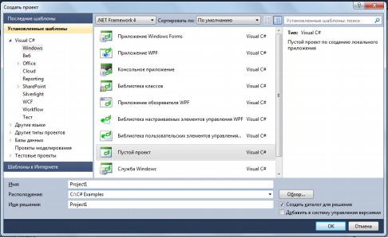
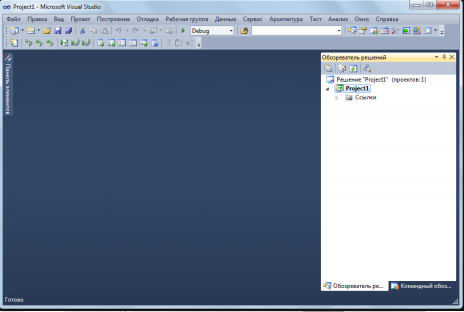
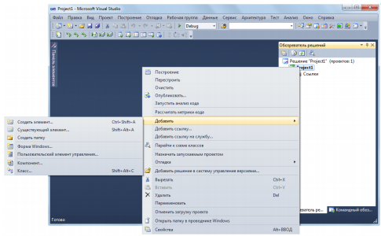
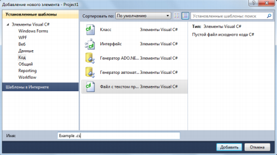
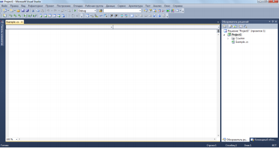
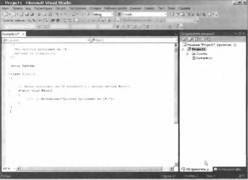
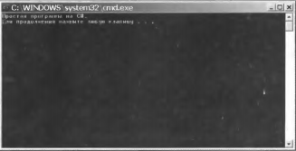

# ГЛАВА 2. Краткий обзор элементов C#

Н
аибольшие трудности в изучении языка програм­
мирования вызывает то обстоятельство, что ни
один из его элементов не существует обособленно.
Напротив, все элементы языка действуют совместно. Такая
взаимосвязанность затрудняет рассмотрение одного аспек­
та C# безотносительно к другому. Поэтому для преодоле­
ния данного затруднения в этой главе дается краткий обзор
нескольких средств языка С#, включая общую форму про­
граммы на С#, ряд основных управляющих и прочих опера­
торов. Вместо того чтобы углубляться в детали, в этой главе
основное внимание уделяется лишь самым общим принци­
пам написания любой программы на С#. А большинство
вопросов, затрагиваемых по ходу изложения материала
этой главы, более подробно рассматриваются в остальных
главах части I.

## Объектно-ориентированное программирование
Основным понятием C# является объектно-ориен­
тированное программирование (ООП). Методика ООП не­
отделима от С#, и поэтому все программы на C# являются
объектно-ориентированными хотя бы в самой малой сте­
пени. В связи с этим очень важно и полезно усвоить осно­
вополагающие принципы ООП, прежде чем приступать
к написанию самой простой программы на С#.

ООП представляет собой эффективный подход к про­
граммированию. Методики программирования претер­
пели существенные изменения с момента изобретения
компьютера, постепенно приспосабливаясь, главным образом, к повышению сложно­
сти программ. Когда, например, появились первые ЭВМ, программирование заклю­
чалось в ручном переключении на разные двоичные машинные команды с переднего
пульта управления ЭВМ. Такой подход был вполне оправданным, поскольку програм­
мы состояли всего из нескольких сотен команд. Дальнейшее усложнение программ
привело к разработке языка ассемблера, который давал программистам возможность
работать с более сложными программами, используя символическое представление
отдельных машинных команд. Постоянное усложнение программ вызвало потреб­
ность в разработке и внедрении в практику программирования таких языков высокого
уровня, как, например, FORTRAN и COBOL, которые предоставляли программистам
больше средств для того, чтобы как-то справиться с постоянно растущей сложностью
программ. Но как только возможности этих первых языков программирования были
полностью исчерпаны, появились разработки языков структурного программирова­
ния, в том числе и С.

На каждом этапе развития программирования появлялись методы и инстру­
ментальные средства для "обуздания" растущей сложности программ. И на каждом
таком этапе новый подход вбирал в себя все самое лучшее из предыдущих, знаме­
нуя собой прогресс в программировании. Это же можно сказать и об ООП. До ООП
многие проекты достигали (а иногда и превышали) предел, за которым структурный
подход к программированию оказывался уже неработоспособным. Поэтому для пре­
одоления трудностей, связанных с усложнением программ, и возникла потребность
в ООП.

ООП вобрало в себя все самые лучшие идеи структурного программирования,
объединив их с рядом новых понятий. В итоге появился новый и лучший способ орга­
низации программ. В самом общем виде программа может быть организована одним
из двух способов: вокруг кода (т.е. того, что фактически происходит) или же вокруг
данных (т.е. того, что подвергается воздействию). Программы, созданные только мето­
дами структурного программирования, как правило, организованы вокруг кода. Такой
подход можно рассматривать "как код, воздействующий на данные".

Совсем иначе работают объектно-ориентированные программы. Они организованы
вокруг данных, исходя из главного принципа: "данные управляют доступом к коду".
В объектно-ориентированном языке программирования определяются данные и код,
которому разрешается воздействовать на эти данные. Следовательно, тип данных точ­
но определяет операции, которые могут быть выполнены над данными.

Для поддержки принципов ООП все объектно-ориентированные языки програм­
мирования, в том числе и С#, должны обладать тремя общими свойствами: инкапсу­
ляцией, полиморфизмом и наследованием. Рассмотрим каждое из этих свойств в от­
дельности.

### Инкапсуляция
Инкапсуляция — это механизм программирования, объединяющий вместе код
и данные, которыми он манипулирует, исключая как вмешательство извне, так и не­
правильное использование данных. В объектно-ориентированном языке данные и код
могут быть объединены в совершенно автономный черный ящик. Внутри такого ящика
находятся все необходимые данные и код. Когда код и данные связываются вместе по­
добным образом, создается объект. Иными словами, объект — это элемент, поддержи­
вающий инкапсуляцию.

В объекте код, данные или же и то и другое могут быть закрытыми или же от­
крытыми. Закрытые данные или код известны и доступны только остальной части
объекта. Это означает, что закрытые данные или код недоступны части программы,
находящейся за пределами объекта. Если же данные или код оказываются открытыми,
то они доступны другим частям программы, хотя и определены внутри объекта. Как
правило, открытые части объекта служат для организации управляемого интерфейса
с закрытыми частями.

Основной единицей инкапсуляции в C# является класс, который определяет форму
объекта. Он описывает данные, а также код, который будет ими оперировать. В C#
описание класса служит для построения объектов, которые являются экземплярами
класса. Следовательно, класс, по существу, представляет собой ряд схематических опи­
саний способа построения объекта.

Код и данные, составляющие вместе класс, называют членами. Данные, определяе­
мые классом, называют полями, или переменными экземпляра. А код, оперирующий
данными, содержится в функциях-членах, самым типичным представителем которых
является метод. В C# метод служит в качестве аналога подпрограммы. (К числу других
функций-членов относятся свойства, события и конструкторы.) Таким образом, методы
класса содержат код, воздействующий на поля, определяемые этим классом.

### Полиморфизм
Полиморфизм, что по-гречески означает "множество форм", — это свойство, по­
зволяющее одному интерфейсу получать доступ к общему классу действий. Простым
примером полиморфизма может служить руль автомашины, который выполняет
одни и те же функции своеобразного интерфейса независимо от вида применяемого
механизма управления автомашиной. Это означает, что руль действует одинаково не­
зависимо от вида рулевого управления: прямого действия, с усилением или реечной
передачей. Следовательно, при вращении руля влево автомашина всегда поворачивает
влево, какой бы вид управления в ней ни применялся. Главное преимущество единоо­
бразного интерфейса заключается в том, что, зная, как обращаться с рулем, вы сумеете
водить автомашину любого типа.

Тот же самый принцип может быть применен и в программировании. Рассмотрим
для примера стек, т.е. область памяти, функционирующую по принципу "последним
пришел — первым обслужен". Допустим, что в программе требуются три разных типа
стеков: один — для целых значений, другой — для значений с плавающей точкой, тре­
тий — для символьных значений. В данном примере алгоритм, реализующий все эти
стеки, остается неизменным, несмотря на то, что в них сохраняются разнотипные дан­
ные. В языке, не являющемся объектно-ориентированным, для этой цели пришлось бы
создать три разных набора стековых подпрограмм с разными именами. Но благодаря
полиморфизму для реализации всех трех типов стеков в C# достаточно создать лишь
один общий набор подпрограмм. Зная, как пользоваться одним стеком, вы сумеете
воспользоваться и остальными.

В более общем смысле понятие полиморфизма нередко выражается следующим
образом: "один интерфейс — множество методов". Это означает, что для группы взаи­
мосвязанных действий можно разработать общий интерфейс. Полиморфизм помогает
упростить программу, позволяя использовать один и тот же интерфейс для описания
общего класса действий. Выбрать конкретное действие (т.е. метод) в каждом отдельном
случае — это задача компилятора. Программисту не нужно делать это самому. Ему
достаточно запомнить и правильно использовать общий интерфейс.

### Наследование
Наследование представляет собой процесс, в ходе которого один объект приобре­
тает свойства другого объекта. Это очень важный процесс, поскольку он обеспечивает
принцип иерархической классификации. Если вдуматься, то большая часть знаний
поддается систематизации благодаря иерархической классификации по нисходящей.
Например, сорт яблок "Джонатан" входит в общую классификацию сортов яблок,
которые, в свою очередь, относятся к классу фруктов, а те — к еще более крупному
классу пищевых продуктов. Это означает, что класс пищевых продуктов обладает ря­
дом свойств (съедобности, питательности и т.д.), которые по логике вещей распростра­
няются и на его подкласс фруктов. Помимо этих свойств, класс фруктов обладает свои­
ми собственными свойствами (сочностью, сладостью и т.д.), которыми он отличается
от других пищевых продуктов. У класса яблок имеются свои характерные особенности
(растут на деревьях, не в тропиках и т.д.). Таким образом, сорт яблок "Джонатан" на­
следует свойства всех предшествующих классов, обладая в то же время свойствами,
присущими только этому сорту яблок, например красной окраской кожицы с желтым
бочком и характерным ароматом и вкусом.

Если не пользоваться иерархиями, то для каждого объекта пришлось бы явно опре­
делять все его свойства. А если воспользоваться наследованием, то достаточно опреде­
лить лишь те свойства, которые делают объект особенным в его классе. Он может так­
же наследовать общие свойства своего родителя. Следовательно, благодаря механизму
наследования один объект становится отдельным экземпляром более общего класса.

### Первая простая программа
А теперь самое время перейти к примеру конкретной программы на С#. Для на­
чала скомпилируем и выполним короткую программу.
```
/*
    Это простая программа на С#.
    Назовем ее Example.cs.
*/
using System;

class Example {
    // Любая программа на C# начинается с вызова метола Main().
    static void Main() {
        Console.WriteLine("Простая программа на С#.");
    }
}
```
Основной средой для разработки программ на C# служит Visual Studio корпорации
Microsoft. Для компилирования примеров всех программ, приведенных для примера
в этой книге, в том числе и тех, где используются новые средства C# 4.0, вам потребует­
ся Visual Studio 2010 или же более поздняя версия, поддерживающая С#.

Создавать, компилировать и выполнять программы на С#, используя Visual Studio,
можно двумя способами: пользуясь, во-первых, интегрированной средой разработки
Visual Studio, а во-вторых, — компилятором командной строки csc.ехе. Далее опи­
сываются оба способа.

### Применение компилятора командной строки csc.ехе
Для коммерческой разработки программ вам, скорее всего, придется пользовать­
ся интегрированной средой Visual Studio, хотя для некоторых читателей более удоб­
ным может оказаться компилятор, работающий в режиме командной строки, осо­
бенно для компилирования и выполнения примеров программ, приведенных в этой
книге. Объясняется это тем, что для работы над отдельной программой не нужно
создавать целый проект. Для этого достаточно написать программу, а затем ском­
пилировать и выполнить ее, причем все это делается из командной строки. Таким
образом, если вы умеете пользоваться окном Командная строка (Command Prompt)
и его интерфейсом в Windows, то компилятор командной строки окажется для вас
более простым и оперативным инструментальным средством, чем интегрированная
среда разработки.

**ПРЕДОСТЕРЕЖЕНИЕ**
Если вы не знаете, как пользоваться окном Командная строка, то вам лучше работать
в интегрированной среде разработки Visual Studio. Ведь пытаться усвоить одновременно
команды интерфейса Командная строка и элементы языка C# не так-то просто, несмотря
на то, что запомнить эти команды совсем нетрудно.

Для написания и выполнения программ на C# с помощью компилятора командной
строки выполните следующую несложную процедуру.
1. Введите исходный текст программы, используя текстовый редактор.
2. Скомпилируйте программу с помощью компилятора csc.ехе.
3. Выполните программу

#### Ввод исходного текста программы
Исходный текст примеров программ, приведенных в этой книге, доступен для за­
грузки по адресу www.mhprofessional.com. Но при желании вы можете сами вве­
сти исходный текст этих программ вручную. Для этого воспользуйтесь избранным
текстовым редактором, например Notepad. Но не забывайте, что вы должны создать
файлы, содержащие простой, а не отформатированный текст, поскольку информация
форматирования текста, сохраняемая в файле для обработки текста, может помешать
нормальной работе компилятора С#. Введя исходный текст программы, присвойте ее
файлу имя Example.cs.

#### Компилирование программы
Для компилирования программы на C# запустите на выполнение компилятор
csc.ехе, указав имя исходного файла в командной строке.
```
С:\>csc Example.cs

```
Компилятор csc создаст файл Example.ехе, содержащий версию MSIL данной
программы. Несмотря на то что псевдокод MSIL не является исполняемым кодом, он
содержится в исполняемом файле с расширением .ехе. Среда CLR автоматически вы­
зывает JIT-компилятор при попытке выполнить файл Example.ехе. Следует, однако,
иметь в виду, что если попытаться выполнить файл Example.ехе (или любой другой
исполняемый файл, содержащий псевдокод MSIL) на том компьютере, где среда .NET
Framework не установлена, то программа не будет выполнена, поскольку на этом ком­
пьютере отсутствует среда CLR.

**ПРИМЕЧАНИЕ**
Прежде чем запускать на выполнение компилятор csc.ехе, откройте окно Командная
строка, настроенное под Visual Studio. Для этого проще всего выбрать команду Visual Studio→
Инструменты Visual Studio→Командная строка Visual Studio (Visual Studio→Visual
Studio Tools→Visual Studio Command Prompt) из меню Пуск→Все программы (Start→AII
Programs) на панели задач Windows. Кроме того, вы можете открыть ненастроенное окно
Командная строка, а затем выполнить командный файл vsvars32.bat, входящий
в состав Visual Studio.

#### Выполнение программы
Для выполнения программы введите ее имя в командной строке следующим
образом.
```
С:\>Ехаmрlе
```
В результате выполнения программы на экране появится такая строка.
```
Простая программа на С#.
```

## Применение интегрированной среды разработки Visual Studio
Visual Studio представляет собой интегрированную среду разработки программ,
созданную корпорацией Microsoft. Такая среда дает возможность править, компили­
ровать, выполнять и отлаживать программы на С#, не покидая эту грамотно органи­
зованную среду. Visual Studio предоставляет не только все необходимые средства для
работы с программами, но и помогает правильно организовать их. Она оказывается
наиболее эффективной для работы над крупными проектами, хотя может быть с тем
же успехом использована и для разработки небольших программ, например, тех, ко­
торые приведены в качестве примера в этой книге.

Ниже приведена краткая процедура правки, компилирования и выполнения
программы на C# в интегрированной среде разработки Visual Studio 2010. При этом
предполагается, что интегрированная среда разработки входит в состав пакета Visual
Studio 2010 Professional. В других версиях Visual Studio возможны незначительные
отличия.

1. Создайте новый (пустой) проект С#, выбрав команду Файл→Создать→Проект (File→New→Project). Затем выберите элемент Windows из списка Установленные шаблоны (Installed Templates) и далее — шаблон Пустой проект (Empty Project), как показано на рисунке.
    **ПРИМЕЧАНИЕ**
    Имя и местоположение вашего проекта может отличаться от того, что показано здесь.

    

    Щелкните на кнопке ОК, чтобы создать проект

2. После создания нового проекта среда Visual Studio будет выглядеть так, как показано на рисунке.
    

    Если по какой-либо причине окно Обозреватель решений (Solution Explorer) будет отсутствовать, откройте его с помощью команды Вид→Обозреватель решений (View→Solution Explorer).

3. На данном этапе проект пуст, и вам нужно ввести в него файл с исходным текстом программы на С#. Для этого щелкните правой кнопкой мыши на имени проекта (в данном случае — Project1) в окне Обозреватель решений, а затем выберите команду Добавить (Add) из контекстного меню. В итоге появится подменю, показанное на рисунке.
    

4. Выберите команду Создать элемент (New Item), чтобы открыть диалоговое окно Добавление нового элемента (Add New Item). Выберите сначала элемент Код (Code) из списка Установленные шаблоны, а затем шаблон Файл с текстом программы (Code File) и измените имя файла на Example.cs, как показано на рисунке.
    

5.  Введите выбранный файл в проект, щелкнув на кнопке Добавить. После этого экран будет выглядеть так, как показано на рисунке.
    

6. Введите исходный текст программы в окне с меткой Example.cs, после чего сохраните этот текст в файле. (Исходный текст примеров программ, приведенных в этой книге, можно свободно загрузить по адресу www.mhprofessional.com, чтобы не вводить его каждый раз вручную.) По завершении ввода исходного текста программы экран будет выглядеть так, как показано на рисунке.
    

7. Скомпилируйте программу, выбрав команду Построение→Построить решение (Build→Build Solution).
8. Выполните программу, выбрав команду Отладка→Запуск без отладки (Debug→Start Without Debugging). В результате выполнения программы откроется окно, показанное на рисунке.
    

Как следует из приведенной выше процедуры, компилирование коротких про­
грамм в интегрированной среде разработки требует выполнения немалого числа ша­
гов. Но для каждого примера программы из этой книги вам совсем не обязательно
создавать новый проект. Вместо этого вы можете пользоваться одним и тем же проек­
том С#. С этой целью удалите текущий исходный файл и введите новый. Затем пере­
компилируйте и выполните программу. Благодаря этому существенно упрощается
весь процесс разработки коротких программ. Однако для разработки реальных при­
ложений каждой программе потребуется отдельный проект.


**ПРИМЕЧАНИЕ**
Приведенных выше инструкций достаточно для компилирования и выполнения примеров
программ, представленных в этой книге, но если вы собираетесь пользоваться Visual Studio
как основной средой для разработки программ, вам придется более подробно ознакомиться
с ее возможностями и средствами. Это весьма эффективная среда разработки программ,
помогающая поддерживать крупные проекты на поддающемся управлению организационном
уровне. Данная интегрированная среда разработки позволяет также правильно организовать
файлы и связанные с проектом ресурсы. Поэтому целесообразно потратить время и приложить
усилия, чтобы приобрести необходимые навыки работы в среде Visual Studio.

## Построчный анализ первого примера программы
Несмотря на то что пример программы Example.cs довольно краток, в нем демон­
стрируется ряд ключевых средств, типичных для всех программ на С#. Проанализиру­
ем более подробно каждую строку этой программы, начиная с ее имени.

В отличие от ряда других языков программирования, и в особенности Java, где имя
файла программы имеет большое значение, имя программы на C# может быть про­
извольным. Ранее вам было предложено присвоить программе из первого примера
имя Example.cs, чтобы успешно скомпилировать и выполнить ее, но в C# файл с ис­
ходным текстом этой программы можно было бы назвать как угодно. Например, его
можно было назвать Sample.cs, Test.cs или даже X.cs.

В файлах с исходным текстом программ на C# условно принято расширение .cs,
и это условие вы должны соблюдать. Кроме того, многие программисты называют
файлы с исходным текстом своих программ по имени основного класса, определенного
в программе. Именно поэтому в рассматриваемом здесь примере было выбрано имя
файла Example.cs. Но поскольку имена программ на C# могут быть произвольными,
то они не указываются в большинстве примеров программ, приведенных в настоящей
книге. Поэтому вы вольны сами выбирать для них имена.

Итак, анализируемая программа начинается с таких строк.
```
/*
    Это простая программа на C#.
    Назовем ее Example.cs.
*/
```
Эти строки образуют комментарий. Как и в большинстве других языков програм­
мирования, в C# допускается вводить комментарии в файл с исходным текстом про­
граммы. Содержимое комментария игнорируется компилятором. Но, с другой сторо­
ны, в комментарии дается краткое описание или пояснение работы программы для
всех, кто читает ее исходный текст. В данном случае в комментарии дается описание
программы и напоминание о том, что ее исходный файл называется Example.cs.
Разумеется, в комментариях к реальным приложениям обычно поясняется работа от­
дельных частей программы или же функции конкретных средств.

В C# поддерживаются три стиля комментариев. Один из них приводится в самом
начале программы и называется многострочным комментарием. Этот стиль коммен­
тария должен начинаться символами /* и оканчиваться символами */. Все, что на­
ходится между этими символами, игнорируется компилятором. Как следует из его
названия, многострочный комментарий может состоять из нескольких строк.

Рассмотрим следующую строку программы.
```
using System;
```
Эта строка означает, что в программе используется пространство имен System.
В C# пространство имен определяет область объявлений. Подробнее о пространстве
имен речь пойдет далее в этой книге, а до тех пор поясним вкратце его назначение.
Благодаря пространству имен одно множество имен отделяется от других. По суще­
ству, имена, объявляемые в одном пространстве имен, не вступают в конфликт с име­
нами, объявляемыми в другом пространстве имен. В анализируемой программе ис­
пользуется пространство имен System, которое зарезервировано для элементов, свя­
занных с библиотекой классов среды .NET Framework, применяемой в С#. Ключевое
слово using просто констатирует тот факт, что в программе используются имена в за­
данном пространстве имен. (Попутно обратим внимание на весьма любопытную воз­
можность создавать собственные пространства имен, что особенно полезно для работы,
над крупными проектами.)

Перейдем к следующей строке программы.
```
class Example {
```
В этой строке ключевое слово class служит для объявления вновь определяемо­
го класса. Как упоминалось выше, класс является основной единицей инкапсуляции
в С#, a Example — это имя класса. Определение класса начинается с открывающей
фигурной скобки ({) и оканчивается закрывающей фигурной скобкой (}). Элементы,
заключенные в эти фигурные скобки, являются членами класса. Не вдаваясь пока что
в подробности, достаточно сказать, что в C# большая часть действий, выполняемых
в программе, происходит именно в классе.

Следующая строка программы содержит однострочный комментарий.
```
// Любая программа на C# начинается с вызова метода Main().
```
Это второй стиль комментариев, поддерживаемых в С#. Однострочный коммен­
тарий начинается и оканчивается символами //. Несмотря на различие стилей ком­
ментариев, программисты нередко пользуются многострочными комментариями для
более длинных примечаний и однострочными комментариями для коротких, построч­
ных примечаний к программе. (Третий стиль комментариев, поддерживаемых в С#,
применяется при создании документации и описывается в приложении А.)
Перейдем к анализу следующей строки программы.
```
static void Main() {
```
Эта строка начинается с метода Main(). Как упоминалось выше, в C# подпрограм­
ма называется методом. И, как поясняется в предшествующем комментарии, именно
с этой строки начинается выполнение программы. Выполнение всех приложений C#
начинается с вызова метода Main(). Разбирать полностью значение каждого элемента
данной строки пока что не имеет смысла, потому что для этого нужно знать ряд других
средств С#. Но поскольку данная строка используется во многих примерах программ,
приведенных в этой книге, то проанализируем ее вкратце.

Данная строка начинается с ключевого слова static. Метод, определяемый ключе­
вым словом static, может вызываться до создания объекта его класса. Необходимость
в этом объясняется тем, что метод Main() вызывается при запуске программы. Ключе­
вое слово void указывает на то, что метод Main() не возвращает значение. В дальней­
шем вы узнаете, что методы могут также возвращать значения. Пустые круглые скоб­
ки после имени метода Main означают, что этому методу не передается никакой ин­
формации. Теоретически методу Main() можно передать информацию, но в данном
примере этого не делается. И последним элементом анализируемой строки является
символ {, обозначающий начало тела метода Main(). Весь код, составляющий тело
метода, находится между открывающими и закрывающими фигурными скобками.
Рассмотрим следующую строку программы. Обратите внимание на то, что она на­
ходится внутри метода Main().
```
Console.WriteLine("Простая программа на С#.");
```
В этой строке осуществляется вывод на экран текстовой строки "Простая про­
грамма на C#. Сам вывод выполняется встроенным методом WriteLine(). В дан­
ном примере метод WriteLine() выводит на экран строку, которая ему передается.
Информация, передаваемая методу, называется аргументом. Помимо текстовых строк,
метод WriteLine() позволяет выводить на экран другие виды информации. Анализи­
руемая строка начинается с Console — имени предопределенного класса, поддержи­
вающего ввод-вывод на консоль. Сочетание обозначений Console и WriteLine() ука­
зывает компилятору на то, что метод WriteLine() является членом класса Console.
Применение в C# объекта для определения вывода на консоль служит еще одним сви­
детельством объектно-ориентированного характера этого языка программирования.
Обратите внимание на то, что оператор, содержащий вызов метода WriteLine(),
оканчивается точкой с запятой, как, впрочем, и рассматривавшаяся ранее дирек­
тива using System. Как правило, операторы в C# оканчиваются точкой с запятой.
Исключением из этого правила служат блоки, которые начинаются символом {
и оканчиваются символом }. Именно поэтому строки программы с этими символами
не оканчиваются точкой с запятой. Блоки обеспечивают механизм группирования опе­
раторов и рассматриваются далее в этой главе.

Первый символ } в анализируемой программе завершает метод Main(), а вто­
рой — определение класса Example.

И наконец, в C# различаются прописные и строчные буквы. Несоблюдение этого
правила может привести к серьезным осложнениям. Так, если вы неумышленно на­
берете main вместо Main или же writeline вместо WriteLine, анализируемая про­
грамма окажется ошибочной. Более того, компилятор C# не предоставит возможность
выполнить классы, которые не содержат метод Main(), хотя и скомпилирует их. По­
этому если вы неверно наберете имя метода Main, то получите от компилятора со­
общение об ошибке, уведомляющее о том, что в исполняемом файле Example.ехе не
определена точка входа.

## Обработка синтаксических ошибок
Если вы только начинаете изучать программирование, то вам следует научиться
правильно истолковывать (и реагировать на) ошибки, которые могут появиться при
попытке скомпилировать программу. Большинство ошибок компиляции возникает
в результате опечаток при наборе исходного текста программы. Все программисты
рано или поздно обнаруживают, что при наборе исходного текста программы очень
легко сделать опечатку. Правда, если вы наберете что-нибудь неправильно, компиля­
тор выдаст соответствующее сообщение о синтаксической ошибке при попытке скомпи­
лировать вашу программу. В таком сообщении обычно указывается номер строки ис­
ходного текста программы, где была обнаружена ошибка, а также кратко описывается
характер ошибки.

Несмотря на всю полезность сообщений о синтаксических ошибках, выдаваемых
компилятором, они иногда вводят в заблуждение. Ведь компилятор C# пытается из­
влечь какой-то смысл из исходного текста, как бы он ни был набран. Именно по этой
причине ошибка, о которой сообщает компилятор, не всегда отражает настоящую
причину возникшего затруднения. Неумышленный пропуск открывающей фигурной
скобки после метода Main() в рассмотренном выше примере программы приводит
к появлению приведенной ниже последовательности сообщений об ошибках при
компиляции данной программы компилятором командной строки csc. (Аналогич­
ные ошибки появляются при компиляции в интегрированной среде разработки Visual
Studio.)
```
EX1.CS(12, 21) : ошибка CS1002: ; ожидалось
ЕХ1.CS(13, 22) : ошибка CS1519: Недопустимая лексема '(' в
объявлении члена класса, структуры или интерфейса
EX1.CS(15, 1) : ошибка CS1022: Требуется определение типа
или пространства имен либо признак конца файла
```
Очевидно, что первое сообщение об ошибке нельзя считать верным, поскольку про­
пущена не точка с запятой, а фигурная скобка. Два других сообщения об ошибках вно­
сят такую же путаницу.

Из всего изложенного выше следует, что если программа содержит синтаксиче­
скую ошибку, то сообщения компилятора не следует понимать буквально, поскольку
они могут ввести в заблуждение. Для выявления истинной причины ошибки может
потребоваться критический пересмотр сообщения об ошибке. Кроме того, полезно
проанализировать несколько строк кода, предшествующих той строке, в которой об­
наружена сообщаемая ошибка. Иногда об ошибке сообщается лишь через несколько
строк после того места, где она действительно произошла.

## Незначительное изменение программы
Несмотря на то что приведенная ниже строка указывается во всех примерах про­
грамм, рассматриваемых в этой книге, формально она не нужна.
```
using System;
```
Тем не менее она указывается ради удобства. Эта строка не нужна потому, что в C#
можно всегда полностью определить имя с помощью пространства имен, к которому
оно принадлежит. Например, строку
```
Console.WriteLine("Простая программа на С#.");
```
можно переписать следующим образом.
```
System.Console.WriteLine("Простая программа на С#.");
```
Таким образом, первый пример программы можно видоизменить так.
```
// В эту версию не включена строка "using System;".
class Example {
    // Любая программа на C# начинается с вызова метода Main().
    static void Main() {
        // Здесь имя Console.WriteLine полностью определено.
       System.Console.WriteLine("Простая программа на С#.");
    }
}
```
Указывать пространство имен System всякий раз, когда используется член этого
пространства, — довольно утомительное занятие, и поэтому большинство програм­
мистов на C# вводят директиву using System в начале своих программ, как это сде­
лано в примерах всех программ, приведенных в данной книге. Следует, однако, иметь
в виду, что любое имя можно всегда определить, явно указав его пространство имен,
если в этом есть необходимость.

## Вторая простая программа
В языке программирования, вероятно, нет более важной конструкции, чем пере­
менная. Переменная — это именованная область памяти, для которой может быть уста­
новлено значение. Она называется переменной потому, что ее значение может быть
изменено по ходу выполнения программы. Иными словами, содержимое переменной
подлежит изменению и не является постоянным.

В приведенной ниже программе создаются две переменные — х и у.
```
// Эта программа демонстрирует применение переменных.
using System;

class Example2 {
    static void Main() {
        int x; // здесь объявляется переменная
        int у; // здесь объявляется еще одна переменная
        х = 100; // здесь переменной х присваивается значение 100
        Console.WriteLine("х содержит " + х);
        у = х / 2;
        Console.Write("у содержит х / 2: ");
        Console.WriteLine(y);
    }
}
```
Выполнение этой программы дает следующий результат.
```
х содержит 100
у содержит х / 2: 50
```
В этой программе вводится ряд новых понятий. Прежде всего, в операторе
```
int х; // здесь объявляется переменная
```
объявляется переменная целочисленного типа с именем х. В C# все переменные долж­
ны объявляться до их применения. Кроме того, нужно обязательно указать тип зна­
чения, которое будет храниться в переменной. Это так называемый тип переменной.
В данном примере в переменной х хранится целочисленное значение, т.е. целое число.
Для объявления в C# переменной целочисленного типа перед ее именем указывает­
ся ключевое слово int. Таким образом, в приведенном выше операторе объявляется
переменная х типа int.

В следующей строке объявляется вторая переменная с именем у.
```
int у; // здесь объявляется еще одна переменная
```
Как видите, эта переменная объявляется таким же образом, как и предыдущая,
за исключением того, что ей присваивается другое имя.

В целом, для объявления переменной служит следующий оператор:
```
тип имя_переменной;
```
где тип — это конкретный тип объявляемой переменной, а имя_переменной — имя
самой переменной. Помимо типа int, в C# поддерживается ряд других типов данных.
В следующей строке программы переменной х присваивается значение 100.
```
х = 100; // здесь переменной х присваивается значение 100
```
В C# оператор присваивания обозначается одиночным знаком равенства (=).

Данный оператор выполняет копирование значения, расположенного справа от знака
равенства, в переменную, находящуюся слева от него.

В следующей строке программы осуществляется вывод на экран текстовой строки
"х содержит " и значения переменной х.
```
Console.WriteLine("х содержит " + х);
```
В этом операторе знак + обозначает, что значение переменной х выводится вслед
за предшествующей ему текстовой строкой. Если обобщить этот частный случай, то
с помощью знака операции + можно организовать сцепление какого угодно числа эле­
ментов в одном операторе с вызовом метода WriteLine().

В следующей строке программы переменной у присваивается значение перемен­
ной х, деленное на 2.
```
у = х / 2;
```
В этой строке значение переменной х делится на 2, а полученный результат со­
храняется в переменной у. Таким образом, после выполнения данной строки в пере­
менной у содержится значение 50. При этом значение переменной х не меняется. Как
и в большинстве других языков программирования, в C# поддерживаются все арифме­
тические операции, в том числе и перечисленные ниже.

+ Сложение
- Вычитание
* Умножение
/ Деление

Рассмотрим две оставшиеся строки программы.
```
Console.Write("у содержит х / 2: ");
Console.WriteLine(у);
```
В этих строках обнаруживаются еще две особенности. Во-первых, для вывода тек­
стовой строки "у содержит х / 2: " на экран используется встроенный метод Write().

После этой текстовой строки новая строка не следует. Это означает, что
последующий вывод будет осуществлен в той же самой строке. Метод Write() по­
добен методу WriteLine(), за исключением того, что после каждого его вызова вы­
вод не начинается с новой строки. И во-вторых, обратите внимание на то, что в вы­
зове метода WriteLine() указывается только переменная у. Оба метода, Write()
и WriteLine(), могут быть использованы для вывода значений любых встроенных в
C# типов.

Прежде чем двигаться дальше, следует упомянуть еще об одной особенности объяв­
ления переменных. Две иди более переменных можно указать в одном операторе
объявления. Нужно лишь разделить их запятой. Например, переменные х и у могут
быть объявлены следующим образом.
```
int х, у; // обе переменные объявляются в одном операторе
```

**ПРИМЕЧАНИЕ**
В C# внедрено средство, называемое неявно типизированной переменной. Неявно
типизированными являются такие переменные, тип которых автоматически определяется
компилятором. Подробнее неявно типизированные переменные рассматриваются в главе 3.

## Другие типы данных
В предыдущем примере программы использовались переменные типа int. Но
в переменных типа int могут храниться только целые числа. Их нельзя использовать
в операциях с числами, имеющими дробную часть. Например, переменная типа int
может содержать значение 18, но не значение 18,3. Правда, int — далеко не единствен­
ный тип данных, определяемых в С#. Для операций с числами, имеющими дробную
часть, в C# предусмотрены два типа данных с плавающей точкой: float и double. Они
обозначают числовые значения с одинарной и двойной точностью соответственно.

Из этих двух типов чаще всего используется тип double.

Для объявления переменной типа double служит оператор
```
double result;
```
где result — это имя переменной типа double. А поскольку переменная result
имеет тип данных с плавающей точкой, то в ней могут храниться такие числовые зна­
чения, как, например, 122,23, 0,034 или -19,0.

Для лучшего понимания отличий между типами данных int и double рассмо­
трим такой пример программы.
```
/*
    Эта программа демонстрирует отличия
    между типами данных int и double.
*/
using System;

class Example3 {
    static void Main() {
        int ivar; // объявить целочисленную переменную
        double dvar; // объявить переменную с плавающей точкой
        ivar = 100; // присвоить переменной ivar значение 100
        dvar = 100.0; // присвоить переменной dvar значение 100.0
        Console.WriteLine("Исходное значение ivar: " + ivar);
        Console.WriteLine("Исходное значение dvar: " + dvar);
        Console.WriteLine(); // вывести пустую строку
        // Разделить значения обеих переменных на 3.
        ivar = ivar / 3;
        dvar = dvar / 3.0;
        Console.WriteLine("Значение ivar после деления: " + ivar);
        Console.WriteLine("Значение dvar после деления: " + dvar);
    }
}
```
Ниже приведен результат выполнения приведенной выше программы.
```
Исходное значение ivar: 100
Исходное значение dvar: 100
Значение ivar после деления: 33
Значение dvar после деления: 33.3333333333333
```
Как видите, при делении значения переменной ivar типа int на 3 остается лишь
целая часть результата — 33, а дробная его часть теряется. В то же время при делении
значения переменной dvar типа double на 3 дробная часть результата сохраняется.
Как демонстрирует данный пример программы, в числовых значениях с плаваю­
щей точкой следует использовать обозначение самой десятичной точки. Например,
значение 100 в С# считается целым, а значение 100,0 — с плавающей точкой.
В данной программе обнаруживается еще одна особенность. Для вывода пустой
строки достаточно вызвать метод WriteLine() без аргументов.

Типы данных с плавающей точкой зачастую используются в операциях с реальными
числовыми величинами, где обычно требуется дробная часть числа. Так, приведенная
ниже программа вычисляет площадь круга, используя значение 3,1416 числа "пи".
```
// Вычислить площадь круга.
using System;

class Circle {
    static void Main() {
        double radius;
        double area;
        radius = 10.0;
        area = radius * radius * 3.1416;
        Console.WriteLine("Площадь равна " + area);
    }
}
```
Выполнение этой программы дает следующий результат.
```
Площадь равна 314.16
```
Очевидно, что вычисление площади круга не дало бы удовлетворительного резуль­
тата, если бы при этом не использовались данные с плавающей точкой.

## Два управляющих оператора
Выполнение программы внутри метода (т.е. в его теле) происходит последователь­
но от одного оператора к другому, т.е. по цепочке сверху вниз. Этот порядок выпол­
нения программы можно изменить с помощью различных управляющих операторов,
поддерживаемых в С#. Более подробно управляющие операторы будут рассмотрены
в дальнейшем, а здесь они представлены вкратце, поскольку используются в последую­
щих примерах программ.

### Условный оператор
С помощью условного оператора if в C# можно организовать выборочное выпол­
нение части программы. Оператор if действует в C# практически так же, как и опера­
тор IF в любом другом языке программирования. В частности, с точки зрения синтак­
сиса он тождествен операторам if в С, C++ и Java. Ниже приведена простейшая форма
этого оператора.
```
if(условие) оператор;
```
Здесь условие представляет собой булево, т.е. логическое, выражение, принимаю­
щее одно из двух значений: "истина" или "ложь". Если условие истинно, то оператор
выполняется. А если условие ложно, то выполнение программы происходит, минуя
оператор. Ниже приведен пример применения условного оператора.
```
if(10 < 11) Console.WriteLine("10 меньше 11");
```
В данном примере условное выражение принимает истинное значение, поскольку
10 меньше 11, и поэтому метод WriteLine() выполняется. А теперь рассмотрим дру­
гой пример.
```
if(10 < 9) Console.WriteLine("не подлежит выводу");
```
В данном примере 10 не меньше 9. Следовательно, вызов метода WriteLine() не
произойдет.

В C# определен полный набор операторов отношения, которые можно использовать
в условных выражениях. Ниже перечислены все эти операторы и их обозначения.

Операция Значение
< Меньше
<= Меньше или равно
> Больше
>= Больше или равно
== Равно
!= Не равно

Далее следует пример еще одной программы, демонстрирующей применение
условного оператора if.
````
// Продемонстрировать применение условного оператора if.
using System;

class IfDemo {
    static void Main() {
        int a, b, c;
        a = 2;
        b = 3;
        if(a < b) Console.WriteLine("а меньше b");
        // He подлежит выводу.
        if(a == b) Console.WriteLine("этого никто не увидит");
        Console.WriteLine();
        c = a - b; // с содержит -1
        Console.WriteLine("с содержит -1");
        if(с >= 0) Console.WriteLine("значение с неотрицательно");
        if(с < 0) Console.WriteLine("значение с отрицательно");
        Console.WriteLine();
        с = b - а; // теперь с содержит 1
        Console.WriteLine("с содержит 1");
        if(с >= 0) Console.WriteLine("значение с неотрицательно");
        if(с < 0) Console.WriteLine("значение с отрицательно ");
    }
}
```
Вот к какому результату приводит выполнение данной программы.
```
а меньше b
с содержит -1
значение с отрицательно
с содержит 1
значение с неотрицательно
```
Обратите внимание на еще одну особенность этой программы. В строке
```
int а, b, с;
```
три переменные, а, b и с, объявляются списком, разделяемым запятыми. Как упоми­
налось выше, если требуется объявить две или более переменные одного и того же
типа, это можно сделать в одном операторе, разделив их имена запятыми.

### Оператор цикла
Для повторного выполнения последовательности операций в программе можно
организовать цикл. Язык C# отличается большим разнообразием циклических кон­
струкций. Здесь будет рассмотрен оператор цикла for. Как и у оператора if, у опе­
ратора for в C# имеются аналоги в С, C++ и Java. Ниже приведена простейшая форма
этого оператора.
```
for(инициализация; условие; итерация) оператор;
```
В самой общей форме в части инициализация данного оператора задается началь­
ное значение переменной управления циклом. Часть условие представляет собой
булево выражение, проверяющее значение переменной управления циклом. Если ре­
зультат проверки истинен, то цикл продолжается. Если же он ложен, то цикл завер­
шается. В части итерация определяется порядок изменения переменной управления
циклом на каждом шаге цикла, когда он повторяется. Ниже приведен пример краткой
программы, демонстрирующей применение оператора цикла for.
```
// Продемонстрировать применение оператора цикла for.
using System;

class ForDemo {
    static void Main() {
        int count;
        for(count = 0; count < 5; count = count+1)
            Console.WriteLine("Это подсчет: " + count);
        Console.WriteLine("Готово!");
    }
}
```
Вот как выглядит результат выполнения данной программы.
```
Это подсчет: 0
Это подсчет: 1
Это подсчет: 2
Это подсчет: 3
Это подсчет: 4
Готово!
```
В данном примере count выполняет роль переменной управления циклом. В ини­
циализирующей части оператора цикла for задается нулевое значение этой перемен­
ной. В начале каждого шага цикла, включая и первый, проверяется условие count < 5.
Если эта проверка дает истинный результат, то выполняется оператор, содержащий
метод WriteLine(). Далее выполняется итерационная часть оператора цикла for,
где значение переменной count увеличивается на 1. Этот процесс повторяется до тех
пор, пока значение переменной count не достигнет величины 5. В этот момент про­
верка упомянутого выше условия дает ложный результат, что приводит к завершению
цикла. Выполнение программы продолжается с оператора, следующего после цикла.

Любопытно, что в программах, профессионально написанных на С#, вы вряд ли уви­
дите итерационную часть оператора цикла в том виде, в каком она представлена в при­
веденном выше примере программы, т.е. вы редко встретите следующую строку.
```
count = count + 1;
```
Дело в том, что в C# имеется специальный оператор инкремента, выполняющий
приращение на 1 значение переменной, или так называемого операнда. Этот оператор
обозначается двумя знаками +(++). Используя оператор инкремента, можно перепи­
сать приведенную выше строку следующим образом.
```
count++;
```
Таким образом, оператор цикла for из приведенного выше примера программы
обычно записывается в следующем виде.
```
for(count = 0; count < 5; count++)
```
Опробуйте этот более краткий способ записи итерационной части цикла. Вы сами
можете убедиться, что данный цикл выполняется так же, как и прежде.

В C# имеется также оператор декремента, обозначаемый двумя дефисами (--). Этот
оператор уменьшает значение операнда на 1.

### Использование кодовых блоков
Еще одним важным элементом C# является кодовый блок, который представляет
собой группу операторов. Для его организации достаточно расположить операторы
между открывающей и закрывающей фигурными скобками. Как только кодовый блок
будет создан, он станет логическим элементом, который можно использовать в любом
месте программы, где применяется одиночный оператор. В частности, кодовый блок
может служить адресатом операторов if и for. Рассмотрим следующий оператор if.
```
if(w < h) {
    v = w * h;
    w = 0;
}
```
Если в данном примере кода значение переменной w меньше значения перемен­
ной h, то оба оператора выполняются в кодовом блоке. Они образуют внутри кодового
блока единый логический элемент, причем один не может выполняться без другого.
Таким образом, если требуется логически связать два (или более) оператора, то для
этой цели следует создать кодовый блок. С помощью кодовых блоков можно более
эффективно и ясно реализовать многие алгоритмы.

Ниже приведен пример программы, в которой кодовый блок служит для того, что­
бы исключить деление на нуль.
```
// Продемонстрировать применение кодового блока.
using System;

class BlockDemo {
    static void Main() {
        int i, j, d;
        i = 5 ;
        j = 10;
        // Адресатом этого оператора if служит кодовый блок.
        if(i != 0) {
            Console.WriteLine("i не равно нулю");
            d = j / i;
            Console.WriteLine("j / i равно " + d);
        }
    }
}
```
Вот к какому результату приводит выполнение данной программы.
```
i не равно нулю
j / i равно 2
```
В данном примере адресатом оператора if служит кодовый блок, а не единствен­
ный оператор. Если условие, управляющее оператором if, оказывается истинным, то
выполняются три оператора в кодовом блоке. Попробуйте задать нулевое значение
переменной i, чтобы посмотреть, что из этого получится.

Рассмотрим еще один пример, где кодовый блок служит для вычисления суммы и
произведения чисел от 1 до 10.
```
// Вычислить сумму и произведение чисел от 1 до 10.
using System;

class ProdSum {
    static void Main() {
        int prod;
        int sum;
        int i;
        sum = 0;
        prod = 1;
        for(i=1; i <= 10; i++) {
            sum = sum + i;
            prod = prod * i;
        }
        Console.WriteLine("Сумма равна " + sum);
        Console.WriteLine("Произведение равно " + prod);
    }
}
```
Ниже приведен результат выполнения данной программы.
```
Сумма равна 55
Произведение равно 3628800
```
В данном примере внутри кодового блока организуется цикл для вычисления сум­
мы и произведения. В отсутствие такого блока для достижения того же самого резуль­
тата пришлось бы организовать два отдельных цикла.

И последнее: кодовые блоки не снижают эффективность программ во время их вы­
полнения. Иными словами, наличие символов { и }, обозначающих кодовый блок,
никоим образом не замедляет выполнение программы. В действительности приме­
нение кодовых блоков, как правило, приводит к повышению быстродействия и эф­
фективности программ, поскольку они упрощают программирование определенных
алгоритмов.

## Точка с запятой и оформление исходного текста программы
В C# точка с запятой обозначает конец оператора. Это означает, что каждый опера­
тор в отдельности должен оканчиваться точкой с запятой.

Как вы уже знаете, кодовый блок представляет собой набор логически связанных
операторов, заключенных в фигурные скобки. Блок не оканчивается точкой с запятой,
поскольку он состоит из группы операторов. Вместо этого окончание кодового блока
обозначается закрывающей фигурной скобкой.

В С# конец строки не означает конец оператора — о его окончании свидетельствует
только точка с запятой. Именно поэтому оператор можно поместить в любой части
строки. Например, на языке C# строки кода
```
х = у;
у = у + 1;
Console.WriteLine(х + " " + у);
```
означают то же самое, что и строка кода
```
х = у; у = у + 1; Consо1е.WriteLine(х + " " + у);
```
Более того, составные элементы оператора можно располагать в отдельных строках.
Например, следующий фрагмент кода считается в C# вполне допустимым.
```
Console.WriteLine("Это длинная строка вывода" +
                х + у + z +
                "дополнительный вывод");
```
Такое разбиение длинных строк нередко применяется для того, чтобы сделать ис­
ходный текст программы более удобным для чтения. Оно помогает также исключить
заворачивание слишком длинных строк.

Возможно, вы уже обратили внимание на то, что в предыдущих примерах про­
грамм некоторые операторы были набраны с отступом. В C# допускается свободная
форма записи. Это означает, что взаимное расположение операторов в строке не
имеет особого значения. Но с годами в программировании сложился общепринятый
стиль оформления исходного текста программ с отступами, что существенно облегчает
чтение этого текста. Именно этому стилю следуют примеры программ в данной книге,
что рекомендуется делать и вам. В соответствии с этим стилем следует делать отступ
(в виде нескольких пробелов) после каждой открывающей фигурной скобки и возвра­
щаться назад после закрывающей фигурной скобки. А для некоторых операторов даже
требуется дополнительный отступ, но об этом речь пойдет далее.

## Ключевые слова C#
Основу любого языка программирования составляют его ключевые слова, посколь­
ку они определяют средства, встроенные в этот язык. В C# определены два общих типа
ключевых слов: зарезервированные и контекстные. Зарезервированные ключевые слова
нельзя использовать в именах переменных, классов или методов. Их можно использо­
вать только в качестве ключевых слов. Именно поэтому они и называются зарезервиро­
ванными. Их иногда еще называют зарезервированными словами, или зарезервированными
идентификаторами. В настоящее время в версии 4.0 языка С# определено 77 зарезерви­
рованных ключевых слов (табл. 2.1).

Таблица 2.1. Ключевые слова, зарезервированные в языке C#
abstract as base bool break
byte case catch char checked
class const continue decimal default
delegate do double else enum
event explicit extern false finally
fixed float for foreach goto
if implicit in int interface
internal is lock long namespace
new null object operator out
override params private protected public
readonly ref return sbyte sealed
short sizeof stackalloc static string
struct switch this throw true
try typeof uint ulong unchecked
unsafe ushort using virtual volatile
void while

Кроме того, в версии C# 4.0 определены 18 контекстных ключевых слов, которые
приобретают особое значение в определенном контексте. В таком контексте они вы­
полняют роль ключевых слов, а вне его они могут использоваться в именах других
элементов программы, например в именах переменных. Следовательно, контекстные
ключевые слова формально не являются зарезервированными. Но, как правило, их сле­
дует считать зарезервированными, избегая их применения в любых других целях. Ведь
применение контекстного ключевого слова в качестве имени какого-нибудь другого
элемента программы может привести к путанице, и поэтому считается многими про­
граммистами плохой практикой. Контекстные ключевые слова приведены в табл. 2.2.
Таблица 2.2. Контекстные ключевые слова в C#
add dynamic from get global
group into join let orderby
partial remove select set value
var where yield


## Идентификаторы
В C# идентификатор представляет собой имя, присваиваемое методу, переменной
или любому другому определяемому пользователем элементу программы. Идентифи­
каторы могут состоять из одного или нескольких символов. Имена переменных могут
начинаться с любой буквы алфавита или знака подчеркивания. Далее может следовать
буква, цифра или знак подчеркивания. С помощью знака подчеркивания можно по­
высить удобочитаемость имени переменной, как, например, line_count. Но иден­
тификаторы, содержащие два знака подчеркивания подряд, например, max__value,
зарезервированы для применения в компиляторе. Прописные и строчные буквы в C#
различаются. Так, например myvar и MyVar — это разные имена переменных. Ниже
приведены некоторые примеры допустимых идентификаторов.
Test x У2 MaxLoad
up _top my_var sample23
Помните, что идентификатор не может начинаться с цифры. Например, 12х — недей­
ствительный идентификатор. Хорошая практика программирования требует выбирать
идентификаторы, отражающие назначение или применение именуемых элементов.
Несмотря на то что зарезервированные ключевые слова нельзя использовать в ка­
честве идентификаторов, в C# разрешается применять ключевое слово с предшествую­
щим знаком @ в качестве допустимого идентификатора. Например, @for — действи­
тельный идентификатор. В этом случае в качестве идентификатора фактически служит
ключевое слово for, а знак @ просто игнорируется. Ниже приведен пример програм­
мы, демонстрирующей применение идентификатора со знаком @.
```
// Продемонстрировать применение идентификатора со знаком @.
using System;
class IdTest {
    static void Main() {
        int @if; // применение ключевого слова if
        // в качестве идентификатора
        for(@if = 0; @if < 10; @if++)
            Console.WriteLine("@if равно " + @if);
    }
}
```
Приведенный ниже результат выполнения этой программы подтверждает, что @if
правильно интерпретируется в качестве идентификатора.
```
@if равно 0
@if равно 1
@if равно 2
@if равно 3
@if равно 4
@if равно 5
@if равно 6
@if равно 7
@if равно 8
@if равно 9
```
Откровенно говоря, применять ключевые слова со знаком @ в качестве идентифи­
каторов не рекомендуется, кроме особых случаев. Помимо того, знак @ может пред­
шествовать любому идентификатору, но такая практика программирования считается
плохой.

## Библиотека классов среды .NET Framework
В примерах программ, представленных в этой главе, применялись два встроен­
ных метода: WriteLine() и Write(). Как упоминалось выше, эти методы являются
членами класса Console, относящегося к пространству имен System, которое опре­
деляется в библиотеке классов для среды .NET Framework. Ранее в этой главе пояс­
нялось, что среда C# опирается на библиотеку классов, предназначенную для среды
.NET Framework, чтобы поддерживать операции ввода-вывода, обработку строк, ра­
боту в сети и графические пользовательские интерфейсы. Поэтому, вообще говоря, C#
представляет собой определенное сочетание самого языка C# и стандартных классов
.NET. Как будет показано далее, библиотека классов обеспечивает функциональные
возможности, являющиеся неотъемлемой частью любой программы на С#. Для того
чтобы научиться программировать на С#, нужно знать не только сам язык, но и уметь
пользоваться стандартными классами. Различные элементы библиотеки классов для
среды .NET Framework рассматриваются в части I этой книги, а в части II — сама
библиотека по отдельным ее составляющим.