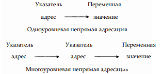

# ГЛАВА 20. Небезопасный код, указатели, обнуляемые типы и разные ключевые слова
В этой главе рассматривается средство языка С#, ко­
торое обычно захватывает программистов врасплох.
Это небезопасный код. В таком коде зачастую ис­
пользуются указатели. Совместно с небезопасным кодом
указатели позволяют разрабатывать на C# приложения,
которые обычно связываются с языком C++, высокой про­
изводительностью и системным кодом. Более того, благода­
ря включению небезопасного кода и указателей в состав C#
в этом языке появились возможности, которые отсутствуют
в Java.

В этой главе рассматриваются также обнуляемые типы,
определения частичных классов и методов, буферы фикси­
рованного размера. И в заключение этой главы представ­
лен ряд ключевых слов, не упоминавшихся в предыдущих
главах.

## Небезопасный код
В C# разрешается писать так называемый "небезопас­
ный" код. В этом странном на первый взгляд утвержде­
нии нет на самом деле ничего необычного. Небезопасным
считается не плохо написанный код, а такой код, который
не может быть выполнен под полным управлением в об­
щеязыковой исполняющей среде (CLR). Как пояснялось в
главе 1, результатом программирования на C# обычно яв­
ляется управляемый код. Тем не менее этот язык програм­
мирования допускает написание кода, который не выпол­
няется под полным управлением в среде CLR. Такой неу­
правляемый код не подчиняется тем же самым средствам
управления и ограничениям, что и управляемый код, и называется он небезопасным
потому, что нельзя никак проверить, не выполняет ли он какое-нибудь опасное дей­
ствие. Следовательно, термин небезопасный совсем не означает, что коду присущи
какие-то изъяны. Это просто означает, что код может выполнять действия, которые не
подлежат контролю в управляемой среде.

Если небезопасный код может вызвать осложнения, то зачем вообще создавать та­
кой код? Дело в том, что управляемый код не позволяет использовать указатели. Если
у вас имеется некоторый опыт программирования на С или C++, то вам должно быть
известно, что указатели представляют собой переменные, предназначенные для хра­
нения адресов других объектов, т.е. они в какой-то степени похожи на ссылки в С#.
Главное отличие указателя заключается в том, что он может указывать на любую об­
ласть памяти, тогда как ссылка всегда указывает на объект своего типа. Но поскольку
указатель способен указывать практически на любую область памяти, то существует
большая вероятность его неправильного использования. Кроме того, используя ука­
затели, легко допустить программные ошибки. Именно поэтому указатели не под­
держиваются при создании управляемого кода в С#. А поскольку указатели все-таки
полезны и необходимы для некоторых видов программирования (например, утилит
системного уровня), в C# разрешается создавать и использовать их. Но при этом все
операции с указателями должны быть помечены как небезопасные, потому что они
выполняются вне управляемой среды.

В языке C# указатели объявляются и используются таким же образом, как и в C/C++.
Если вы знаете, как пользоваться ими в C/C++, то вам нетрудно будет сделать это и в С#.
Но не забывайте, что главное назначение C# — создание управляемого кода. А спо­
собность этого языка программирования поддерживать неуправляемый код следует
использовать для решения лишь особого рода задач. Это, скорее, исключение, чем
правило для программирования на С#. По существу, для компилирования неуправ­
ляемого кода следует использовать параметр компилятора /unsafe.

Указатели составляют основу небезопасного кода, поэтому мы начнем его рассмо­
трение именно с них.

### Основы применения указателей
Указатель представляет собой переменную, хранящую адрес какого-нибудь другого
объекта, например другой переменной. Так, если в переменной х хранится адрес пере­
менной у, то говорят, что переменная х указывает на переменную у. Когда указатель
указывает на переменную, то значение этой переменной может быть получено или
изменено по указателю. Такие операции с указателями называют непрямой адресацией.

#### Объявление указателя
Переменные-указатели должны быть объявлены как таковые. Ниже приведена об­
щая форма объявления переменной-указателя:
```
тип* имя_переменной;
```
где тип обозначает соотносимый тип, который не должен быть ссылочным. Это озна­
чает, что в C# нельзя объявить указатель на объект определенного класса. Соотноси­
мый тип указателя иногда еще называют базовым. Обратите внимание на положение
знака * в объявлении указателя. Он должен следовать после наименования типа.
А имя_переменной обозначает конкретное имя указателя-переменной.

Обратимся к конкретному примеру. Для того чтобы сделать переменную ip указа­
телем на значение типа int, необходимо объявить ее следующим образом.
```
int* ip;
```
А указатель типа float объявляется так, как показано ниже.
```
float* fp;
```
Вообще говоря, если в операторе объявления после имени типа следует знак *, то
это означает, что создается переменная типа указателя.

Тип данных, на которые будет указывать сам указатель, зависит от его соотносимого
типа. Поэтому в приведенных выше примерах переменная ip может служить для ука­
зания на значение типа int, а переменная fp — для указания на значение типа float.
Следует, однако, иметь в виду, что указателю ничто не мешает указывать на что угодно.
Именно поэтому указатели потенциально небезопасны.

Если у вас есть опыт программирования на С/С++, то вы должны ясно понимать
главное отличие в объявлении указателей в C# и C/C++. При объявлении указателя
в C/C++ знак * не разделяет список переменных в объявлении. Поэтому в следующей
строке кода:
```
int* р, q;
```
объявляется указатель р типа int и переменная q типа int. Это равнозначно двум
следующим объявлениям.
```
int* р;
int q;
```
А в C# знак * является разделительным, и поэтому в объявлении
```
int* р, q;
```
создаются две переменные-указателя. Это равнозначно двум следующим объявлениям.
```
int* р;
int* q;
```
Это главное отличие следует иметь в виду при переносе кода C/C++ на С#.

#### Операторы * и & в указателях
В указателях применяются два оператора: * и &. Оператор & является унарным
и возвращает адрес памяти своего операнда. (Напомним, что для унарного оператора
требуется единственный операнд.) Например, в следующем фрагменте кода:
```
int* ip;
int num = 10;
ip = &num;
```
в переменной ip сохраняется адрес памяти переменной num. Это адрес расположения
переменной num в оперативной памяти компьютера. Он не имеет никакого отноше­
ния к значению переменной num. Поэтому в переменной ip содержится не значение
10, являющееся исходным для переменной num, а конкретный адрес, по которому эта
переменная хранится в оперативной памяти. Операцию & можно рассматривать как
возврат адреса той переменной, перед которой она указывается. Таким образом, при­
веденное выше присваивание словами можно описать так: "Переменная ip получает
адрес переменной num.

Второй оператор, *, является дополнением оператора &. Этот унарный оператор на­
ходит значение переменной, расположенной по адресу, на который указывает его опе­
ранд. Следовательно, этот оператор обращается к значению переменной, на которую
указывает соответствующий указатель. Так, если переменная ip содержит адрес памяти
переменной num, как показано в предыдущем примере, то в следующей строке кода:
```
int val = *ip;
```
в переменной val сохраняется значение 10 переменной num, на которую указывает
переменная ip. Операцию * можно рассматривать как получение значения по адресу.
Поэтому приведенный выше оператор присваивания описывается словами следую­
щим образом: "Переменная val получает значение по адресу, хранящемуся в пере­
менной ip."

Оператор * можно использовать также в левой части оператора присваивания.
В этом случае он задает значение, на которое указывает соответствующий указатель,
как в приведенном ниже примере.
```
*ip = 100;
```
В данном примере значение 100 присваивается переменной, на которую указывает
переменная ip, т.е. переменной num. Поэтому приведенный выше оператор присваи­
вания описывается словами следующим образом: "Разместить значение 100 по адресу,
хранящемуся в переменной ip."

### Применение ключевого слова unsafe
Любой код, в котором используются указатели, должен быть помечен как небезо­
пасный с помощью специального ключевого слова unsafe. Подобным образом мож­
но пометить конкретные типы данных (например, классы и структуры), члены класса
(в том числе методы и операторы) или отдельные кодовые блоки как небезопасные.
В качестве примера ниже приведена программа, где указатели используются в методе
Main(), помеченном как небезопасный.
```
// Продемонстрировать применение указателей и ключевого слова unsafe.
using System;

class UnsafeCode {
    // Пометить метод Main() как небезопасный.
    unsafe static void Main() {
        int count = 99;
        int* p; // создать указатель типа int
        p = &count; // поместить адрес переменной count в переменной р

        Console.WriteLine("Исходное значение переменной count: " + *р);

        *р = 10; // присвоить значение 10 переменной count,
                // на которую указывает переменная р

        Console.WriteLine("Новое значение переменной count: " + *р);
    }
}
```
Эта программа дает следующий результат.
```
Исходное значение переменной count: 99
Новое значение переменной count: 10
```

### Применение модификатора fixed
В работе с указателями нередко используется модификатор fixed, который препят­
ствует удалению управляемой переменной средствами "сборки мусора". Потребность
в этом возникает, например, в том случае, если указатель обращается к полю в объекте
определенного класса. А поскольку указателю ничего не известно о действиях системы
"сборки мусора", то он будет указывать не на тот объект, если удалить нужный объект.
Ниже приведена общая форма модификатора fixed:
```
fixed (тип* р = &фиксированный_объект) (
    // использовать фиксированный объект
}
```
где р обозначает указатель, которому присваивается адрес объекта. Этот объект будет
оставаться на своем текущем месте в памяти до конца выполнения кодового блока.
В качестве адресата оператора fixed может быть также указано единственное выраже­
ние, а не целый кодовый блок. Модификатор fixed допускается использовать только
в коде, помеченном как небезопасный. Кроме того, несколько указателей с модифика­
тором fixed могут быть объявлены списком через запятую.

Ниже приведен пример применения модификатора fixed.
```
// Продемонстрировать применение оператора fixed.
using System;

class Test {
    public int num;
    public Test(int i) { num = i; }
}

class FixedCode {
    // Пометить метод Main() как небезопасный.
    unsafe static void Main() {
        Test о = new Test(19);

        fixed (int* p = &o.num) { // использовать модификатор fixed для размещения
            // адреса переменной экземпляр о.num в переменной р
            Console.WriteLine("Исходное значение переменной о.num: " + *р);

            *р = 10; // присвоить значение 10 переменной count,
                    // на которую указывает переменная р

            Console.WriteLine("Новое значение переменной о.num: " + *р);
        }
    }
}
```
Вот к какому результату приводит выполнение этой программы.
```
Исходное значение переменной о.num: 19
Новое значение переменной о.num: 10
```
В данном примере модификатор fixed препятствует удалению объекта о. А по­
скольку переменная р указывает на переменную экземпляра о.num, то она будет ука­
зывать на недостоверную область памяти, если удалить объект о.

### Доступ к членам структуры с помощью указателя
Указатель может указывать на объект типа структуры при условии, что структура
не содержит ссылочные типы данных. Для доступа к члену структуры с помощью ука­
зателя следует использовать оператор-стрелку (->), а не оператор-точку (.). Напри­
мер, доступ к членам структуры
```
struct MyStruct {
    public int a;
    public int b;
    public int Sum() { return a + b; }
}
```
осуществляется следующим образом.
```
MyStruct о = new MyStruct();
MyStruct* p; // объявить указатель

p = &o;
p->a = 10; // использовать оператор ->
p->b = 20; // использовать оператор ->

Console.WriteLine("Сумма равна " + p->Sum());
```

### Арифметические операции над указателями
Над указателями можно выполнять только четыре арифметические операции: ++,
--, + и -. Для того чтобы стало понятнее, что именно происходит в арифметических
операциях над указателями, рассмотрим сначала простой пример. Допустим, что пе­
ременная p1 является указателем с текущим значением 2000, т.е. она содержит адрес
2000. После выполнения выражения
```
p1++;
```
переменная p1 будет содержать значение 2004, а не 2001! Дело в том, что после каждого
инкрементирования переменная p1 указывает на следующее значение типа int. А по­
скольку тип int представлен в C# 4 байтами, то в результате инкрементирования зна­
чение переменной p1 увеличивается на 4. Справедливо и обратное: при каждом декре­
ментировании переменной p1 ее значение уменьшается на 4. Например выражение
```
p1--;
```
приводит к тому, что значение переменной p1 становится равным 1996, если раньше
оно было равно 2000!

Все сказанное выше можно обобщить: после каждого инкрементирования указа­
тель будет указывать на область памяти, где хранится следующий элемент его соот­
носимого типа, а после каждого декрементирования указатель будет указывать на об­
ласть памяти, где хранится предыдущий элемент его соотносимого типа.
Арифметические операции над указателями не ограничиваются только инкремен­
тированием и декрементированием. К указателям можно добавлять и вычитать из них
целые значения. Так, после вычисления следующего выражения:
```
p1 = p1 + 9;
```
переменная p1 будет указывать на девятый элемент ее соотносимого типа по отноше­
нию к элементу, на который она указывает в настоящий момент.

Если складывать указатели нельзя, то разрешается вычитать один указатель из дру­
гого, при условии, что оба указателя имеют один и тот же соотносимый тип. Резуль­
татом такой операции окажется количество элементов соотносимого типа, которые
разделяют оба указателя.

Кроме сложения и вычитания целого числа из указателя, а также вычитания двух
указателей, другие арифметические операции над указателями не разрешаются. В част­
ности, к указателям нельзя добавлять или вычитать из них значения типа float или
double. Не допускаются также арифметические операции над указателями типа void*.

Для того чтобы проверить на практике результаты арифметических операций над
указателями, выполните приведенную ниже короткую программу, где выводятся фи­
зические адреса, на которые указывает целочисленный указатель (ip) и указатель с пла­
вающей точкой одинарной точности (fp). Понаблюдайте за изменениями каждого из
этих указателей по отношению к их соотносимым типам на каждом шаге цикла.
```
// Продемонстрировать результаты арифметических операций над указателями.
using System;

class PtrArithDemo {
    unsafe static void Main() {
        int x;
        int i;
        double d;
        int* ip = &i;
        double* fp = &d;
        Console.WriteLine("int double\n");

        for(x=0; x < 10; x++) {
            Console.WriteLine((uint) (ip) + " " + (uint) (fp));
            ip++;
            fp++;
        }
    }
}
```
Ниже приведен примерный результат выполнения данной программы. У вас он
может оказаться иным, хотя промежутки между выводимыми значения должны быть
такими же самыми.
```
int double

1243464 1243468
1243468 1243476
1243472 1243484
1243476 1243492
1243480 1243500
1243484 1243508
1243488 1243516
1243492 1243524
1243496 1243532
1243500 1243540
```
Как следует из приведенного выше результата, арифметические операции выпол­
няются над указателями относительно их соотносимого типа. Так, значения типа int
занимают в памяти 4 байта, а значения типа double — 8 байтов, и поэтому их адреса
изменяются с приращением именно на эти величины.

### Сравнение указателей
Указатели можно сравнивать с помощью таких операторов отношения, как ==, <
и >. Но для того чтобы результат сравнения указателей оказался содержательным, оба
указателя должны быть каким-то образом связаны друг с другом. Так, если перемен­
ные p1 и р2 являются указателями на две разные и не связанные вместе переменные,
то любое их сравнение, как правило, не имеет никакого смысла. Но если переменные
p1 и р2 указывают на связанные вместе переменные, например на элементы одного
массива, то их сравнение может иметь определенный смысл.

### Указатели и массивы
В C# указатели и массивы связаны друг с другом. Например, при указании имени
массива без индекса в операторе с модификатором fixed формируется указатель на
начало массива. В качестве примера рассмотрим следующую программу.
```
/* Указание имени массива без индекса приводит к
    формированию указателя на начало массива. */
using System;

class PtrArray {
    unsafe static void Main() {
        int[] nums = new int [10];

        fixed(int* p = &nums[0], p2 = nums) {
            if(p == p2)
                Console.WriteLine("Указатели p и p2 содержат " +
                    "один и тот же адрес.");
        }
    }
}
```
Ниже приведен результат выполнения этой программы.
```
Указатели р и р2 содержат один и тот же адрес
```
Как следует из приведенного выше результата, выражения
```
&nums[0]
```
и
```
nums
```
оказываются одинаковыми. Но поскольку вторая форма более лаконична, то она чаще
используется в программировании, когда требуется указатель на начало массива.

#### Индексирование указателей
Когда указатель обращается к массиву, его можно индексировать как сам массив.
Такой синтаксис служит более удобной в некоторых случаях альтернативой арифмети­
ческим операциям над указателями. Рассмотрим следующий пример программы.
```
// Проиндексировать указатель как массив.
using System;

class PtrlndexDemo {
    unsafe static void Main() {
        int[] nums = new int[10];

        // Проиндексировать указатель.
        Console.WriteLine("Индексирование указателя как массива.");
        fixed (int* p = nums) {
        for(int i=0; i < 10; i++)
            p[i] = i; // индексировать указатель как массив

            for(int i=0; i < 10; i++)
                Console.WriteLine("p[{0}]: {1} ", i, p[i]);
        }

        // Использовать арифметические операции над указателями.
        Console.WriteLine("ХпПрименение арифметических " +
                        "операций над указателями.");

        fixed (int* р = nums) {
            for(int i=0; i < 10; i++)
                *(p+i) = i; // использовать арифметическую операцию над указателем

            for(int i=0; i < 10; i++)
                Console.WriteLine("*(p+(0)): {1} ", i, *(p+i));
        }
    }
}
```
Ниже приведен результат выполнения этой программы.
```
Индексирование указателя как массива.
р[0]: 0
p[1]: 1
p[2]: 2
p[3]: 3
p[4]: 4
p[5]: 5
p[6]: 6
p[7]: 7
Р[8]: 8
р[9]: 9
Применение арифметических операций над указателями.
*(р+0) : 0
*(р+1) : 1
*(р+2) : 2
*(р+3) : 3
*(р+4) : 4
*(р+5) : 5
*(р+6) : 6
*(р+7) : 7
*(р+8) : 8
*(р+9) : 9
```
Как следует из результата выполнения приведенной выше программы, общая фор­
ма выражения с указателем
```
*(ptr + i)
```
может быть заменена следующим синтаксисом индексирования массива.
```
ptr[i]
```
Что касается индексирования указателей, то необходимо иметь в виду следующее.
Во-первых, при таком индексировании контроль границ массива не осуществляется.
Поэтому указатель может обращаться к элементу вне границ массива. И во-вторых,
для указателя не предусмотрено свойство Length, определяющее длину массива. Поэ­
тому, если используется указатель, длина массива заранее неизвестна.

### Указатели и строки
Символьные строки реализованы в C# в виде объектов. Тем не менее отдельные сим­
волы в строке могут быть доступны по указателю. Для этого указателю типа char*
присваивается адрес начала символьной строки в следующем операторе с модифика­
тором fixed.
```
fixed(char* р = str) { // ...
```
После выполнения оператора с модификатором fixed переменная р будет указы­
вать на начало массива символов, составляющих строку. Этот массив оканчивается
символом конца строки, т.е. нулевым символом. Поэтому данное обстоятельство мож­
но использовать для проверки конца массива. В С/С++ строки реализуются в виде мас­
сивов, оканчивающихся символом конца строки, а следовательно, получив указатель
типа char* на строку, ею можно манипулировать таким же образом, как и в C/C++.

Ниже приведена программа, демонстрирующая доступ к символьной строке по
указателю типа char*.
```
// Использовать модификатор fixed для получения
// указателя на начало строки.
using System;

class FixedString {
    unsafe static void Main() {
        string str = "это тест";
        // Получить указатель р на начало строки str.
        fixed(char* р = str) {
            // Вывести содержимое строки str по указателю р.
            for(int i=0; p[i] != 0; i++)
                Console.Write(p[i]);
        }
        Console.WriteLine();
    }
}
```
Эта программа дает следующий результат.
```
это тест
```

### Многоуровневая непрямая адресация
Один указатель может указывать на другой, а тот, свою очередь, — на целевое зна­
чение. Это так называемая многоуровневая непрямая адресация, или применение указа­
телей на указатели. Такое применение указателей может показаться, на первый взгляд,
запутанным. Для прояснения принципа многоуровневой непрямой адресации обра­
тимся за помощью к рис. 20.1. Как видите, значением обычного указателя является
адрес переменной, содержащей требуемое значение. Если же применяется указатель
на указатель, то первый из них содержит адрес второго, указывающего на переменную,
содержащую требуемое значение.



Рис. 20.1. Одно- и многоуровневая непрямая адресация

Многоуровневая непрямая адресация может быть продолжена до любого предела,
но потребность более чем в двух уровнях адресации по указателям возникает крайне
редко. На самом деле чрезмерная непрямая адресация очень трудно прослеживается
и чревата ошибками.

Переменная, являющаяся указателем на указатель, должна быть объявлена как та­
ковая. Для этого достаточно указать дополнительный знак * после имени типа пере­
менной. Например, в следующем объявлении компилятор уведомляется о том, что
переменная q является указателем на указатель и относится к типу int.
```
int** q;
```
Следует, однако, иметь в виду, что переменная q является указателем не на целое
значение, а на указатель типа int.

Для доступа к целевому значению, косвенно адресуемому по указателю на указа­
тель, следует дважды применить оператор *, как в приведенном ниже примере.
```
using System;

class MultipleIndirect {
    unsafe static void Main() {
        int x; // содержит значение типа int
        int* p; // содержит указатель типа int
        int** q; // содержит указатель на указатель типа int

        х = 10;
        р = &х; // поместить адрес переменной х в переменной р
        q = &р; // поместить адрес переменной р в переменной q

        Console.WriteLine(**q); // вывести значение переменной х
    }
}
```
Результатом выполнения этой программы будет выведенное на экран значение 10
переменной х. В данной программе переменная р объявляется как указатель на значе­
ние типа int, а переменная q — как указатель на указатель типа int.

И последнее замечание: не путайте многоуровневую непрямую адресацию со
структурами данных высокого уровня, в том числе связными списками, так как это со­
вершенно разные понятия.

### Массивы указателей
Указатели могут быть организованы в массивы, как и любой другой тип данных.
Ниже приведен пример объявления массива указателей типа int длиной в три эле­
мента.
```
int * [] ptrs = new int * [3];
```
Для того чтобы присвоить адрес переменной var типа int третьему элементу мас­
сива указателей, достаточно написать следующую строку кода.
```
ptrs[2] = Svar;
```
А для того чтобы обнаружить значение переменной var, достаточно написать при­
веденную ниже строку кода.
```
*ptrs[2]
```

#### Оператор sizeof
Во время работы с небезопасным кодом иногда полезно знать размер в байтах
одного из встроенных в C# типов значений. Для получения этой информации служит
оператор sizeof. Ниже приведена его общая форма:
```
sizeof(тип)
```
где тип обозначает тот тип, размер которого требуется получить. Вообще говоря, опе­
ратор sizeof предназначен главным образом для особых случаев и, в частности, для
работы со смешанным кодом: управляемым и неуправляемым.

#### Оператор stackalloc
Для распределения памяти, выделенной под стек, служит оператор stackalloc.
Им можно пользоваться лишь при инициализации локальных переменных. Ниже
приведена общая форма этого оператора:
```
тип *р = stackalloc тип[размер]
```
где р обозначает указатель, получающий адрес области памяти, достаточной для хра­
нения объектов, имеющих указанный тип, в количестве, которое обозначает размер.
Если же в стеке недостаточно места для распределения памяти, то генерируется ис­
ключение System.StackOverflowException. И наконец, оператор stackalloc мож­
но использовать только в небезопасном коде.

Как правило, память для объектов выделяется из кучи — динамически распределя­
емой свободной области памяти. А выделение памяти из стека является исключением.
Ведь переменные, располагаемые в стеке, не удаляются средствами "сборки мусора",
а существуют только в течение времени выполнения метода, в котором они объявляют­
ся. После возврата из метода выделенная память освобождается. Преимущество при­
менения оператора stackalloc заключается, в частности, в том, что в этом случае не
нужно беспокоиться об очистке памяти средствами "сборки мусора".

Ниже приведен пример применения оператора stackalloc.
```
// Продемонстрировать применение оператора stackalloc.
using System;

class UseStackAlloc {
    unsafe static void Main() {
        int* ptrs = stackalloc int[3];

        ptrs[0] = 1;
        ptrs[1] = 2;
        ptrs[2] = 3;

        for(int i=0; i < 3; i++)
            Console.WriteLine(ptrs[i]);
    }
}
```
Вот к какому результату приводит выполнение кода из данного примера.
```
1
2
3
```

### Создание буферов фиксированного размера
Ключевое слово fixed находит еще одно применение при создании одномерных
массивов фиксированного размера. В документации на C# такие массивы называются
буферами фиксированного размера. Такие буферы всегда являются членами структуры.
Они предназначены для создания структуры, в которой содержатся элементы массива,
образующие буфер. Когда элемент массива включается в состав структуры, в ней, как
правило, хранится лишь ссылка на этот массив. Используя буфер фиксированного раз­
мера, в структуре можно разместить весь массив. В итоге получается структура, при­
годная в тех случаях, когда важен ее размер, как, например, в многоязыковом програм­
мировании, при согласовании данных, созданных вне программы на С#, или же когда
требуется неуправляемая структура, содержащая массив. Но буферы фиксированного
размера можно использовать только в небезопасном коде.

Для создания буфера фиксированного размера служит следующая общая форма:
```
fixed тип имя_буфера[размер];
```
где тип обозначает тип данных массива; имя_буфера — конкретное имя буфера фик­
сированного размера; размер — количество элементов, образующих буфер. Буферы
фиксированного размера могут указываться только в структуре.

Для того чтобы стала очевиднее польза от буферов фиксированного размера, рас­
смотрим ситуацию, в которой программе ведения счетов, написанной на C++, тре­
буется передать информацию о банковском счете. Допустим также, что учетная запись
каждого счета организована так, как показано ниже.

|         |                                                                         |
|---------|-------------------------------------------------------------------------|
| Name    | Строка длиной 80 байтов, состоящая из 8-разрядных символов в коде ASCII |
| Balance | Числовое значение типа double длиной 8 байтов                           |
| ID      | Числовое значение типа long длиной 8 байтов                             |

В программе на C++ каждая структура содержит массив Name, тогда как в програм­
ме на C# в такой структуре хранится лишь ссылка на массив. Поэтому для правильного
представления данных из этой структуры в C# требуется буфер фиксированного раз­
мера, как показано ниже.
```
// Использовать буфер фиксированного размера.
unsafe struct FixedBankRecord {
	public fixed byte Name[80]; // создать буфер фиксированного размера
	public double Balance;
	public long ID;
}
```
Когда буфер фиксированного размера используется вместо массива Name, каждый
экземпляр структуры FixedBankRecord будет содержать все 80 байтов массива Name.
Именно таким образом структура и организована в программе на C++. Следовательно,
общий размер структуры FixedBankRecord окажется равным 96, т.е. сумме ее членов.
Ниже приведена программа, демонстрирующая этот факт.
```
// Продемонстрировать применение буфера фиксированного размера.
using System;

// Создать буфер фиксированного размера.
unsafe struct FixedBankRecord {
	public fixed byte Name[80];
	public double Balance;
	public long ID;
}

class FixedSizeBuffer {
	// Пометить метод Main() как небезопасный.
	unsafe static void Main() {
		Console.WriteLine("Размер структуры FixedBankRecord: " +
						sizeof(FixedBankRecord));
	}
}
```
Эта программа дает следующий результат.
```
Размер структуры FixedBankRecord: 96
```
Размер структуры FixedBankRecord оказывается в точности равным сумме ее чле­
нов, но так бывает далеко не всегда со структурами, содержащими буферы фиксиро­
ванного размера. Ради повышения эффективности кода общая длина структуры мо­
жет быть увеличена для выравнивания по четной границе, например по границе слова.
Поэтому общая длина структуры может оказаться на несколько байтов больше, чем
сумма ее членов, даже если в ней содержатся буферы фиксированного размера. Как
правило, аналогичное выравнивание длины структуры происходит и в C++. Следует,
однако, иметь в виду возможные отличия в этом отношении.

И наконец, обратите внимание на то, как в данной программе создается буфер фик­
сированного размера вместо массива Name.
```
public fixed byte Name[80]; // создать буфер фиксированного размера
```
Как видите, размер массива указывается после его имени. Такое обозначение обычно
принято в C++ и отличается в объявлениях массивов в С#. В данном операторе распре­
деляется по 80 байтов памяти в пределах каждого объекта типа FixedBankRecord.

## Обнуляемые типы
Начиная с версии 2.0, в C# внедрено средство, обеспечивающее изящное решение
типичной и не очень приятной задачи распознавания и обработки полей, не содержа­
щих значения, т.е. неинициализированных полей. Это средство называется обнуляемым
типом. Для того чтобы стала более понятной суть данной задачи, рассмотрим пример
простой базы данных заказчиков, в которой хранится запись с именем, адресом, иден­
тификационным номером заказчика, номером счета-фактуры и текущим остатком на
счету. В подобной ситуации может быть вполне создан элемент данных заказчика, в ко­
тором одно или несколько полей не инициализированы. Например, заказчик может
просто запросить каталог продукции, и в этом случае номер счета-фактуры не потре­
буется, а значит, его поле окажется неиспользованным.

Раньше для обработки неиспользуемых полей приходилось применять заполняю­
щие значения или дополнительные поля, которые просто указывали, используется
поле или нет. Безусловно, заполняющие значения пригодны лишь в том случае, если
они подставляются вместо значения, которое в противном случае окажется недействи­
тельным, но так бывает далеко не всегда. А дополнительные поля, указывающие, ис­
пользуется поле или нет, пригодны во всех случаях, но их ввод и обработка вручную до­
ставляют немало хлопот. Оба эти затруднения позволяет преодолеть обнуляемый тип.

### Основы применения обнуляемых типов
Обнуляемый тип — это особый вариант типа значения, представленный структу­
рой. Помимо значений, определяемых базовым типом, обнуляемый тип позволяет
хранить пустые значения (null). Следовательно, обнуляемый тип имеет такой же диа­
пазон представления чисел и характеристики, как и его базовый тип. Он предоставляет
дополнительную возможность обозначить значение, указывающее на то, что перемен­
ная данного типа не инициализирована. Обнуляемые типы являются объектами типа
`System.Nullаble<Т>`, где Т — тип значения, которое не должно быть обнуляемым.

**ПРИМЕЧАНИЕ**
Обнуляемые эквиваленты могут быть только у типов значений.

Обнуляемый тип может быть указан двумя способами. Во-первых, объекты типа
`Nullable<T>`, определенного в пространстве имен System, могут быть объявлены яв­
ным образом. Так, в приведенном ниже примере создаются обнуляемые переменные
типа int и bool.
```
System.Nullable<int> count;
System.Nullable<bool> done;
```
И во-вторых, обнуляемый тип объявляется более кратким и поэтому чаще исполь­
зуемым способом с указанием знака ? после имени базового типа. В приведенном
ниже примере демонстрируется более распространенный способ объявления обну­
ляемых переменных типа int и bool.
```
int? count;
bool? done;
```
Когда в коде применяются обнуляемые типы, создаваемый обнуляемый объект
обычно выглядит следующим образом.
```
int? count = null;
```
В данной строке кода переменная count явно инициализируется пустым значени­
ем (null). Это вполне соответствует принятому правилу: прежде чем использовать
переменную, ей нужно присвоить значение. В данном случае присваиваемое значение
означает, что переменная не определена.

Значение может быть присвоено обнуляемой переменной обычным образом, по­
скольку преобразование базового типа в обнуляемый определено заранее. Например,
в следующей строке кода переменной count присваивается значение 100.
```
count = 100;
```
Определить, имеет переменная обнуляемого типа пустое или конкретное значение,
можно двумя способами. Во-первых, можно проверить переменную на пустое значе­
ние. Так, если переменная count объявлена так, как показано выше, то в следующей
строке определяется, имеет ли эта переменная конкретное значение.
```
if (count != null) // переменная имеет значение
```
Если переменная count не является пустой, то она содержит конкретное значение.
И во-вторых, можно воспользоваться доступным только для чтения свойством
HasValue типа `Nullable<T>`, чтобы определить, содержит ли переменная обнуляе­
мого типа конкретное значение. Это свойство показано ниже.
```
bool HasValue
```
Свойство HasValue возвращает логическое значение true, если экземпляр объекта,
для которого оно вызывается, содержит конкретное значение, а иначе оно возвраща­
ет логическое значение false. Ниже приведен пример, в котором конкретное значе­
ние обнуляемого объекта count определяется вторым способом с помощью свойства
HasValue.
```
if(count.HasValue) // переменная имеет значение
```
Если обнуляемый объект содержит конкретное значение, то получить это значение
можно с помощью доступного только для чтения свойства Value типа Nullable<T>.
```
Т Value
```
Свойство Value возвращает экземпляр обнуляемого объекта, для которо­
го оно вызывается. Если же попытаться получить с помощью этого свойства зна­
чение пустой переменной, то в итоге будет сгенерировано исключение System.
InvalidOperationException. Кроме того, значение экземпляра обнуляемого объек­
та можно получить путем приведения к его базовому типу.

В следующей программе демонстрируется основной механизм обращения с обну­
ляемым типом.
```
// Продемонстрировать применение обнуляемого типа.
using System;

class NullableDemo {
	static void Main() {
		int? count = null;
		if(count.HasValue)
			Console.WriteLine("Переменная count имеет следующее значение: " +
							count.Value);
		else
			Console.WriteLine("У переменной count отсутствует значение");

		count = 100;
		if(count.HasValue)
			Console.WriteLine("Переменная count имеет следующее значение: " +
							count.Value);
		else
			Console.WriteLine("У переменной count отсутствует значение");
	}
}
```
Вот к какому результату приводит выполнение этой программы.
```
У переменной count отсутствует значение
Переменная count имеет следующее значение: 100
```

### Применение обнуляемых объектов в выражениях
Обнуляемый объект может использоваться в тех выражениях, которые являются
действительными для его базового типа. Более того, обнуляемые объекты могут со­
четаться с необнуляемыми объектами в одном выражении. И это вполне допустимо
благодаря предопределенному преобразованию базового типа в обнуляемый. Когда
обнуляемые и необнуляемые типы сочетаются в одной операции, ее результатом ста­
новится значение обнуляемого типа.

В приведенной ниже программе демонстрируется применение обнуляемых типов
в выражениях.
```
// Использовать обнуляемые объекты в выражениях.
using System;

class NullableDemo {
	static void Main() {
		int? count = null;
		int? result = null;

		int incr = 10; // переменная incr не является обнуляемой

		// переменная result содержит пустое значение.
		// переменная оказывается count пустой.
		result = count + incr;
		if(result.HasValue)
			Console.WriteLine("Переменная result имеет следующее значение: " +
							result.Value);
		else
			Console.WriteLine("У переменной result отсутствует значение");

		// Теперь переменная count получает свое значение, и поэтому
		// переменная result будет содержать конкретное значение.
		count = 100;
		result = count + incr;
		if(result.HasValue)
			Console.WriteLine("Переменная result имеет следующее значение: " +
							result.Value);
		else
			Console.WriteLine("У переменной result отсутствует значение");
	}
}
```
При выполнении этой программы получается следующий результат.
```
У переменной result отсутствует значение
Переменная result имеет следующее значение: 110
```

### Оператор ??
Попытка преобразовать обнуляемый объект в его базовый тип путем при­
ведения типов обычно приводит к генерированию исключения System.
InvalidOperationException, если обнуляемый объект содержит пустое значение.
Это может произойти, например, в том случае, если значение обнуляемого объекта
присваивается переменной его базового типа с помощью приведения типов. Появле­
ния данного исключения можно избежать, если воспользоваться оператором ??, на­
зываемым нулеобъединяющим оператором. Этот оператор позволяет указать значение,
которое будет использоваться по умолчанию, если обнуляемый объект содержит пу­
стое значение. Он также исключает потребность в приведении типов.

Ниже приведена общая форма оператора ??.
```
обнуляемый_объект ?? значение_по_умолчанию
```
Если обнуляемый_объект содержит конкретное значение, то результатом опера­
ции ?? будет именно это значение. В противном случае результатом операции ?? ока­
жется значение_по_умолчанию.

Например, в приведенном ниже фрагменте кода переменная balance содержит
пустое значение. Вследствие этого переменной currentBalance присваивается зна­
чение 0.0, используемое по умолчанию, и тем самым устраняется причина для гене­
рирования исключения.
```
double? balance = null;
double currentBalance;
currentBalance = balance ?? 0.0;
```
В следующем фрагменте кода переменной balance присваивается значение
123.75.
```
double? balance = 123.75;
double currentBalance;

currentBalance = balance ?? 0.0;
```
Теперь переменная currentBalance содержит значение 123.75 переменной
balance.

И еще одно замечание: выражение в правой части оператора ?? вычисляется толь­
ко в том случае, если выражение в левой его части не содержит значение. Этот факт
демонстрируется в приведенной ниже программе.
```
// Применение оператора ??
using System;

class NullableDemo2 {

	// Возвратить нулевой остаток.
	static double GetZeroBal() {
		Console.WriteLine("В методе GetZeroBalO.");
		return 0.0;
	}

	static void Main() {
		double? balance = 123.75;
		double currentBalance;

		// Здесь метод GetZeroBal() не вызывается, поскольку
		// переменная balance содержит конкретное значение.
		currentBalance = balance ?? GetZeroBal();

		Console.WriteLine(currentBalance);
	}
}
```
В этой программе метод GetZeroBal() не вызывается, поскольку переменная
balance содержит конкретное значение. Как пояснялось выше, если выражение в ле­
вой части оператора ?? содержит конкретное значение, то выражение в правой его
части не вычисляется.

### Обнуляемые объекты, операторы отношения и логические операторы
Обнуляемые объекты могут использоваться в выражениях отношения таким же
образом, как и соответствующие объекты необнуляемого типа. Но они должны под­
чиняться следующему дополнительному правилу: когда два обнуляемых объекта срав­
ниваются в операциях сравнения &lt;, &gt;, &lt;= или &gt;=, то их результат будет ложным, если
любой из обнуляемых объектов оказывается пустым, т.е. содержит значение null.
В качестве примера рассмотрим следующий фрагмент кода.
```
byte? lower = 16;
byte? upper = null;
```
// Здесь переменная lower определена, а переменная upper не определена.
```
if(lower < upper) // ложно
```
В данном случае проверка того, что значение одной переменой меньше значения
другой, дает ложный результат. Хотя это и не совсем очевидно, как, впрочем, и следую­
щая проверка противоположного характера.
```
if(lower > upper) // .. также ложно!
```
Следовательно, если один или оба сравниваемых обнуляемых объекта оказываются
пустыми, то результат их сравнения всегда будет ложным. Это фактически означает,
что пустое значение (null) не участвует в отношении порядка.

Тем не менее с помощью операторов == и != можно проверить, содержит ли обну­
ляемый объект пустое значение. Например, следующая проверка вполне допустима и
дает истинный результат.
```
if(upper == null) // ...
```
Если в логическом выражении участвуют два объекта типа bool?, то его результат
может иметь одно из трех следующих значений: true (истинное), false (ложное) или
null (неопределенное). Ниже приведены результаты применения логических опера­
торов & и | к объектам типа bool?.

| P     | Q     | P &vert; Q | P & Q |
|-------|-------|------------|-------|
| true  | null  | true       | null  |
| false | null  | null       | false |
| null  | true  | true       | null  |
| null  | false | null       | false |
| null  | null  | null       | null  |

И наконец, если логический оператор ! применяется к значению типа bool?, ко­
торое является пустым (null), то результат этой операции будет неопределенным
(null).

## Частичные типы
Начиная с версии 2.0, в C# появилась возможность разделять определение класса,
структуры или интерфейса на две или более части с сохранением каждой из них в от­
дельном файле. Это делается с помощью контекстного ключевого слова partial. Все
эти части объединяются вместе во время компиляции программы.

Если модификатор partial используется для создания частичного типа, то он
принимает следующую общую форму:
```
partial тип имя_типа { // ...
```
где имя_типа обозначает имя класса, структуры или интерфейса, разделяемого на ча­
сти. Каждая часть получающегося частичного типа должна указываться вместе с моди­
фикатором partial.

Рассмотрим пример разделения простого класса, содержащего координаты XY, на
три отдельных файла. Ниже приведено содержимое первого файла.

partial class XY {
	public XY(int a, int b) {
		X = a;
		Y = b;
	}
}

Далее следует содержимое второго файла.
```
partial class XY {
	public int X { get; set; }
}
```
И наконец, содержимое третьего файла.
partial class XY {
	public int Y { get; set; }
}
```
В приведенном ниже файле исходного текста программы демонстрируется при­
менение класса XY.
```
// Продемонстрировать определения частичного класса.
using System;

class Test {
	static void Main() {
		XY xy = new XY (1, 2);
		Console.WriteLine(xy.X + + xy.Y);
	}
}
```
Для того чтобы воспользоваться классом XY, необходимо включить в компиля­
цию все его файлы. Так, если файлы класса XY называются xy1.cs, ху2.cs и ху3.cs,
а класс Test содержится в файле test.cs, то для его компиляции достаточно ввести
в командной строке следующее.
```
csc test.cs xy1.cs xy2.cs хуЗ.cs
```
И последнее замечание: в C# допускаются частичные обобщенные классы. Но пара­
метры типа в объявлении каждого такого класса должны совпадать с теми, что указы­
ваются в остальных его частях.

## Частичные методы
Как пояснялось в предыдущем разделе, с помощью модификатора partial мож­
но создать класс частичного типа. Начиная с версии 3.0, в C# появилась возможность
использовать этот модификатор и для создания частичного метода в элементе данных
частичного типа. Частичный метод объявляется в одной его части, а реализуется в дру­
гой. Следовательно, с помощью модификатора partial можно отделить объявление
метода от его реализации в частичном классе или структуре.

Главная особенность частичного метода заключается в том, что его реализация не
требуется! Если частичный метод не реализуется в другой части класса или структуры,
то все его вызовы молча игнорируются. Это дает возможность определить, но не вос­
требовать дополнительные, хотя и не обязательные функции класса. Если эти функции
не реализованы, то они просто игнорируются.

Ниже приведена расширенная версия предыдущей программы, в которой создает­
ся частичный метод Show(). Этот метод вызывается другим методом, ShowXY(). Ради
удобства все части класса XY представлены в одном файле, но они могут быть распре­
делены по отдельным файлам, как было показано в предыдущем разделе.
```
// Продемонстрировать применение частичного метода.
using System;

partial class XY {
	public XY(int a, int b) {
		X = a;
		Y = b;
	}

	// Объявить частичный метод.
	partial void Show();
}

partial class XY {
	public int X { get; set; }

	// Реализовать частичный метод.
	partial void Show() {
		Console.WriteLine("{0}, {1}", X, Y);
	}
}

partial class XY {
	public int Y { get; set; }

	// Вызвать частичный метод.
	public void ShowXY() {
		Show();
	}
}

class Test {
	static void Main() {
		XY xy = new XY(1, 2);
		xy.ShowXY();
	}
}
```
Обратите внимание на то, что метод Show() объявляется в одной части класса XY,
а реализуется в другой его части. В реализации этого метода выводятся значения ко­
ординат X и Y. Это означает, что когда метод Show() вызывается из метода ShowXY(),
то данный вызов действительно имеет конкретные последствия: вывод значений
координат X и Y. Но если закомментировать реализацию метода Show(), то его вызов
из метода ShowXY() ни к чему не приведет.

Частичным методам присущ ряд следующих ограничений. Они должны возвра­
щать значение типа void. У них не может быть модификаторов доступа и они не могут
быть виртуальными. В них нельзя также использовать параметры out.

## Создание объектов динамического типа
Как уже упоминалось не раз, начиная с главы 3, C# является строго типизирован­
ным языком программирования. Вообще говоря, это означает, что все операции про­
веряются во время компиляции на соответствие типов, и поэтому действия, не под­
держиваемые конкретным типом, не подлежат компиляции. И хотя строгий контроль
типов дает немало преимуществ программирующему, помогая создавать устойчивые
и надежные программы, он может вызвать определенные осложнения в тех случаях,
когда тип объекта остается неизвестным вплоть до времени выполнения. Нечто по­
добное может произойти при использовании рефлексии, доступе к COM-объекту или
же в том случае, если требуется возможность взаимодействия с таким динамическим
языком, как, например, IronPython. До появления версии C# 4.0 подобные ситуации
были трудноразрешимы. Поэтому для выхода из столь затруднительного положения
в версии C# 4.0 был внедрен новый тип данных под названием dynamic.

За одним важным исключением, тип dynamic очень похож на тип object, по­
скольку его можно использовать для ссылки на объект любого типа. А отличается он
от типа object тем, что вся проверка объектов типа dynamic на соответствие типов
откладывает до времени выполнения, тогда как объекты типа object подлежат этой
проверке во время компиляции. Преимущество откладывания подобной проверки до
времени выполнения состоит в том, что во время компиляции предполагается, что
объект типа dynamic поддерживает любые операции, включая применение операто­
ров, вызовы методов, доступ к полям и т.д. Это дает возможность скомпилировать код
без ошибок. Конечно, если во время выполнения фактический тип, присваиваемый
объекту, не поддерживает ту или иную операцию, то возникнет исключительная си­
туация во время выполнения.

В приведенном ниже примере программы применение типа dynamic демонстри­
руется на практике.
```
// Продемонстрировать применение типа dynamic.
using System;
using System.Globalization;

class DynDemo {
	static void Main() {
		// Объявить две динамические переменные.
		dynamic str;
		dynamic val;

		// Поддерживается неявное преобразование в динамические типы.
		// Поэтому следующие присваивания вполне допустимы.
		str = "Это строка";
		val = 10;

		Console.WriteLine("Переменная str содержит: " + str);
		Console.WriteLine("Переменная val содержит: " + val + '\n');

		str = str.ToUpper(CultureInfo.CurrentCulture);
		Console.WriteLine("Переменная str теперь содержит: " + str);

		val = val + 2;
		Console.WriteLine("Переменная val теперь содержит: " + val + '\n');

		string str2 = str.ToLower(CultureInfo.CurrentCulture);
		Console.WriteLine("Переменная str2 содержит: " + str2);

		// Поддерживаются неявные преобразования из динамических типов.
		int х = val * 2;
		Console.WriteLine("Переменная x содержит: " + х);
	}
}
```
Выполнение этой программы дает следующий результат.
```
Переменная str содержит: Это строка
Переменная val содержит: 10

Переменная str теперь содержит: ЭТО СТРОКА
Переменная val теперь содержит: 12

Переменная str2 содержит: это строка
Переменная х содержит: 24
```
Обратите внимание в этой программе на две переменные str и val, объявляемые
с помощью типа dynamic. Это означает, что проверка на соответствие типов операций
с участием обеих переменных не будет произведена во время компиляции. В итоге
для них оказывается пригодной любая операция. В данном случае для переменной
str вызываются методы ToUpper() и ToLower() класса String, а переменная уча­
ствует в операциях сложения и умножения. И хотя все перечисленные выше действия
совместимы с типами объектов, присваиваемых обеим переменным в рассматривае­
мом здесь примере, компилятору об этом ничего не известно — он просто принимает.
И это, конечно, упрощает программирование динамических процедур, хотя и допу­
скает возможность появления ошибок в подобных действиях во время выполнения.
В разбираемом здесь примере программа ведет себя "правильно" во время выпол­
нения, поскольку объекты, присваиваемые упомянутым выше переменным, поддер­
живают действия, выполняемые в программе. В частности, переменной val присваи­
вается целое значение, и поэтому она поддерживает такие целочисленные операции,
как сложение. А переменной str присваивается символьная строка, и поэтому она
поддерживает строковые операции. Следует, однако, иметь в виду, что ответственность
за фактическую поддержку типом объекта, на который делается ссылка, всех операций
над данными типа dynamic возлагается на самого программирующего. В противном
случае выполнение программы завершится аварийным сбоем.

В приведенном выше примере обращает на себя внимание еще одно обстоятель­
ство: переменной типа dynamic может быть присвоен любой тип ссылки на объект
благодаря неявному преобразованию любого типа в тип dynamic. Кроме того, тип
dynamic автоматически преобразуется в любой другой тип. Разумеется, если во время
выполнения такое преобразование окажется неправильным, то произойдет ошибка
при выполнении. Так, если добавить в конце рассматриваемой здесь программы сле­
дующую строку кода:
```
bool b = val;
```
то возникнет ошибка при выполнении из-за отсутствия неявного преобразования типа
int (который оказывается типом переменной val во время выполнения) в тип bool.
Поэтому данная строка кода приведет к ошибке при выполнении, хотя она и будет
скомпилирована безошибочно.

Прежде чем оставить данный пример программы, попробуйте поэксперименти­
ровать с ней. В частности, измените тип переменных str и val на object, а затем
попытайтесь скомпилировать программу еще раз. В итоге появятся ошибки при ком­
пиляции, поскольку тип object не поддерживает действия, выполняемые над обеи­
ми переменными, что и будет обнаружено во время компиляции. В этом, собственно,
и заключается основное отличие типов object и dynamic. Несмотря на то что оба
типа могут использоваться для ссылки на объект любого другого типа, над перемен­
ной типа object можно производить только те действия, которые поддерживаются
типом object. Если же вы используете тип dynamic, то можете указать какое угодно
действие, при условии что это действие поддерживается конкретным объектом, на ко­
торый делается ссылка во время выполнения.

Для того чтобы стало понятно, насколько тип dynamic способен упростить реше­
ние некоторых задач, рассмотрим простой пример его применения вместе с рефлек­
сией. Как пояснялось в главе 17, чтобы вызвать метод для объекта класса, получаемого
во время выполнения с помощью рефлексии, можно, в частности, обратиться к методу
Invoke(). И хотя такой способ оказывается вполне работоспособным, нужный метод
намного удобнее вызвать по имени в тех случаях, когда его имя известно. Например,
вполне возможна такая ситуация, когда в некоторой сборке содержится конкретный
класс, поддерживающий методы, имена и действия которых заранее известны. Но по­
скольку эта сборка подвержена изменениям, то приходится постоянно убеждаться в том,
что используется последняя ее версия. Для проверки текущей версии сборки можно,
например, воспользоваться рефлексией, сконструировать объект искомого класса, а за­
тем вызвать методы, определенные в этом классе. Теперь эти методы можно вызвать по
имени с помощью типа dynamic, а не метода Invoke(), поскольку их имена известны.
Разместите сначала приведенный ниже код в файле с именем MyClass.cs. Этот
код будет динамически загружаться посредством рефлексии.
```
public class DivBy {
	public bool IsDivBylint a, int b) {
		if((a % b) == 0) return true;
		return false;
	}

	public bool IsEven(int a) {
		if((a % 2) == 0) return true;
		return false;
	}
}
```
Затем скомпилируйте этот файл в библиотеку DLL под именем MyClass.dll.
Если вы пользуетесь компилятором командной строки, введите в командной строке
следующее.
```
csc /t:library MyClass.cs
```
Далее составьте программу, в которой применяется библиотека MyClass.dll, как
показано ниже.
```
// Использовать тип dynamic вместе с рефлексией.
using System;
using System.Reflection;

class DynRefDemo {
	static void Main() {
		Assembly asm = Assembly.LoadFrom("MyClass.dll");

		Type[] all = asm.GetTypes();

		// Найти класс DivBy.
		int i;
		for(i = 0; i < all.Length; i++)
			if(all[i].Name == "DivBy") break;

		if(i == all.Length) {
			Console.WriteLine("Класс DivBy не найден в сборке.");
			return;
		}
		Type t = all[i];

		//А теперь найти используемый по умолчанию конструктор.
		ConstructorInfо[] ci = t.GetConstructors();

		int j;
		for(j = 0; j < ci.Length; j++)
			if(ci[j].GetParameters().Length == 0) break;

		if(j == ci.Length) {
			Console.WriteLine("Используемый по умолчанию конструктор не найден.");
			return;
		}

		// Создать объект класса DivBy динамически.
		dynamic obj = ci[j].Invoke (null);

		// Далее вызвать по имени методы для переменной obj. Это вполне допустимо,
		// поскольку переменная obj относится к типу dynamic, а вызовы методов
		// проверяются на соответствие типов во время выполнения, а не компиляции.
		if(obj.IsDivBy(15, 3))
			Console.WriteLine("15 делится нацело на 3.");
		else
			Console.WriteLine("15 HE делится нацело на 3.");

		if(obj.IsEven(9))
			Console.WriteLine("9 четное число.");
		else
			Console.WriteLine("9 HE четное число.");
	}
}
```
Как видите, в данной программе сначала динамически загружается библиотека
MyClass.dll, а затем используется рефлексия для построения объекта класса DivBy.
Построенный объект присваивается далее переменной obj типа dynamic. А раз так,
то методы IsDivBy() и IsEven() могут быть вызваны для переменной obj по имени,
а не с помощью метода Invoke(). В данном примере это вполне допустимо, посколь­
ку переменная obj на самом деле ссылается на объект класса DivBy. В противном слу­
чае выполнение программы завершилось бы неудачно.

Приведенный выше пример сильно упрощен и несколько надуман. Тем не менее он
наглядно показывает главное преимущество, которое дает тип dynamic в тех случаях,
когда типы получаются во время выполнения. Когда характеристики искомого типа,
в том числе методы, операторы, поля и свойства, заранее известны, эти характеристи­
ки могут быть получены по имени с помощью типа dynamic, как следует из приведен­
ного выше примера. Благодаря этому код становится проще, короче и понятнее.
Применяя тип dynamic, следует также иметь в виду, что при компиляции програм­
мы тип dynamic фактически заменяется объектом, а для описания его применения во
время выполнения предоставляется соответствующая информация. И поскольку тип
dynamic компилируется в тип object для целей перегрузки, то оба типа dynamic
и object расцениваются как одно и то же. Поэтому при компиляции двух следующих
перегружаемых методов возникнет ошибка.
```
static void f(object v) { // ... }
static void f(dynamic v) { // ... } // Ошибка!
```
И последнее замечание: тип dynamic поддерживается компонентом DLR (Dynamic
Language Runtime — Средство создания динамических языков во время выполнения),
внедренным в .NET 4.0.

## Возможность взаимодействия с моделью СОМ
В версии C# 4.0 внедрены средства, упрощающие возможность взаимодействия
с неуправляемым кодом, определяемым моделью компонентных объектов (СОМ)
и применяемым, в частности, в COM-объекте Office Automation. Некоторые из этих
средств, в том числе тип dynamic, именованные и необязательные свойства, пригодны
для применения помимо возможности взаимодействия с моделью СОМ. Тема модели
СОМ вообще и COM-объекта Office Automation в частности весьма обширна, а порой и
довольно сложна, чтобы обсуждать ее в этой книге. Поэтому возможность взаимодей­
ствия с моделью СОМ выходит за рамки данной книги.

Тем не менее две особенности, имеющие отношение к возможности взаимодей­
ствия с моделью СОМ, заслуживают краткого рассмотрения в этом разделе. Первая из
них состоит в применении индексированных свойств, а вторая — в возможности пере­
давать аргументы значения тем COM-методам, которым требуется ссылка.

Как вам должно быть уже известно, в C# свойство обычно связывается только с одним
значением с помощью одного из аксессоров get или set. Но совсем иначе дело обсто­
ит со свойствами модели СОМ. Поэтому, начиная с версии C# 4.0, в качестве выхода из
этого затруднительного положения во время работы с COM-объектом появилась воз­
можность пользоваться индексированным свойством для доступа к COM-свойству, име­
ющему несколько параметров. С этой целью имя свойства индексируется, почти так
же, как это делается с помощью индексатора. Допустим, что имеется объект myXLApp,
который относится к типу Microsoft.Office.Interop.Execl.Application.

В прошлом для установки строкового значения "OК" в ячейках С1-СЗ электронной
таблицы Excel можно было бы воспользоваться оператором, аналогичным следую­
щему.
```
myXLapp.get_Range("C1", "С3").set_Value(Type.Missing, "OK");
```
В этой строке кода интервал ячеек электронной таблицы получается при вызове
метода get_Range(), для чего достаточно указать начало и конец интервала. А значе­
ния задаются при вызове метода set_Value(), для чего достаточно указать тип (что
не обязательно) и конкретное значение. В этих методах используются свойства Range и
Value, поскольку у обоих свойств имеются два параметра. Поэтому в прошлом к ним
нельзя было обращаться как к свойствам, но приходилось пользоваться упомянутыми
выше методами. Кроме того, аргумент Type.Missing служил в качестве обычного за­
полнителя, который передавался для указания на тип, используемый по умолчанию.
Но, начиная с версии C# 4.0, появилась возможно переписать приведенный выше опе­
ратор, приведя его к следующей более удобной форме.
```
myXLapp.Range["C1", "С3"].Value = "OK";
```
В этом случае значения интервала ячеек электронной таблицы передаются с ис­
пользованием синтаксиса индексаторов, а заполнитель Туре.Missing уже не нужен,
поскольку данный параметр теперь задается по умолчанию.

Как правило, при определении в методе параметра ref приходится передавать
ссылку на этот параметр. Но, работая с моделью СОМ, можно передавать параметру
ref значение, не заключая его предварительно в оболочку объекта. Дело в том, что
компилятор будет автоматически создавать временный аргумент, который уже заклю­
чен в оболочку объекта, и поэтому указывать параметр ref в списке аргументов уже
не нужно.

## Дружественные сборки
Одну сборку можно сделать дружественной по отношению к другой. Такой сборке
доступны закрытые члены дружественной ей сборки. Благодаря этому средству стано­
вится возможным коллективное использование членов выбранных сборок, причем эти
члены не нужно делать открытыми. Для того чтобы объявить дружественную сборку,
необходимо воспользоваться атрибутом InternalsVisibleTo.

## Разные ключевые слова
В заключение этой главы в частности и всей части I вообще будут вкратце представ­
лены ключевые слова, определенные в C# и не упоминавшиеся в предыдущих главах
данной книги.

### Ключевое слов lock
Ключевое слово lock используется при создании многопоточных программ. Под­
робнее оно рассматривается в главе 23, где речь пойдет о многопоточном программи­
ровании. Но ради полноты изложения ниже приведено краткое описание этого клю­
чевого слова.

Программа на C# может состоять из нескольких потоков исполнения. В этом случае
программа считается многопоточной, и отдельные ее части выполняются параллельно,
т.е. одновременно и независимо друг от друга. В связи с такой организацией програм­
мы возникает особого рода затруднение, когда два потока пытаются воспользоваться
ресурсом, которым можно пользоваться только по очереди. Для разрешения этого за­
труднения можно создать критический раздел кода, который будет одновременно вы­
полняться одним и только одним потоком. И это делается с помощью ключевого слова
lock. Ниже приведена общая форма этого ключевого слова:
```
lock(obj) {
	// критический раздел кода
}
```
где obj обозначает объект, для которого согласуется блокировка кода. Если один поток
уже вошел в критический раздел кода, то второму потоку придется ждать до тех пор,
пока первый поток не выйдет из данного критического раздела кода. Когда же первый
поток покидает критический раздел кода, блокировка снимается и предоставляется
второму потоку. С этого момента второй поток может выполнять критический раздел
кода.

**ПРИМЕЧАНИЕ**
Более подробно ключевое слово lock рассматривается в главе 23.

### Ключевое слово readonly
Отдельное поле можно сделать доступным в классе только для чтения, объявив его
как readonly. Значение такого поля можно установить только с помощью инициали­
затора, когда оно объявляется или же когда ему присваивается значение в конструк­
торе. После того как значение доступного только для чтения поля будет установлено,
оно не подлежит изменению за пределами конструктора. Следовательно, поле типа
readonly удобно для установки фиксированного значения с помощью конструктора.
Такое поле можно, например, использовать для обозначения размера массива, кото­
рый часто используется в программе. Допускаются как статические, так и нестатиче­
ские поля типа readonly.

**ПРИМЕЧАНИЕ**
Несмотря на кажущееся сходство, поля типа readonly не следует путать с полями типа
const, которые рассматриваются далее в этой главе.

Ниже приведен пример применения поля с ключевым словом readonly.
```
// Продемонстрировать применение поля с ключевым словом readonly.
using System;

class MyClass {
	public static readonly int SIZE = 10;
}

class DemoReadOnly {
	static void Main() {
		int[] source = new int[MyClass.SIZE];
		int[] target = new int[MyClass.SIZE];

		// Присвоить ряд значений элементам массива source.
		for(int i=0; i < MyClass.SIZE; i++)
			source[i] = i;

		foreach(int i in source)
			Console.Write(i + " ");

		Console.WriteLine();

		// Перенести обращенную копию массива source в массив target.
		for(int i = MyClass.SIZE-1, j = 0; i > 0; i--, j++)
			target[j] = source[i];

		foreach(int i in target)
			Console.Write(i + " ");

		Console.WriteLine();

		// MyClass.SIZE = 100; // Ошибка!!! He подлежит изменению!
	}
}
```
В данном примере поле MyClass.SIZE инициализируется значением 10. После
этого его можно использовать, но не изменять. Для того чтобы убедиться в этом, уда­
лите символы комментария в начале последней строки приведенного выше кода и по­
пробуйте скомпилировать его. В итоге вы получите сообщение об ошибке.

### Ключевые слова const и volatile
Ключевое слово, или модификатор, const служит для объявления полей и локаль­
ных переменных, которые нельзя изменять. Исходные значения таких полей и пере­
менных должны устанавливаться при их объявлении. Следовательно, переменная с
модификатором const, по существу, является константой. Например, в следующей
строке кода:
```
const int i = 10;
```
создается переменная i типа const и устанавливается ее значение 10. Поле типа const
очень похоже на поле типа readonly, но все же между ними есть отличие. Если поле
типа readonly можно устанавливать в конструкторе, то поле типа const — нельзя.
Ключевое слово, или модификатор, volatile уведомляет компилятор о том, что
значение поля может быть изменено двумя или более параллельно выполняющимися
потоками. В этой ситуации одному потоку может быть неизвестно, когда поле было
изменено другим потоком. И это очень важно, поскольку компилятор C# будет автома­
тически выполнять определенную оптимизацию, которая будет иметь результат лишь
в том случае, если поле доступно только одному потоку. Для того чтобы подобной
оптимизации не подвергалось общедоступное поле, оно объявляется как volatile.
Этим компилятор уведомляется о том, что значение поля типа volatile следует по­
лучать всякий раз, когда к нему осуществляется доступ.

### Оператор using
Помимо рассматривавшейся ранее директивы using, имеется вторая форма ключе­
вого слова using в виде оператора. Ниже приведены две общие формы этого оператора:
```
using (obj) {
	// использовать объект obj
}

using (тип obj = инициализатор) {
	// использовать объект obj
}
```
где obj является выражением, в результате вычисления которого должен быть полу­
чен объект, реализующий интерфейс System.IDisposable. Этот объект определяет
переменную, которая будет использоваться в блоке оператора using. В первой форме
объект объявляется вне оператора using, а во второй форме — в этом операторе. По
завершении блока оператора using для объекта obj вызывается метод Dispose(),
определенный в интерфейсе System.IDisposable. Таким образом, оператор using
предоставляет средства, необходимые для автоматической утилизации объектов, когда
они больше не нужны. Не следует, однако, забывать, что оператор using применяется
только к объектам, реализующим интерфейс System.IDisposable.

В приведенном ниже примере демонстрируются обе формы оператора using.
```
// Продемонстрировать применение оператора using.
using System;
using System.IO;

class UsingDemo {
	static void Main() {
		try {
				StreamReader sr = new StreamReader("test.txt");
				// Использовать объект в операторе using.
			using(sr) {
				// ...
			}
		} catch(IOException exc) {
			// ...
		}

		try {
			// Создать объект класса StreamReader в операторе using.
			using(StreamReader sr2 = new StreamReader("test.txt")) {
				// ...
			}
		} catch(IOException exc) {
			// ...
		}
	}
}
```
В данном примере интерфейс IDisposable реализуется в классе StreamReader
(посредством его базового класса TextReader). Поэтому он может использоваться в
операторе using. По завершении этого оператора автоматически вызывается метод
Dispose() для переменной потока, закрывая тем самым поток.

Как следует из приведенного выше примера, оператор using особенно полезен для
работы с файлами, поскольку файл автоматически закрывается по завершении блока
этого оператора, даже если он и завершается исключением. Таким образом, закрытие
файла с помощью оператора using зачастую упрощает код обработки файлов. Разу­
меется, применение оператора using не ограничивается только работой с файлами.
В среде .NET Framework имеется немало других ресурсов, реализующих интерфейс
IDisposable. И всеми этими ресурсами можно управлять с помощью оператора
using.

### Ключевое слово extern
Ключевое слово extern находит два основных применения. Каждое из них рассма­
тривается далее по порядку.

#### Объявление внешних методов
В первом своем применении ключевое слово extern было доступно с момента соз­
дания С#. Оно обозначает, что метод предоставляется в неуправляемом коде, который
не является составной частью программы. Иными словами, метод предоставляется
внешним кодом.

Для того чтобы объявить метод как внешний, достаточно указать в самом начале его
объявления модификатор extern. Таким образом, общая форма объявления внешне­
го метода выглядит следующим образом.
```
extern возвращаемый_тип имя_метода(список_аргументов);
```
Обратите внимание на отсутствие фигурных скобок.

В данном варианте ключевое слово extern нередко применяется вместе с атри­
бутом DllImport, обозначающим библиотеку DLL, в которой содержится внешний
метод. Атрибут DllImport принадлежит пространству имен System.Runtime.
InteropServices. Он допускает несколько вариантов, но, как правило, достаточно
указать лишь имя библиотеки DLL, в которой содержится внешний метод. Вообще го­
воря, внешние методы следует программировать на С. (Если же это делается на С++, то
имя внешнего метода может быть изменено в библиотеке DLL путем дополнительного
оформления типов.)

Для того чтобы стало понятнее, как пользоваться внешними методами, обратимся
к примеру конкретной программы, состоящей из двух файлов. Ниже приведен ис­
ходный код С из первого файла ExtMeth.с, где определяется метод AbsMax().
```
#include <stdlib.h>

int __declspec(dllexport) AbsMax(int a, int b) {
	return abs(a) < abs(b) ? abs(b) : abs(a);
}
```
В методе AbsMax() сравниваются абсолютные значения двух его параме­
тров и возвращается самое большое из них. Обратите внимание на обозначение _
declspec(dllexport). Это специальное расширение языка С для программных
средств корпорации Microsoft. Оно уведомляет компилятор о необходимости экспор­
тировать метод AbsMax() из библиотеки DLL, в которой он содержится. Для компи­
лирования файла ExtMeth.с в командной строке указывается следующее.
```
CL /LD /MD ExtMeth.с
```
В итоге создается библиотечный файл DLL — ExtMeth.dll.

Далее следует программа на С#, в которой применяется внешний метод
AbsMax().
```
using System;
using System.Runtime.InteropServices;

class ExternMeth {

	// Здесь объявляется внешний метод.
	[DllImport("ExtMeth.dll")]
	public extern static int AbsMax(int a, int b);

	static void Main() {
		// Использовать внешний метод.
		int max = AbsMax(-10, —20);
		Console.WriteLine(max);
	}
}
```
Обратите внимание на использование атрибута DllImport в приведенной выше
программе. Он уведомляет компилятор о наличии библиотеки DLL, содержащей
внешний метод AbsMax(). В данном случае это файл ExtMeth.dll, созданный во вре­
мя компиляции файла с исходным текстом метода AbsMax() на С. В результате вы­
полнения данной программы на экран, как и ожидалось, выводится значение 20.

#### Объявление псевдонима внешней сборки
Во втором применении ключевое слово extern предоставляет псевдоним для
внешней сборки, что полезно в тех случаях, когда в состав программы включаются две
отдельные сборки с одним и тем же именем элемента. Так, если в сборке test1 содер­
жится класс MyClass, а в сборке test2 класс с таким же именем, то при обращении к
классу по этому имени в одной и той же программе может возникнуть конфликт.
Для разрешения подобного конфликта необходимо создать псевдоним каждой
сборки. Это делается в два этапа. На первом этапе нужно указать псевдонимы, исполь­
зуя параметр компилятора /r, как в приведенном ниже примере.
```
/r:Asm1=test1
/r:Asm2=test2
```
А на втором этапе необходимо ввести операторы с ключевым словом extern, в ко­
торых делается ссылка на указанные выше псевдонимы. Ниже приведена форма такого
оператора для создания псевдонима сборки.
```
extern alias имя_сборки;
```
Если продолжить приведенный выше пример, то в программе должны появиться
следующие строки кода.
```
extern alias Asm1;
extern alias Asm2;
```
Теперь оба варианта класса MyClass будут доступны в программе по соответствую­
щему псевдониму.

Рассмотрим полноценный пример программы, в которой демонстрируется приме­
нение внешних псевдонимов. Эта программа состоит из трех файлов. Ниже приведен
исходный текст, который следует поместить в первый файл — test1.cs.
```
using System;

namespace MyNS {
	public class MyClass {
		public MyClass() {
			Console.WriteLine("Конструирование из файла MyClass1.dll.");
		}
	}
}
```
Далее следует исходный текст из файла test2.cs.
```
using System;

namespace MyNS {
	public class MyClass {
		public MyClass() {
			Console.WriteLine("Конструирование из файла MyClass2.dll.");
		}
	}
}
```
Обратите внимание на то, что в обоих файлах, test1.cs и test2.cs, объявляется
пространство имен MyNS и что именно в этом пространстве в обоих файлах опреде­
ляется класс MyClass. Следовательно, без псевдонима оба варианта класса MyClass
будут недоступными ни одной из программ.

И наконец, ниже приведен исходный текст из третьего файла test3.cs, где ис­
пользуются оба варианта класса MyClass из файлов test1.cs и test2.cs. Это стано­
вится возможным благодаря операторам с внешними псевдонимами.
```
// Операторы с внешними псевдонимами должны быть указаны в самом начале файла.
extern alias Asm1;
extern alias Asm2;
using System;

class Demo {
	static void Main() {
		Asm1::MyNS.MyClass t = new Asm1::MyNS.MyClass();
		Asm2::MyNS.MyClass t2 = new Asm2::MyNS.MyClass();
	}
}
```
Сначала следует скомпилировать файлы test1.cs и test2.cs в их библиотечные
эквиваленты DLL. Для этого достаточно ввести в командной строке следующее.
```
csc /t:library test1.cs
csc /t:library test2.cs
```
Затем необходимо скомпилировать файл test3.cs, указав в командной строке
```
csc /r:Asm1=test1.dll /r:Asm2=test2.dll test3.cs
```
Обратите внимание на применение параметра /r, уведомляющего компилятор
о том, что ссылка на метаданные находится в соответствующем файле. В данном слу­
чае псевдоним Asm1 связывается с файлом test1.dll, а псевдоним Asm2 — с файлом
test2.dll.

В самой программе псевдонимы указываются в приведенных ниже операторах
с модификатором extern, которые располагаются в самом начале файла.
```
extern alias Asm1;
extern alias Asm2;
```
А в методе Main() псевдонимы используются для разрешения неоднозначности
ссылок на класс MyClass. Обратите внимание на следующее применение псевдонима
для обращения к классу MyClass.
```
Asm1::MyNS.MyClass
```
В этой строке кода первым указывается псевдоним, затем оператор разрешения
пространства имен, далее имя пространства имен, в котором находится класс с неодно­
значным именем, и, наконец, имя самого класса, следующее после оператора-точки.
Та же самая общая форма пригодна и для других внешних псевдонимов.

Ниже приведен результат выполнения данной программы.
```
Конструирование из файла MyClass1.dll.
Конструирование из файла MyClass2.dll.
```