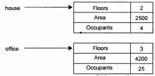

# ГЛАВА 6. Введение в классы, объекты и методы
Эта глава служит введением в классы. Класс составляет
основу языка С#, поскольку он определяет характер
объекта. Кроме того, класс служит основанием для
объектно-ориентированного программирования (ООП).
В пределах класса определяются данные и код. А посколь­
ку классы и объекты относятся к основополагающим эле­
ментам С#, то для их рассмотрения требуется не одна глава
книги. В данной главе рассмотрение классов и объектов на­
чинается с их главных особенностей.

## Основные положения о классах
Классы использовались в примерах программ с самого
начала этой книги. Разумеется, это были лишь самые про­
стые классы, что не позволяло выгодно воспользоваться
большинством их возможностей. На самом же деле классы
намного более эффективны, чем это следует из приведен­
ных ранее примеров их ограниченного применения.

Начнем рассмотрение классов с основных положений.
Класс представляет собой шаблон, по которому определя­
ется форма объекта. В нем указываются данные и код, кото­
рый будет оперировать этими данными. В С# используется
спецификация класса для построения объектов, которые
являются экземплярами класса. Следовательно, класс, по
существу, представляет собой ряд схематических описа­
ний способа построения объекта. При этом очень важно
подчеркнуть, что класс является логической абстракцией.
Физическое представление класса появится в оперативной
памяти лишь после того, как будет создан объект этого
класса.

### Общая форма определения класса
При определении класса объявляются данные, которые он содержит, а также код,
оперирующий этими данными. Если самые простые классы могут содержать только
код или только данные, то большинство настоящих классов содержит и то и другое.

Вообще говоря, данные содержатся в членах данных, определяемых классом, а код —
в функциях-членах. Следует сразу же подчеркнуть, что в C# предусмотрено несколько
разновидностей членов данных и функций-членов. Например, к членам данных, назы­
ваемым также полями, относятся переменные экземпляра и статические переменные,
а к функциям-членам — методы, конструкторы, деструкторы, индексаторы, события,
операторы и свойства. Ограничимся пока что рассмотрением самых основных компо­
нентов класса: переменных экземпляра и методов. А далее в этой главе будут представ­
лены конструкторы и деструкторы. Об остальных разновидностях членов класса речь
пойдет в последующих главах.

Класс создается с помощью ключевого слова class. Ниже приведена общая форма
определения простого класса, содержащая только переменные экземпляра и методы.
```
class имя_класса {
    // Объявление переменных экземпляра.
    доступ тип переменная1;
    доступ тип переменная2;
    //...
    доступ тип переменнаяN;
    // Объявление методов.
    доступ возращаемый_тип метод1(параметры) {
        // тело метода
    }
    доступ возращаемый_тип метод2(параметры) {
        // тело метода
    }
    // ...
    доступ возращаемый_тип методы(параметры) {

    }
}
```
Обратите внимание на то, что перед каждым объявлением переменной и метода
указывается доступ. Это спецификатор доступа, например public, определяющий
порядок доступа к данному члену класса. Как упоминалось в главе 2, члены класса мо­
гут быть как закрытыми (private) в пределах класса, так открытыми (public), т.e. бо­
лее доступными. Спецификатор доступа определяет тип разрешенного доступа. Ука­
зывать спецификатор доступа не обязательно, но если он отсутствует, то объявляемый
член считается закрытым в пределах класса. Члены с закрытым доступом могут ис­
пользоваться только другими членами их класса. В примерах программ, приведенных
в этой главе, все члены, за исключением метода Main(), обозначаются как открытые
(public). Это означает, что их можно использовать во всех остальных фрагментах
кода — даже в тех, что определены за пределами класса. Мы еще вернемся к обсужде­
нию спецификаторов доступа в главе 8.

**ПРИМЕЧАНИЕ**
Помимо спецификатора доступа, в объявлении члена класса могут также присутствовать
один или несколько модификаторов. О модификаторах речь пойдет далее в этой главе.

Несмотря на отсутствие соответствующего правила в синтаксисе С#, правильно
сконструированный класс должен определять одну и только одну логическую сущ­
ность. Например, класс, в котором хранятся Ф.И.О. и номера телефонов, обычно не со­
держит сведения о фондовом рынке, среднем уровне осадков, циклах солнечных пятен
или другую информацию, не связанную с перечисляемыми фамилиями. Таким об­
разом, в правильно сконструированном классе должна быть сгруппирована логически
связанная информация. Если же в один и тот же класс помещается логически несвя­
занная информация, то структурированность кода быстро нарушается.

Классы, использовавшиеся в приведенных ранее примерах программ, содержали
только один метод: Main(). Но в представленной выше общей форме определения
класса метод Main() не указывается. Этот метод требуется указывать в классе лишь в
том случае, если программа начинается с данного класса.

### Определение класса
Для того чтобы продемонстрировать классы на конкретных примерах, разработаем
постепенно класс, инкапсулирующий информацию о зданиях, в том числе о домах,
складских помещениях, учреждениях и т.д. В этом классе (назовем его Building) бу­
дут храниться три элемента информации о зданиях: количество этажей, общая пло­
щадь и количество жильцов.

Ниже приведен первый вариант класса Building. В нем определены три перемен­
ные экземпляра: Floors, Area и Occupants. Как видите, в классе Building вообще
отсутствуют методы. Это означает, что в настоящий момент этот класс состоит только
из данных. (Впоследствии в него будут также введены методы.)
```
class Building {
    public int Floors; // количество этажей
    public int Area; // общая площадь здания
    public int Occupants; // количество жильцов
}
```
Переменные экземпляра, определенные в классе Building, демонстрируют общий
порядок объявления переменных экземпляра. Ниже приведена общая форма для объ­
явления переменных экземпляра:
```
доступ тип имя_переменной;
```
где доступ обозначает вид доступа; тип — конкретный тип переменной, а имя_пере-
менной — имя, присваиваемое переменной. Следовательно, за исключением специфи­
катора доступа, переменная экземпляра объявляется таким же образом, как и локаль­
ная переменная. Все переменные объявлены в классе Building с предваряющим их
модификатором доступа public. Как пояснялось выше, благодаря этому они стано­
вятся доступными за пределами класса Building.

Определение class обозначает создание нового типа данных. В данном случае но­
вый тип данных называется Building. С помощью этого имени могут быть объявлены
объекты типа Building. Не следует, однако, забывать, что объявление class лишь
описывает тип, но не создает конкретный объект. Следовательно, в приведенном выше
фрагменте кода объекты типа Building не создаются.

Для того чтобы создать конкретный объект типа Building, придется воспользо­
ваться следующим оператором.
```
Building house = new Building(); // создать объект типа Building
```
После выполнения этого оператора объект house станет экземпляром класса
Building, т.е. обретет "физическую" реальность. Не обращайте пока что внимание на
отдельные составляющие данного оператора.

Всякий раз, когда получается экземпляр класса, создается также объект, содержа­
щий собственную копию каждой переменной экземпляра, определенной в данном
классе. Таким образом, каждый объект типа Building будет содержать свои копии
переменных экземпляра Floors, Area и Occupants. Для доступа к этим перемен­
ным служит оператор доступа к члену класса, который принято называть оператором-
точкой. Оператор-точка связывает имя объекта с именем члена класса. Ниже приведе­
на общая форма оператора-точки.
```
объект.член
```
В этой форме объект указывается слева, а член — справа. Например, присваива­
ние значения 2 переменной Floors объекта house осуществляется с помощью сле­
дующего оператора.
```
house.Floors = 2;
```
В целом, оператор-точка служит для доступа к переменным экземпляра и мето­
дам. Ниже приведен полноценный пример программы, в которой используется класс
Building.
```
// Программа, в которой используется класс Building.
using System;

class Building {
    public int Floors; // количество этажей
    public int Area; // общая площадь здания
    public int Occupants; // количество жильцов
}

// В этом классе объявляется объект типа Building.
class BuildingDemo {
    static void Main() {
        Building house = new Building(); // создать объект типа Building
        int areaPP; // площадь на одного человека
        // Присвоить значения полям в объекте house.
        house.Occupants = 4;
        house.Area = 2500;
        house.Floors = 2;
        // Вычислить площадь на одного человека.
        areaPP = house.Area / house.Occupants;
        Console.WriteLine("Дом имеет:\n " +
                        house.Floors + " этажа\n " +
                        house.Occupants + " жильца\n " +
                        house.Area +
                        " кв. футов общей площади, из них\n " +
                        агеаРР + " приходится на одного человека");
    }
}
```
Эта программа состоит из двух классов: Building и BuildingDemo. В классе
BuildingDemo сначала создается экземпляр house класса Building с помощью ме­
тода Main(), а затем в коде метода Main() осуществляется доступ к переменным эк­
земпляра house для присваивания им значений и последующего использования этих
значений. Следует особо подчеркнуть, что Building и BuildingDemo — это два со­
вершенно отдельных класса. Единственная взаимосвязь между ними состоит в том, что
в одном из них создается экземпляр другого. Но, несмотря на то, что это раздельные
классы, у кода из класса BuildingDemo имеется доступ к членам класса Building,
поскольку они объявлены как открытые (public). Если бы при их объявлении не был
указан спецификатор доступа public, то доступ к ним ограничивался бы пределами
Building, а следовательно, их нельзя было бы использовать в классе BuildingDemo.
Допустим, что исходный текст приведенной выше программы сохранен в файле
UseBuilding.cs. В результате ее компиляции создается файл UseBuilding.exe.
При этом оба класса, Building и BuildingDemo, автоматически включаются в состав
исполняемого файла. При выполнении данной программы выводится следующий ре­
зультат.
```
Дом имеет:
2 этажа
4 жильца
2500 кв. футов общей площади, из них
625 приходится на одного человека
```
Но классам Building и BuildingDemo совсем не обязательно находиться в одном
и том же исходном файле. Каждый из них можно поместить в отдельный файл, на­
пример Building.cs и BuildingDemo.cs, а компилятору C# достаточно сообщить,
что оба файла должны быть скомпилированы вместе. Так, если разделить рассматри­
ваемую здесь программу на два таких файла, для ее компилирования можно восполь­
зоваться следующей командной строкой.
```
csc Building.cs BuildingDemo.cs
```
Если вы пользуетесь интегрированной средой разработки Visual Studio, то вам нуж­
но ввести оба упомянутых выше файла в свой проект и затем скомпоновать их.
Прежде чем двигаться дальше, рассмотрим следующий основополагающий прин­
цип: у каждого объекта имеются свои копии переменных экземпляра, определенных
в его классе. Следовательно, содержимое переменных в одном объекте может отли­
чаться от их содержимого в другом объекте. Между обоими объектами не существует
никакой связи, за исключением того факта, что они являются объектами одного и того
же типа. Так, если имеются два объекта типа Building, то у каждого из них своя ко­
пия переменных Floors, Area и Occupants, а их содержимое в обоих объектах может
отличаться. Этот факт демонстрируется в следующей программе.
```
// В этой программе создаются два объекта типа Building.
using System;

class Building {
    public int Floors; // количество этажей
    public int Area; // общая площадь здания
    public int Occupants; // количество жильцов
}

// В этом классе объявляются два объекта типа Building.
class BuildingDemo {
    static void Main() {
        Building house = new Building();
        Building office = new Building();
        int areaPP; // площадь на одного человека
        // Присвоить значения полям в объекте house.
        house.Occupants = 4;
        house.Area = 2500;
        house.Floors = 2;
        // Присвоить значения полям в объекте office.
        office.Occupants = 25;
        office.Area = 4200;
        office.Floors = 3;
        // Вычислить площадь на одного человека в жилом доме.
        areaPP = house.Area / house.Occupants;
        Console.WriteLine("Дом имеет\n " +
                        house.Floors + " этажа\n " +
                        house.Occupants + " жильца\n " +
                        house.Area +
                        " кв. футов общей площади, из них\n " +
                        areaPP + " приходится на одного человека");

        // Вычислить площадь на одного человека в учреждении.
        areaPP = office.Area / office.Occupants;
        Console.WriteLine("Учреждение имеет:\n " +
                        office.Floors + " этажа\n " +
                        office.Occupants + " работников\n " +
                        office.Area +
                        " кв. футов общей площади, из них\n " +
                        areaPP + " приходится на одного человека");
    }
}
```
Ниже приведен результат выполнения этой программы.
```
Дом имеет:
2 этажа
4 жильца
2500 кв. футов общей площади, из них
625 приходится на одного человека
Учреждение имеет:
3 этажа
25 работников
4200 кв. футов общей площади, из них
168 приходится на одного человека
```
Как видите, данные из объекта house полностью отделены от данных, содержащих­
ся в объекте office. Эта ситуация наглядно показана на рис. 6.1.




Рис. 6.1. Переменные экземпляра одного объекта полностью отделены от переменных экземпляра другого объекта

## Создание объектов
В предыдущих примерах программ для объявления объекта типа Building ис­
пользовалась следующая строка кода.
```
Building house = new Building!);
```
Эта строка объявления выполняет три функции. Во-первых, объявляется перемен­
ная house, относящаяся к типу класса Building. Сама эта переменная не является
объектом, а лишь переменной, которая может ссылаться на объект. Во-вторых, соз­
дается конкретная, физическая, копия объекта. Это делается с помощью оператора
new. И наконец, переменной house присваивается ссылка на данный объект. Таким
образом, после выполнения анализируемой строки объявленная переменная house
ссылается на объект типа Building.

Оператор new динамически (т.е. во время выполнения) распределяет память для объ­
екта и возвращает ссылку на него, которая затем сохраняется в переменной. Следова­
тельно, в C# для объектов всех классов должна быть динамически распределена память.

Как и следовало ожидать, объявление переменной house можно отделить от созда­
ния объекта, на который она ссылается, следующим образом.
```
Building house; // объявить ссылку на объект
house = new Building(); // распределить память для объекта типа Building
```
В первой строке объявляется переменная house в виде ссылки на объект типа
Building. Следовательно, house — это переменная, которая может ссылаться на объ­
ект, хотя сама она не является объектом. А во второй строке создается новый объект
типа Building, и ссылка на него присваивается переменной house. В итоге перемен­
ная house оказывается связанной с данным объектом.

То обстоятельство, что объекты классов доступны по ссылке, объясняет, почему
классы называются ссылочными типами. Главное отличие типов значений от ссылочных
типов заключается в том, что именно содержит переменная каждого из этих типов.
Так, переменная типа значения содержит конкретное значение. Например, во фраг­
менте кода
```
int х;
х = 10;
```
переменная х содержит значение 10, поскольку она относится к типу int, который
является типом значения. Но в строке
```
Building house = new Building();
```
переменная house содержит не сам объект, а лишь ссылку на него.

## Переменные ссылочного типа и присваивание
В операции присваивания переменные ссылочного типа действуют иначе, чем пе­
ременные типа значения, например типа int. Когда одна переменная типа значения
присваивается другой, ситуация оказывается довольно простой. Переменная, находя­
щаяся в левой части оператора присваивания, получает копию значения переменной,
находящейся в правой части этого оператора. Когда же одна переменная ссылки на
объект присваивается другой, то ситуация несколько усложняется, поскольку такое
присваивание приводит к тому, что переменная, находящаяся в левой части оператора
присваивания, ссылается на тот же самый объект, на который ссылается переменная,
находящаяся в правой части этого оператора. Сам же объект не копируется. В силу
этого отличия присваивание переменных ссылочного типа может привести к несколь­
ко неожиданным результатам. В качестве примера рассмотрим следующий фрагмент
кода.
```
Building house1 = new Building();
Building house2 = house1;
```
На первый взгляд, переменные house1 и house2 ссылаются на совершенно разные
объекты, но на самом деле это не так. Переменные house1 и house2, напротив, ссы­
лаются на один и тот же объект. Когда переменная house1 присваивается переменой
house2, то в конечном итоге переменная house2 просто ссылается на тот же самый объ­
ект, что и переменная house1. Следовательно, этим объектом можно оперировать с по­
мощью переменной house1 или house2. Например, после очередного присваивания
```
house1.Area = 2600;
```
оба метода WriteLine()
```
Console.WriteLine(house1.Area);
Console.WriteLine(house2.Area);
```
выводят одно и то же значение: 2600.

Несмотря на то что обе переменные, house1 и house2, ссылаются на один и тот же
объект, они никак иначе не связаны друг с другом. Например, в результате следующей
последовательности операций присваивания просто изменяется объект, на который
ссылается переменная house2.
```
Building house1 = new Building();
Building house2 = house1;
Building house3 = new Building();
house2 = house3; // теперь обе переменные, house2 и house3,
                 // ссылаются на один и тот же объект.
```
После выполнения этой последовательности операций присваивания перемен­
ная house2 ссылается на тот же самый объект, что и переменная house3. А ссылка на
объект в переменной house1 не меняется.

## Методы
Как пояснялось выше, переменные экземпляра и методы являются двумя основны­
ми составляющими классов. До сих пор класс Building, рассматриваемый здесь в каче­
стве примера, содержал только данные, но не методы. Хотя классы, содержащие только
данные, вполне допустимы, у большинства классов должны быть также методы. Методы
представляют собой подпрограммы, которые манипулируют данными, определенны­
ми в классе, а во многих случаях они предоставляют доступ к этим данным. Как прави­
ло, другие части программы взаимодействуют с классом посредством его методов.

Метод состоит из одного или нескольких операторов. В грамотно написанном коде
C# каждый метод выполняет только одну функцию. У каждого метода имеется свое
имя, по которому он вызывается. В общем, методу в качестве имени можно присвоить
любой действительный идентификатор. Следует, однако, иметь в виду, что идентифи­
катор Main() зарезервирован для метода, с которого начинается выполнение програм­
мы. Кроме того, в качестве имен методов нельзя использовать ключевые слова С#.

В этой книге методы именуются в соответствии с условными обозначениями, при­
нятыми в литературе по С#. В частности, после имени метода следуют круглые скобки.
Так, если методу присвоено имя GetVal, то в тексте книги он упоминается в следую­
щем виде: GetVal(). Такая форма записи помогает отличать имена методов от имен
переменных при чтении книги.

Ниже приведена общая форма определения метода:
```
доступ возращаемый_тип имя(список_параметров) {
    // тело метода
}
```
где доступ — это модификатор доступа, определяющий те части программы, из ко­
торых может вызываться метод. Как пояснялось выше, указывать модификатор досту­
па необязательно. Но если он отсутствует, то метод оказывается закрытым (private)
в пределах того класса, в котором он объявляется. Мы будем пока что объявлять методы
открытыми (public), чтобы вызывать их из любой другой части кода в программе. За­
тем возращаемый_тип обозначает тип данных, возвращаемых методом. Этот тип должен
быть действительным, в том числе и типом создаваемого класса. Если метод не возвра­
щает значение, то в качестве возвращаемого для него следует указать тип void. Далее
имя обозначает конкретное имя, присваиваемое методу. В качестве имени метода может
служить любой допустимый идентификатор, не приводящий к конфликтам в текущей
области объявлений. И наконец, список_параметров — это последовательность пар, со­
стоящих из типа и идентификатора и разделенных запятыми. Параметры представляют
собой переменные, получающие значение аргументов, передаваемых методу при его вы­
зове. Если у метода отсутствуют параметры, то список параметров оказывается пустым.

### Добавление метода в класс Building
Как пояснялось выше, методы класса, как правило, манипулируют данными класса
и предоставляют доступ к ним. С учетом этого напомним, что в приведенных выше
примерах в методе Main() вычислялась площадь на одного человека путем деления
общей площади здания на количество жильцов. И хотя такой способ формально счи­
тается правильным, на самом деле он оказывается далеко не самым лучшим для орга­
низации подобного вычисления. Площадь на одного человека лучше всего вычислять
в самом классе Building, просто потому, что так легче понять сам характер вычисле­
ния. Ведь площадь на одного человека зависит от значений в полях Area и Occupants,
инкапсулированных в классе Building. Следовательно, данное вычисление может
быть вполне произведено в самом классе Building. Кроме того, вводя вычисление
площади на одного человека в класс Building, мы тем самым избавляем все програм­
мы, пользующиеся классом Building, от необходимости выполнять это вычисление
самостоятельно. Благодаря этому исключается ненужное дублирование кода. И нако­
нец, добавление в класс Building метода, вычисляющего площадь на одного человека,
способствует улучшению его объектно-ориентированной структуры, поскольку вели­
чины, непосредственно связанные со зданием, инкапсулируются в классе Building.

Для того чтобы добавить метод в класс Building, достаточно указать его в обла­
сти объявлений в данном классе. В качестве примера ниже приведен переработанный
вариант класса Building, содержащий метод AreaPerPerson(), который выводит
площадь, рассчитанную на одного человека в конкретном здании.
```
// Добавить метод в класс Building.
using System;

class Building {
    public int Floors; // количество этажей
    public int Area; // общая площадь здания
    public int Occupants; // количество жильцов
    // Вывести площадь на одного человека,
    public void AreaPerPerson() {
        Console.WriteLine(" " + Area / Occupants +
                        " приходится на одного человека");
    }
}

// Использовать метод AreaPerPerson().
class BuildingDemo {
    static void Main() {
        Building house = new Building();
        Building office = new Building();
        // Присвоить значения полям в объекте house.
        house.Occupants = 4;
        house.Area = 2500;
        house.Floors = 2;
        // Присвоить значения полям в объекте office.
        office.Occupants = 25;
        office.Area = 4200;
        office.Floors = 3;
        Console.WriteLine("Дом имеет:\n " +
                        house.Floors + " этажа\n " +
                        house.Occupants + " жильца\n " +
                        house.Area +
                        "кв. футов общей площади, из них");
        house.AreaPerPerson();
        Console.WriteLine();
        Console.WriteLine("Учреждение имеет:\n " +
                        office.Floors + " этажа\n " +
                        office.Occupants + " работников\n " +
                        office.Area +
                        " кв. футов общей площади, из них");
        office.AreaPerPerson();
    }
}
```
Эта программа дает такой же результат, как и прежде.
```
Дом имеет:
2 этажа
4 жильца
2500 кв. футов общей площади, из них
625 приходится на одного человека
Учреждение имеет:
3 этажа
25 работников
4200 кв. футов общей площади, из них
168 приходится на одного человека
```
Рассмотрим основные элементы этой программы, начиная с метода
AreaPerPerson(). Первая его строка выглядит следующим образом.
```
public void AreaPerPerson() {
```
В этой строке объявляется метод, именуемый AreaPerPerson и не имеющий параме­
тров. Для него указывается тип public, а это означает, что его можно вызывать из любой
другой части программы. Метод AreaPerPerson() возвращает пустое значение типа
void, т.е. он практически ничего не возвращает вызывающей части программы. Анали­
зируемая строка завершается фигурной скобкой, открывающей тело данного метода.

Тело метода AreaPerPerson() состоит всего лишь из одного оператора.
```
Console.WriteLine(" " + Area / Occupants +
                " приходится на одного человека");
```
Этот оператор осуществляет вывод величины площади на одного человека, ко­
торая получается путем деления общей площади здания (переменной Area) на ко­
личество жильцов (переменную Occupants). А поскольку у каждого объекта типа
Building имеется своя копия переменных Area и Occupants, то при вызове метода
AreaPerPerson() в вычислении используются копии этих переменных, принадлежа­
щие вызывающему объекту.

Метод AreaPerPerson() завершается закрывающейся фигурной скобкой. Когда
встречается эта скобка, управление передается обратно вызывающей части программы.
Далее проанализируем внимательно следующую строку кода из метода Main().
```
house.AreaPerPerson();
```
В этой строке вызывается метод AreaPerPerson() для объекта house. Это озна­
чает, что метод AreaPerPerson() вызывается относительно объекта, на который
ссылается переменная house, и для этой цели служит оператор-точка. Когда метод
AreaPerPerson() вызывается, ему передается управление программой. А по его за­
вершении управление передается обратно вызывающей части программы, выполне­
ние которой возобновляется со строки кода, следующей после вызова данного метода.

В данном случае в результате вызова house.AreaPerPerson() выводится пло­
щадь на одного человека в здании, определенном в объекте house. Аналогично, в ре­
зультате вызова office.AreaPerPerson() выводится площадь на одного человека
в здании, определенном в объекте office. Таким образом, при каждом вызове метода
AreaPerPerson() выводится площадь на одного человека для указанного объекта.

В методе AreaPerPerson() особого внимания заслуживает следующее обстоятель­
ство: обращение к переменным экземпляра Area и Occupants осуществляется непо­
средственно, т.е. без помощи оператора-точки. Если в методе используется переменная
экземпляра, определенная в его классе, то делается это непосредственно, без указания
явной ссылки на объект и без помощи оператора-точки. Понять это нетрудно, если хо­
рошенько подумать. Ведь метод всегда вызывается относительно некоторого объекта его
класса. Как только вызов произойдет, объект становится известным. Поэтому объект не
нужно указывать в методе еще раз. В данном случае это означает, что переменные эк­
земпляра Area и Occupants в методе AreaPerPerson() неявно ссылаются на копии
этих же переменных в том объекте, который вызывает метод AreaPerPerson().

**ПРИМЕЧАНИЕ**
Попутно следует заметить, что значение переменной Occupants в методе
AreaPerPerson() не должно быть равно нулю (это касается всех примеров, приведенных
в данной главе). Если бы значение переменной Occupants оказалось равным нулю, то
произошла бы ошибка из-за деления на нуль. В главе 13, где рассматриваются исключительные
ситуации, будет показано, каким образом в C# отслеживаются и обрабатываются ошибки,
которые могут возникнуть во время выполнения программы.

### Возврат из метода
В целом, возврат из метода может произойти при двух условиях. Во-первых, когда
встречается фигурная скобка, закрывающая тело метода, как показывает пример метода
AreaPerPerson() из приведенной выше программы. И во-вторых, когда выполняется
оператор return. Имеются две формы оператора return: одна — для методов типа
void, т.е. тех методов, которые не возвращают значения, а другая — для методов, возвра­
щающих конкретные значения. Первая форма рассматривается в этом разделе, а в сле­
дующем разделе будет пояснено, каким образом значения возвращаются из методов.

Для немедленного завершения метода типа void достаточно воспользоваться
следующей формой оператора return.
```
return;
```
Когда выполняется этот оператор, управление возвращается вызывающей части
программы, а оставшийся в методе код пропускается. В качестве примера рассмотрим
следующий метод.
```
public void MyMeth() {
    int i;
    for(i=0; i<10; i++) {
        if(i == 5) return; // прервать на шаге 5
        Console.WriteLine();
    }
}
```
В данном примере выполняется лишь 5 полноценных шагов цикла for, поскольку
при значении 5 переменной i происходит возврат из метода.

В методе допускается наличие нескольких операторов return, особенно если име­
ются два или более вариантов возврата из него. Например:
```
public void MyMeth() {
    //...
    if(done) return;
    // ...
    if(error) return;
}
```
В данном примере возврат из метода происходит в двух случаях: если метод за­
вершает свою работу или происходит ошибка. Но пользоваться таким приемом про­
граммирования следует очень аккуратно. Ведь из-за слишком большого числа точек
возврата из метода может нарушиться структура кода.

Итак, напомним еще раз: возврат из метода типа void может произойти при двух
условиях: по достижении закрывающей фигурной скобки или при выполнении опе­
ратора return.

### Возврат значения
Методы с возвратом типа void нередко применяются в программировании, тем
не менее, большинство методов возвращает конкретное значение. В действительности
способность возвращать значение является одним из самых полезных свойств метода.
Возврат значения уже демонстрировался в главе 3 на примере метода Math.Sqrt(),
использовавшегося для получения квадратного корня.

Возвращаемые значения используются в программировании с самыми разными
целями. В одних случаях, как в примере метода Math.Sqrt(), возвращаемое значение
содержит результат некоторого вычисления, в других — оно может просто указывать
на успешное или неудачное завершение метода, а в третьих — содержать код состоя­
ния. Но независимо от преследуемой цели использование возвращаемых значений
является неотъемлемой частью программирования на С#.

Для возврата значения из метода в вызывающую часть программы служит следую­
щая форма оператора return:
```
return значение;
```
где значение — это конкретное возвращаемое значение.

Используя возвращаемое значение, можно усовершенствовать рассматривавшийся
ранее метод AreaPerPerson(). Вместо того чтобы выводить величину площади на
одного человека, лучше возвратить ее из этого метода. Среди прочих преимуществ
такого подхода следует особо отметить возможность использовать возвращаемое зна­
чение для выполнения других вычислений. Приведенный ниже пример представляет
собой улучшенный вариант рассматривавшейся ранее программы с усовершенство­
ванным методом AreaPerPerson(), возвращающим величину площади на одного
человека вместо того, чтобы выводить ее.
```
// Возвратить значение из метода AreaPerPerson().
using System;

class Building {
    public int Floors; // количество этажей
    public int Area; // общая площадь здания
    public int Occupants; // количество жильцов
    // Возвратить величину площади на одного человека,
    public int AreaPerPerson() {
        return Area / Occupants;
    }
}

// Использовать значение, возвращаемое методом AreaPerPerson!).
class BuildingDemo {
    static void Main() {
        Building house = new Building();
        Building office = new Building();
        int areaPP; // площадь на одного человека
        // Присвоить значения полям в объекте house.
        house.Occupants = 4;
        house.Area = 2500;
        house.Floors = 2;
        // Присвоить значения полям в объекте office.
        office.Occupants = 25;
        office.Area = 4200;
        office.Floors = 3;
        // Получить площадь на одного человека в жилом доме.
        areaPP = house.AreaPerPerson();
        Console.WriteLine("Дом имеет:\n " +
                        house.Floors + " этажа\n " +
                        house.Occupants + " жильца\n " +
                        house.Area +
                        " кв. футов общей площади, из них\n " +
                        areaPP + " приходится на одного человека");
        Console.WriteLine();
        // Получить площадь на одного человека в учреждении.
        areaPP = office.AreaPerPerson();
        Console.WriteLine("Учреждение имеет:\n " +
                        office.Floors + " этажа\n " +
                        office.Occupants + " работников\n " +
                        office.Area +
                        " кв. футов общей площади, из них\n " +
                        areaPP + " приходится на одного человека");
    }
}
```
Эта программа дает такой же результат, как и прежде.

В данной программе обратите внимание на следующее: когда метод
AreaPerPerson() вызывается, он указывается в правой части оператора присваива­
ния. А в левой части этого оператора указывается переменная, которой передается
значение, возвращаемое методом AreaPerPerson(). Следовательно, после выполне­
ния оператора
```
areaPP = house.AreaPerPerson();
```
в переменной areaPP сохраняется величина площади на одного человека в жилом
доме (объект house).

Обратите также внимание на то, что теперь метод AreaPerPerson() имеет возвра­
щаемый тип int. Это означает, что он будет возвращать целое значение вызывающей
части программы. Тип, возвращаемый методом, имеет очень большое значение, по­
скольку тип данных, возвращаемых методом, должен быть совместим с возвращаемым
типом, указанным в методе. Так, если метод должен возвращать данные типа double,
то в нем следует непременно указать возвращаемый тип double.

Несмотря на то что приведенная выше программа верна, она, тем не менее, написа­
на не совсем эффективно. В частности, в ней можно вполне обойтись без переменной
areaPP, указав вызов метода AreaPerPerson() непосредственно в операторе, содер­
жащем вызов метода WriteLine(), как показано ниже.
```
Console.WriteLine("Дом имеет:\n " +
                house.Floors + " этажа\n " +
                house.Occupants + " жильца\n " +
                house.Area +
                " кв. футов общей площади, из них\n " +
                house.AreaPerPerson() +
                " приходится на одного человека");
```
В данном случае при выполнении оператора, содержащего вызов метода
WriteLine(), автоматически вызывается метод house.AreaPerPerson(), а воз­
вращаемое им значение передается методу WriteLine(). Кроме того, вызов метода
AreaPerPerson() можно использовать всякий раз, когда требуется получить величи­
ну площади на одного человека для конкретного объекта типа Building. Например,
в приведенном ниже операторе сравниваются величины площади на одного человека
для двух зданий.
```
if(b1.AreaPerPerson() > b2.AreaPerPerson())
    Console.WriteLine("В здании b1 больше места для каждого человека");
```

### Использование параметров
При вызове метода ему можно передать одно или несколько значений. Значение,
передаваемое методу, называется аргументом. А переменная, получающая аргумент,
называется формальным параметром, или просто параметром. Параметры объявляют­
ся в скобках после имени метода. Синтаксис объявления параметров такой же, как
и у переменных. А областью действия параметров является тело метода. За исключе­
нием особых случаев передачи аргументов методу, параметры действуют так же, как и
любые другие переменные.

Ниже приведен пример программы, в котором демонстрируется применение па­
раметра. В классе ChkNum используется метод IsPrime(), который возвращает зна­
чение true, если ему передается значение, являющееся простым числом. В против­
ном случае он возвращает значение false. Следовательно, возвращаемым для метода
IsPrime() является тип bool.
```
// Простой пример применения параметра.
using System;

class ChkNum {
    // Возвратить значение true, если значение
    // параметра х окажется простым числом.
    public bool IsPrime(int x) {
        if (x <= 1) return false;
        for (int i=2; i <= x/i; i++)
        if((x %i) == 0) return false;
        return true;
    }
}

class ParmDemo {
    static void Main() {
        ChkNum ob = new ChkNum();
        for (int i=2; i < 10; i++)
            if(ob.IsPrime(i)) Console.WriteLine(i + " простое число.");
            else Console.WriteLine(i + " непростое число.");
    }
}
```
Вот какой результат дает выполнение этой программы.
```
2 простое число.
3 простое число.
4 непростое число.
5 простое число.
6 непростое число.
7 простое число.
8 непростое число.
9 непростое число.
```
В данной программе метод IsPrime() вызывается восемь раз, и каждый раз ему
передается другое значение. Проанализируем этот процесс более подробно. Прежде
всего обратите внимание на то, как вызывается метод IsPrime(). Его аргумент указы­
вается в скобках. Когда метод IsPrime() вызывается в первый раз, ему передается зна­
чение 2. Следовательно, когда метод IsPrime() начинает выполняться, его параметр
х принимает значение 2. При втором вызове этого метода его параметр х принимает
значение 3, при третьем вызове — значение 4 и т.д. Таким образом, значение, пере­
даваемое методу IsPrime() в качестве аргумента при его вызове, представляет собой
значение, которое принимает его параметр х.

У метода может быть не только один, но и несколько параметров. Каждый его па­
раметр объявляется, отделяясь от другого запятой. В качестве примера ниже приве­
ден класс ChkNum, который расширен дополнительным методом LeastComFactor(),
возвращающим наименьший общий множитель двух его аргументов. Иными слова­
ми, этот метод возвращает наименьшее число, на которое оба его аргумента делятся
нацело.
```
// Добавить метод, принимающий два аргумента.
using System;

class ChkNum {
    // Возвратить значение true, если значение
    // параметра х окажется простым числом.
    public bool IsPrime(int x) {
        if(x <= 1) return false;
        for(int i=2; i <= x/i; i++)
            if((x %i) == 0) return false;
        return true;
    }
    // Возвратить наименьший общий множитель.
    public int LeastComFactor(int a, int b) {
        int max;
        if(IsPrime(a) || IsPrime(b)) return 1;
        max = a < b ? a : b;
        for(int i=2; i <= max/2; i++)
            if(((a%i) == 0) && ((b%i) == 0)) return i;
        return 1;
    }
}

class ParmDemo {
    static void Main() {
        ChkNum ob = new ChkNum();
        int a, b;
        for(int i=2; i < 10; i++)
            if(ob.IsPrime(i)) Console.WriteLine(i + " простое число.");
            else Console.WriteLine(i + " непростое число.");
        а = 7;
        b = 8;
        Console.WriteLine("Наименьший общий множитель чисел " +
                        а + " и " + b + " равен " +
        ob.LeastComFactor(а, b));
        а = 100;
        b = 8;
        Console.WriteLine("Наименьший общий множитель чисел " +
                        а + " и " + b + " равен " +
        ob.LeastComFactor(а, b));
        а = 100;
        b = 75;
        Console.WriteLine("Наименьший общий множитель чисел " +
                        а + " и " + b + " равен " +
        ob.LeastComFactor(а, b));
    }
}
```
Обратите внимание на следующее: когда вызывается метод LeastComFactor(),
его аргументы также разделяются запятыми. Ниже приведен результат выполнения
данной программы.
```
2 простое число.
3 простое число.
4 непростое число.
5 простое число.
6 непростое число.
7 простое число.
8 непростое число.
9 непростое число.
Наименьший общий множитель чисел 7 и 8 равен 1
Наименьший общий множитель чисел 100 и 8 равен 2
Наименьший общий множитель чисел 100 и 75 равен 5
```
Если в методе используется несколько параметров, то для каждого из них указы­
вается свой тип, отличающийся от других. Например, приведенный ниже код является
вполне допустимым.
```
int MyMeth(int a, double b, float с) {
    // ...
```

### Добавление параметризированного метода в класс Building
С помощью параметризированного метода можно дополнить класс Building но­
вым средством, позволяющим вычислять максимальное количество жильцов в здании,
исходя из определенной величины минимальной площади на одного человека. Этим
новым средством является приведенный ниже метод MaxOccupant().
```
// Возвратить максимальное количество человек, занимающих здание,
// исходя из заданной минимальной площади на одного человека.
public int MaxOccupant(int minArea) {
    return Area / minArea;
}
```
Когда вызывается метод MaxOccupant(), его параметр minArea принимает вели­
чину необходимой минимальной площади на одного человека. На эту величину делит­
ся общая площадь здания при выполнении данного метода, после чего он возвращает
результат.

Ниже приведен весь класс Building, включая и метод MaxOccupant().
```
/*
    Добавить параметризированный метод, вычисляющий
    максимальное количество человек, которые могут
    занимать здание, исходя из заданной минимальной
    площади на одного человека.
*/
using System;

class Building {
    public int Floors; // количество этажей
    public int Area; // общая площадь здания
    public int Occupants; // количество жильцов
    // Возвратить площадь на одного человека.
    public int AreaPerPerson() {
        return Area / Occupants;
    }

    // Возвратить максимальное количество человек, занимающих здание,
    // исходя из заданной минимальной площади на одного человека.
    public int MaxOccupant(int minArea) {
        return Area / minArea;
    }
}

// Использовать метод MaxOccupant().
class BuildingDemo {
    static void Main() {
        Building house = new Building();
        Building office = new Building();
        // Присвоить значения полям в объекте house.
        house.Occupants = 4;
        house.Area = 2500;
        house.Floors = 2;
        // Присвоить значения полям в объекте office.
        office.Occupants = 25;
        office.Area = 4200;
        office.Floors = 3;
        Console.WriteLine("Максимальное количество человек в доме, \n" +
                        "если на каждого должно приходиться " +
                        300 + " кв. футов: " +
                        house.MaxOccupant(300));
        Console.WriteLine("Максимальное количество человек " +
                        "в учреждении, \n" +
                        "если на каждого должно приходиться " +
                        300 + " кв. футов: " +
        office.MaxOccupant(300));
    }
}
```
Выполнение этой программы дает следующий результат.
```
Максимальное количество человек в доме,
если на каждого должно приходиться 300 кв. футов: 8
Максимальное количество человек в учреждении,
если на каждого должно приходиться 300 кв. футов: 14
```

### Исключение недоступного кода
При создании методов следует исключить ситуацию, при которой часть кода не мо­
жет быть выполнена ни при каких обстоятельствах. Такой код называется недоступным
и считается в C# неправильным. Если создать метод, содержащий недоступный код,
компилятор выдаст предупреждающее сообщение соответствующего содержания.

Рассмотрим следующий пример кода.
```
public void MyMeth() {
    char a, b;
    // ...
    if(a==b) {
        Console.WriteLine("равно");
        return;
    } else {
        Console.WriteLine("не равно");
        return;
    }
    Console.WriteLine("это недоступный код");
}
```
В данном примере возврат из метода MyMeth() всегда происходит до выполнения
последнего оператора, содержащего вызов метода WriteLine(). Если попытаться
скомпилировать этот код, то будет выдано предупреждающее сообщение. Вообще го­
воря, недоступный код считается ошибкой программирования, и поэтому предупре­
ждения о таком коде следует воспринимать всерьез.

## Конструкторы
В приведенных выше примерах программ переменные экземпляра каждого объек­
та типа Building приходилось инициализировать вручную, используя, в частности,
следующую последовательность операторов.
```
house.Occupants = 4;
house.Area = 2500;
house.Floors = 2;
```
Такой прием обычно не применяется в профессионально написанном коде С#. Кро­
ме того, он чреват ошибками (вы можете просто забыть инициализировать одно из по­
лей). Впрочем, существует лучший способ решить подобную задачу: воспользоваться
конструктором.

Конструктор инициализирует объект при его создании. У конструктора такое же
имя, как и у его класса, а с точки зрения синтаксиса он подобен методу. Но у конструк­
торов нет возвращаемого типа, указываемого явно. Ниже приведена общая форма
конструктора.
```
доступ имя_класса(список_параметров) {
    // тело конструктора
}
```
Как правило, конструктор используется для задания первоначальных значений пе­
ременных экземпляра, определенных в классе, или же для выполнения любых других
установочных процедур, которые требуются для создания полностью сформирован­
ного объекта. Кроме того, доступ обычно представляет собой модификатор доступа
типа public, поскольку конструкторы зачастую вызываются в классе. А список_па-
раметров может быть как пустым, так и состоящим из одного иди более указываемых
параметров.

У всех классов имеются конструкторы, независимо от того, определите вы их или
нет, поскольку в C# автоматически предоставляется конструктор, используемый по
умолчанию и инициализирующий все переменные экземпляра их значениями по
умолчанию. Для большинства типов данных значением по умолчанию является ну­
левое, для типа bool — значение false, а для ссылочных типов — пустое значение.
Но как только вы определите свой собственный конструктор, то конструктор по умол­
чанию больше не используется.

Ниже приведен простой пример применения конструктора.
```
// Простой конструктор.
using System;

class MyClass {
    public int x;
    public MyClass() {
        x = 10;
    }
}

class ConsDemo {
    static void Main() {
        MyClass t1 = new MyClass();
        MyClass t2 = new MyClass();
        Console.WriteLine(t1.x + " " + t2.x);
    }
}
```
В данном примере конструктор класса MyClass имеет следующий вид.
```
public MyClass() {
    x = 10;
}
```
Обратите внимание на то, что этот конструктор обозначается как public. Дело
в том, что он должен вызываться из кода, определенного за пределами его класса.
В этом конструкторе переменной экземпляра класса MyClass присваивается значе­
ние 10. Он вызывается в операторе new при создании объекта. Например, в следующей
строке:
```
MyClass t1 = new MyClass();
```
конструктор MyClass() вызывается для объекта t1, присваивая переменной его эк­
земпляра t1.х значение 10. То же самое происходит и для объекта t2. После констру­
ирования переменная t2.х будет содержать то же самое значение 10. Таким образом,
выполнение приведенного выше кода приведет к следующему результату.
```
10 10
```

### Параметризированные конструкторы
В предыдущем примере использовался конструктор без параметров. В некоторых
случаях этого оказывается достаточно, но зачастую конструктор, должен принимать
один или несколько параметров. В конструктор параметры вводятся таким же образом,
как и в метод. Для этого достаточно объявить их в скобках после имени конструктора.
Ниже приведен пример применения параметризированного конструктора MyClass.
```
// Параметризированный конструктор.
using System;

class MyClass {
    public int x;
    public MyClass(int i) {
        x = i;
    }
}

class ParmConsDemo {
    static void Main() {
        MyClass t1 = new MyClass(10);
        MyClass t2 = new MyClass(88);
        Console.WriteLine(t1.x + " " + t2.x);
    }
}
```
При выполнении этого кода получается следующий результат.
```
10 88
```
В данном варианте конструктора MyClass() определен параметр i, с помощью
которого инициализируется переменная экземпляра х. Поэтому при выполнении
следующей строки кода:
```
MyClass t1 = new MyClass(10);
```
параметру i передается значение, которое затем присваивается переменной х.

### Добавление конструктора в класс Building
Класс Building можно усовершенствовать, добавив в него конструктор, автомати­
чески инициализирующий поля Floors, Area и Occupants при создании объекта.
Обратите особое внимание на то, как создаются объекты класса Building.
```
// Добавить конструктор в класс Building.
using System;

class Building {
    public int Floors; // количество этажей
    public int Area; // общая площадь здания
    public int Occupants; // количество жильцов
    // Параметризированный конструктор для класса Building.
    public Building(int f, int a, int o) {
        Floors = f;
        Area = a;
        Occupants = o;
    }
    // Возвратить площадь на одного человека.
    public int AreaPerPerson() {
        return Area / Occupants;
    }
    // Возвратить максимальное количество человек, занимающих здание,
    // исходя из заданной минимальной площади на одного человека.
    public int MaxOccupant(int minArea) {
        return Area / minArea;
    }
}

// Использовать параметризированный конструктор класса Building.
class BuildingDemo {
    static void Main() {
        Building house = new Building(2, 2500, 4);
        Building office = new Building(3, 4200, 25);
        Console.WriteLine("Максимальное количество человек в доме, \n" +
                        "если на каждого должно приходиться " +
                        300 ,+ " кв. футов: " +
                        house.MaxOccupant(300));
        Console.WriteLine("Максимальное количество человек " +
                        "в учреждении, \n" +
                        "если на каждого должно приходиться " +
                        300 + " кв. футов: " +
        office.MaxOccupant (300));
    }
}
```
Результат выполнения этой программы оказывается таким же, как и в предыдущей
ее версии.

Оба объекта, house и office, были инициализированы конструктором Building()
при их создании в соответствии с параметрами, указанными в этом конструкторе.
Например, в строке
```
Building house = new Building(2, 2500, 4);
```
конструктору Building() передаются значения 2, 2500 и 4 при создании нового объек­
та. Следовательно, в копиях переменных экземпляра Floors, Area и Occupants
объекта house будут храниться значения 2, 2500 и 4 соответственно.

## Еще раз об операторе new
Теперь, когда вы ближе ознакомились с классами и их конструкторами, вернемся
к оператору new, чтобы рассмотреть его более подробно. В отношении классов общая
форма оператора new такова:
```
new имя_класса(список_аргументов)
```
где имя_класса обозначает имя класса, реализуемого в виде экземпляра его объекта.
А имя_класса с последующими скобками обозначает конструктор этого класса. Если
в классе не определен его собственный конструктор, то в операторе new будет исполь­
зован конструктор, предоставляемый в C# по умолчанию. Следовательно, оператор new
может быть использован для создания объекта, относящегося к классу любого типа.

Оперативная память не бесконечна, и поэтому вполне возможно, что оператору
new не удастся распределить память для объекта из-за нехватки имеющейся оператив­
ной памяти. В этом случае возникает исключительная ситуация во время выполнения
(подробнее об обработке исключительных ситуаций речь пойдет в главе 13). В приме­
рах программ, приведенных в этой книге, ситуация, связанная с исчерпанием опера­
тивной памяти, не учитывается, но при написании реальных программ такую возмож­
ность, вероятно, придется принимать во внимание.

### Применение оператора new вместе с типами значений
В связи с изложенным выше возникает резонный вопрос: почему оператор new не­
целесообразно применять к переменным таких типов значений, как int или float?
В C# переменная типа значения содержит свое собственное значение. Память для хра­
нения этого значения выделяется автоматически во время прогона программы. Следо­
вательно, распределять память явным образом с помощью оператора new нет никакой
необходимости. С другой стороны, в переменной ссылочного типа хранится ссылка на
объект, и поэтому память для хранения этого объекта должна распределяться динами­
чески во время выполнения программы.

Благодаря тому что основные типы данных, например int или char, не преобра­
зуются в ссылочные типы, существенно повышается производительность программы.
Ведь при использовании ссылочного типа существует уровень косвенности, повышаю­
щий издержки на доступ к каждому объекту. Такой уровень косвенности исключается
при использовании типа значения.

Но ради интереса следует все же отметить, что оператор new разрешается исполь­
зовать вместе с типами значений, как показывает следующий пример.
```
int i = new int();
```
При этом для типа int вызывается конструктор, инициализирующий по умол­
чанию переменную i нулевым значением. В качестве примера рассмотрим такую
программу.
```
// Использовать оператор new вместе с типом значения.
using System;

class newValue {
    static void Main() {
        int i = new int(); // инициализировать переменную i нулевым значением
        Console.WriteLine("Значение переменной i равно: " + i);
    }
}
```
Выполнение этой программы дает следующий результат.
```
Значение переменной i равно: 0
```
Как показывает результат выполнения данной программы, переменная i инициа­
лизируется нулевым значением. Напомним, что если не применить оператор new, то
переменная i окажется неинициализированной. Это может привести к ошибке при
попытке воспользоваться ею в операторе, содержащем вызов метода WriteLine(),
если предварительно не задать ее значение явным образом.

В общем, обращение к оператору new для любого типа значения приводит к вызову
конструктора, используемого по умолчанию для данного типа. Но в этом случае па­
мять динамически не распределяется. Откровенно говоря, в программировании обыч­
но не принято пользоваться оператором new вместе с типами значений.

## “Сборка мусора” и применение деструкторов
Как было показано выше, при использовании оператора new свободная память
для создаваемых объектов динамически распределяется из доступной буферной об­
ласти оперативной памяти. Разумеется, оперативная память не бесконечна, и поэто­
му свободно доступная память рано или поздно исчерпывается. Это может привести
к неудачному выполнению оператора new из-за нехватки свободной памяти для соз­
дания требуемого объекта. Именно по этой причине одной из главных функций лю­
бой схемы динамического распределения памяти является освобождение свободной
памяти от неиспользуемых объектов, чтобы сделать ее доступной для последующего
перераспределения. Во многих языках программирования освобождение распреде­
ленной ранее памяти осуществляется вручную. Например, в C++ для этой цели слу­
жит оператор delete. Но в C# применяется другой, более надежный подход: "сборка
мусора".

Система "сборки мусора" в C# освобождает память от лишних объектов автома­
тически, действуя незаметно и без всякого вмешательства со стороны программиста.
"Сборка мусора" происходит следующим образом. Если ссылки на объект отсутству­
ют, то такой объект считается ненужным, и занимаемая им память в итоге освобож­
дается и накапливается. Эта утилизированная память может быть затем распределена
для других объектов.

"Сборка мусора" происходит лишь время от времени по ходу выполнения про­
граммы. Она не состоится только потому, что существует один или более объектов,
которые больше не используются. Следовательно, нельзя заранее знать или предпо­
ложить, когда именно произойдет "сборка мусора".

### Деструкторы
В языке C# имеется возможность определить метод, который будет вызываться не­
посредственно перед окончательным уничтожением объекта системой "сборки му­
сора". Такой метод называется деструктором и может использоваться в ряде особых
случаев, чтобы гарантировать четкое окончание срока действия объекта. Например,
деструктор может быть использован для гарантированного освобождения системного
ресурса, задействованного освобождаемым объектом. Следует, однако, сразу же под­
черкнуть, что деструкторы — весьма специфические средства, применяемые только
в редких, особых случаях. И, как правило, они не нужны. Но здесь они рассматривают­
ся вкратце ради полноты представления о возможностях языка С#.

Ниже приведена общая форма деструктора:
```
~имя_класса() {
    // код деструктора
}
```
где имя_класса означает имя конкретного класса. Следовательно, деструктор объяв­
ляется аналогично конструктору, за исключением того, что перед его именем указы­
вается знак "тильда" (~). Обратите внимание на то, что у деструктора отсутствуют воз­
вращаемый тип и передаваемые ему аргументы.

Для того чтобы добавить деструктор в класс, достаточно включить его в класс в каче­
стве члена. Он вызывается всякий раз, когда предполагается утилизировать объект его
класса. В деструкторе можно указать те действия, которые следует выполнить перед
тем, как уничтожать объект.

Следует, однако, иметь в виду, что деструктор вызывается непосредственно перед
"сборкой мусора". Он не вызывается, например, в тот момент, когда переменная, со­
держащая ссылку на объект, оказывается за пределами области действия этого объек­
та. (В этом отношении деструкторы в C# отличаются от деструкторов в C++, где они
вызываются в тот момент, когда объект оказывается за пределами области своего дей­
ствия.) Это означает, что заранее нельзя знать, когда именно следует вызывать деструк­
тор. Кроме того, программа может завершиться до того, как произойдет "сборка му­
сора", а следовательно, деструктор может быть вообще не вызван.
Ниже приведен пример программы, демонстрирующий применение деструкто­
ра. В этой программе создается и уничтожается большое число объектов. В какой-то
момент по ходу данного процесса активизируется "сборка мусора" и вызываются де­
структоры для уничтожения ненужных объектов.
```
// Продемонстрировать применение деструктора.
using System;

class Destruct {
    public int x;
    public Destruct(int i) {
        х = i;
    }
    // Вызывается при утилизации объекта.
    ~Destruct() {
        Console.WriteLine("Уничтожить " + х);
    }
    // Создает объект и тут же уничтожает его.
    public void Generator(int i) {
        Destruct о = new Destruct(i);
    }
}

class DestructDemo {
    static void Main() {
        int count;
        Destruct ob = new Destruct(0);
        /* А теперь создать большое число объектов.
        В какой-то момент произойдет "сборка мусора".
        Примечание: для того чтобы активизировать
        "сборку мусора", возможно, придется увеличить
        число создаваемых объектов. */
        for(count=1; count < 100000; count++)
            ob.Generator(count);
        Console.WriteLine( "Готово!");
    }
}
```
Эта программа работает следующим образом. Конструктор инициализирует пере­
менную х известным значением. В данном примере переменная х служит в качестве
идентификатора объекта. А деструктор выводит значение переменной х, когда объект
утилизируется. Особый интерес вызывает метод Generator(), который создает и тут
же уничтожает объект типа Destruct. Сначала в классе DestructDemo создается ис­
ходный объект ob типа Destruct, а затем осуществляется поочередное создание и уни­
чтожение 100 тыс. объектов. В разные моменты этого процесса происходит "сборка му­
сора". Насколько часто она происходит — зависит от нескольких факторов, в том числе
от первоначального объема свободной памяти, типа используемой операционной си­
стемы и т.д. Тем не менее в какой-то момент начинают появляться сообщения, форми­
руемые деструктором. Если же они не появятся до окончания программы, т.е. до того
момента, когда будет выдано сообщение "Готово!", попробуйте увеличить число созда­
ваемых объектов, повысив предельное количество подсчитываемых шагов в цикле for.

И еще одно важное замечание: метод WriteLine() вызывается в деструкторе
~Destruct() исключительно ради наглядности данного примера его использования.
Как правило, деструктор должен воздействовать только на переменные экземпляра,
определенные в его классе.

В силу того что порядок вызова деструкторов не определен точно, их не следует
применять для выполнения действий, которые должны происходить в определенный
момент выполнения программы. В то же время имеется возможность запрашивать
"сборку мусора", как будет показано в части II этой книги при рассмотрении библио­
теки классов С#. Тем не менее инициализация "сборки мусора" вручную в большин­
стве случаев не рекомендуется, поскольку это может привести к снижению эффектив­
ности программы. Кроме того, у системы "сборки мусора" имеются свои особенно­
сти — даже если запросить "сборку мусора" явным образом, все равно нельзя заранее
знать, когда именно будет утилизирован конкретный объект.

### Ключевое слово this
Прежде чем завершать эту главу, необходимо представить ключевое слово this.
Когда метод вызывается, ему автоматически передается ссылка на вызывающий
объект, т.е. тот объект, для которого вызывается данный метод. Эта ссылка обозна­
чается ключевым словом this. Следовательно, ключевое слово this обозначает
именно тот объект, по ссылке на который действует вызываемый метод. Для того
чтобы стало яснее назначение ключевого слова this, рассмотрим сначала пример
программы, в которой создается класс Rect, инкапсулирующий ширину и высо­
ту прямоугольника и включающий в себя метод Area(), возвращающий площадь
прямоугольника.
```
using System;

class Rect {
    public int Width;
    public int Height;
    public Rect(int w, int h) {
        Width = w;
        Height = h;
    }
    public int Area() {
        return Width * Height;
    }
    }

class UseRect {
    static void Main() (
        Rect r1 = new Rect(4, 5);
        Rect r2 = new Rect(7, 9);
        Console.WriteLine("Площадь прямоугольника r1: " + r1.Area());
        Console.WriteLine("Площадь прямоугольника r2: " + r2.Area());
    }
}
```
Как вам должно уже быть известно, другие члены класса могут быть доступны не­
посредственно без дополнительного уточнения имени объекта или класса. Поэтому
оператор
```
return Width * Height;
```
в методе Area() означает, что копии переменных Width и Height, связанные с вы­
зывающим объектом, будут перемножены, а метод возвратит их произведение. Но тот
же самый оператор можно написать следующим образом.
```
return this.Width * this.Height;
```
В этом операторе ключевое слово this обозначает объект, для которого вызван
метод Area(). Следовательно, в выражении this.Width делается ссылка на копию
переменной Width данного объекта, а в выражении this.Height — ссылка на копию
переменной Height этого же объекта. Так, если бы метод Area() был вызван для объ­
екта х, то ключевое слово this в приведенном выше операторе обозначало бы ссылку
на объект х. Написание оператора без ключевого слова this представляет собой не
более чем сокращенную форму записи.

Ключевое слово this можно также использовать в конструкторе. В этом случае оно
обозначает объект, который конструируется. Например, следующие операторы в ме­
тоде Rect()
```
Width = w;
Height = h;
```
можно было бы написать таким образом.
```
this.Width = w;
this.Height = h;
```
Разумеется, такой способ записи не дает в данном случае никаких преимуществ.
Ради примера ниже приведен весь класс Rect, написанный с использованием ссыл­
ки this.
```
using System;

class Rect {
    public int Width;
    public int Height;
    public Rect(int w, int h) {
        this.Width = w;
        this.Height = h;
    }
    public int Area() {
        return this.Width * this.Height;
    }
}

class UseRect {
    static void Main() {
        Rect r1 = new Rect(4, 5);
        Rect r2 = new Rect(7, 9);
        Console.WriteLine("Площадь прямоугольника r1: " + r1.Area());
        Console.WriteLine("Площадь прямоугольника r2: " + r2.Area());
    }
}
```
В действительности ключевое слово this не используется приведенным выше
способом в программировании на С#, поскольку это практически ничего не дает, да
и стандартная форма записи намного проще и понятнее. Тем не менее ключевому сло­
ву this можно найти не одно полезное применение. Например, в синтаксисе C# допу­
скается называть параметр или локальную переменную тем же именем, что и у пере­
менной экземпляра. В этом случае имя локальной переменной скрывает переменную
экземпляра. Для доступа к скрытой переменной экземпляра и служит ключевое слово
this. Например, приведенный ниже код является правильным с точки зрения синтак­
сиса C# способом написания конструктора Rect().
```
public Rect(int Width, int Height) {
    this.Width = Width;
    this.Height = Height;
}
```
В этом варианте написания конструктора Rect() имена параметров совпадают
с именами переменных экземпляра, а следовательно, скрывают их. Но для "обнаруже­
ния" скрытых переменных служит ключевое слово this.