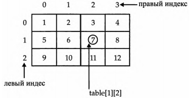

# ГЛАВА 7. Массивы и строки
В этой главе речь вновь пойдет о типах данных в С#.
В ней рассматриваются массивы и тип string, а так­
же оператор цикла foreach.

## Массивы
Массив представляет собой совокупность перемен­
ных одного типа с общим для обращения к ним именем.
В C# массивы могут быть как одномерными, так и многомер­
ными, хотя чаще всего применяются одномерные массивы.
Массивы служат самым разным целям, поскольку они пре­
доставляют удобные средства для объединения связанных
вместе переменных. Например, в массиве можно хранить
максимальные суточные температуры, зарегистрированные
в течение месяца, перечень биржевых курсов или же назва­
ния книг по программированию из домашней библиотеки.

Главное преимущество массива — в организации данных
таким образом, чтобы ими было проще манипулировать.
Так, если имеется массив, содержащий дивиденды, выпла­
чиваемые по определенной группе акций, то, организовав
циклическое обращение к элементам этого массива, можно
без особого труда рассчитать средний доход от этих акций.
Кроме того, массивы позволяют организовать данные та­
ким образом, чтобы легко отсортировать их.

Массивами в C# можно пользоваться практически так
же, как и в других языках программирования. Тем не менее
у них имеется одна особенность: они реализованы в виде
объектов. Именно поэтому их рассмотрение было отло­
жено до тех пор, пока в этой книге не были представлены
объекты. Реализация массивов в виде объектов дает ряд существенных преимуществ,
и далеко не самым последним среди них является возможность утилизировать неис­
пользуемые массивы средствам "сборки мусора".

### Одномерные массивы
Одномерный массив представляет собой список связанных переменных. Такие спи­
ски часто применяются в программировании. Например, в одномерном массиве мож­
но хранить учетные номера активных пользователей сети или текущие средние уровни
достижений бейсбольной команды.

Для того чтобы воспользоваться массивом в программе, требуется двухэтапная про­
цедура, поскольку в C# массивы реализованы в виде объектов. Во-первых, необходимо
объявить переменную, которая может обращаться к массиву. И во-вторых, нужно соз­
дать экземпляр массива, используя оператор new. Так, для объявления одномерного
массива обычно применяется следующая общая форма:
```
тип[] имя_массива = new тип[размер];
```
где тип объявляет конкретный тип элемента массива. Тип элемента определяет тип
данных каждого элемента, составляющего массив. Обратите внимание на квадратные
скобки, которые сопровождают тип. Они указывают на то, что объявляется одномер­
ный массив. А размер определяет число элементов массива.

**ПРИМЕЧАНИЕ**
Если у вас имеется некоторый опыт программирования на С или C++, обратите особое
внимание на то, как объявляются массивы в С#. В частности, квадратные скобки следуют
после названия типа, а не имени массива.

Обратимся к конкретному примеру. В приведенной ниже строке кода создается
массив типа int, который составляется из десяти элементов и связывается с перемен­
ной ссылки на массив, именуемой sample.
```
int[] sample = new int[10];
```
В переменной sample хранится ссылка на область памяти, выделяемой для массива
оператором new. Эта область памяти должна быть достаточно большой, чтобы в ней
могли храниться десять элементов массива типа int.

Как и при создании экземпляра класса, приведенное выше объявление массива
можно разделить на два отдельных оператора. Например:
```
int[] sample;
sample = new int[10];
```
В данном случае переменная sample не ссылается на какой-то определенный фи­
зический объект, когда она создается в первом операторе. И лишь после выполнения
второго оператора эта переменная ссылается на массив.

Доступ к отдельному элементу массива осуществляется по индексу: Индекс обозна­
чает положение элемента в массиве. В языке C# индекс первого элемента всех массивов
оказывается нулевым. В частности, массив sample состоит из 10 элементов с индекса­
ми от 0 до 9. Для индексирования массива достаточно указать номер требуемого эле­
мента в квадратных скобках. Так, первый элемент массива sample обозначается как
sample [0], а последний его элемент — как sample[9]. Ниже приведен пример про­
граммы, в которой заполняются все 10 элементов массива sample.
```
// Продемонстрировать одномерный массив.
using System;

class ArrayDemo {
    static void Main() {
        int[] sample = new int[10];
        int i;
        for(i = 0; i < 10; i = i+1)
            sample[i] = i;
        for(i = 0; i < 10; i = i+1)
            Console.WriteLine("sample[" + i + "]: " + sample[i]);
    }
}
```
При выполнении этой программы получается следующий результат.
```
sample[0]: 0
sample[1]: 1
sample[2]: 2
sample[3]: 3
sample[4]: 4
sample[5]: 5
sample[6]: 6
sample[7]: 7
sample[8]: 8
sample[9]: 9
```
Схематически массив sample можно представить таким образом.


Массивы часто применяются в программировании потому, что они дают возмож­
ность легко обращаться с большим числом взаимосвязанных переменных. Например,
в приведенной ниже программе выявляется среднее арифметическое ряда значений,
хранящихся в массиве nums, который циклически опрашивается с помощью операто­
ра цикла for.
```
// Вычислить среднее арифметическое ряда значений.
using System;

class Average {
    static void Main() {
        int[] nums = new int[10];
        int avg = 0;
        nums[0] = 99;
        nums[1] = 10;
        nums[2] = 100;
        nums[3] = 18;
        nums[4] = 78;
        nums[5] = 23;
        nums[6] = 63;
        nums[7] = 9;
        nums[8] = 87;
        nums[9] = 49;
        for(int i=0; i < 10; i++)
            avg = avg + nums[i];
        avg = avg / 10;
        Console.WriteLine("Среднее: " + avg);
    }
}
```
Результат выполнения этой программы выглядит следующим образом.
```
Среднее: 53
```

#### Инициализация массива
В приведенной выше программе первоначальные значения были заданы для эле­
ментов массива nums вручную в десяти отдельных операторах присваивания. Конечно,
такая инициализация массива совершенно правильна, но то же самое можно сделать
намного проще. Ведь массивы могут инициализироваться, когда они создаются. Ниже
приведена общая форма инициализации одномерного массива:
```
тип[] имя_массива = {vall, val2, val3, ..., valN};
```
где val1-valN обозначают первоначальные значения, которые присваиваются по оче­
реди, слева направо и по порядку индексирования. Для хранения инициализаторов
массива в C# автоматически распределяется достаточный объем памяти. А необходи­
мость пользоваться оператором new явным образом отпадает сама собой. В качестве
примера ниже приведен улучшенный вариант программы, вычисляющей среднее
арифметическое.
```
// Вычислить среднее арифметическое ряда значений.
using System;

class Average {
    static void Main() {
        int[] nums = { 99, 10, 100, 18, 78, 23,
                        63, 9, 87, 49 };
        int avg = 0;
        for(int i=0; i < 10; i++)
            avg = avg + nums[i];
        avg = avg / 10;
        Console.WriteLine("Среднее: " + avg);
    }
}
```
Любопытно, что при инициализации массива можно также воспользоваться опе­
ратором new, хотя особой надобности в этом нет. Например, приведенный ниже фраг­
мент кода считается верным, но избыточным для инициализации массива nums в упо­
мянутой выше программе.
```
int[] nums = new int[] { 99, 10, 100, 18, 78, 23,
                            63, 9, 87, 49 };
```
Несмотря на свою избыточность, форма инициализации массива с оператором new
оказывается полезной в том случае, если новый массив присваивается уже существую­
щей переменной ссылки на массив. Например:
```
int[] nums;
nums = new int[] { 99, 10, 100, 18, 78, 23,
                    63, 9, 87, 49 };
```
В данном случае переменная nums объявляется в первом операторе и инициализи­
руется во втором.

И последнее замечание: при инициализации массива его размер можно указывать
явным образом, но этот размер должен совпадать с числом инициализаторов. В каче­
стве примера ниже приведен еще один способ инициализации массива nums.
```
int[] nums = new int[10] { 99, 10, 100, 18, 78, 23,
                            63, 9, 87, 49 );
```
В этом объявлении размер массива nums задается равным 10 явно.

### Соблюдение границ массива
Границы массива в C# строго соблюдаются. Если границы массива не достигаются
или же превышаются, то возникает ошибка при выполнении. Для того чтобы убедить­
ся в этом, попробуйте выполнить приведенную ниже программу, в которой намерен­
но превышаются границы массива.
```
// Продемонстрировать превышение границ массива.
using System;

class ArrayErr {
    static void Main() {
        int[] sample = new int[10];
        int i;
        // Воссоздать превышение границ массива.
        for(i = 0; i < 100; i = i+1)
            sample[i] = i;
    }
}
```
Как только значение переменной i достигает 10, возникнет исключительная ситуа­
ция типа IndexOutOfRangeException, связанная с выходом за пределы индексирова­
ния массива, и программа преждевременно завершится. (Подробнее об исключитель­
ных ситуациях и их обработке речь пойдет в главе 13.)

## Многомерные массивы
В программировании чаще всего применяются одномерные массивы, хотя и много­
мерные не так уж и редки. Многомерным называется такой массив, который отличается
двумя или более измерениями, причем доступ к каждому элементу такого массива
осуществляется с помощью определенной комбинации двух или более индексов.

### Двумерные массивы
Простейшей формой многомерного массива является двумерный массив. Местопо­
ложение любого элемента в двумерном массиве обозначается двумя индексами. Такой
массив можно представить в виде таблицы, на строки которой указывает один индекс,
а на столбцы — другой.

В следующей строке кода объявляется двумерный массив integer размерами
10×20.
```
int[,] table = new int[10, 20];
```
Обратите особое внимание на объявление этого массива. Как видите, оба его разме­
ра разделяются запятой. В первой части этого объявления синтаксическое обозначение
```
[,]
```
означает, что создается переменная ссылки на двумерный массив. Если же память рас­
пределяется для массива с помощью оператора new, то используется следующее син­
таксическое обозначение.
```
int[10, 20]
```
В данном объявлении создается массив размерами 10×20, но и в этом случае его раз­
меры разделяются запятой.

Для доступа к элементу двумерного массива следует указать оба индекса, разделив
их запятой. Например, в следующей строке кода элементу массива table с координа­
тами местоположения (3,5) присваивается значение 10.
```
table[3, 5] = 10;
```
Ниже приведен более наглядный пример в виде небольшой программы, в которой
двумерный массив сначала заполняется числами от 1 до 12, а затем выводится его со­
держимое.
```
// Продемонстрировать двумерный массив.
using System;

class TwoD {
    static void Main() {
        int t, i;
        int[,] table = new int[3, 4];
        for(t=0; t < 3; ++t) {
            for(i=0; i < 4; ++i) {
                table[t,i] = (t*4)+i+1;
                Console.Write(table[t,i] + " ");
            }
            Console.WriteLine();
        }
    }
}
```
В данном примере элемент массива table[0,0] будет иметь значение 1, элемент
массива table[0,1] — значение 2, элемент массива table[0,2] — значение 3 и т.д.
А значение элемента массива table[2,3] окажется равным 12. На рис. 7.1 показано
схематически расположение элементов этого массива и их значений.



Рис. 7.1. Схематическое представление массива table, созданного в программе TwoD

**СОВЕТ**
Если вам приходилось раньше программировать на С, C++ или Java, то будьте особенно
внимательны, объявляя или организуя доступ к многомерным массивам в С#. В этих языках
программирования размеры массива и индексы указываются в отдельных квадратных
скобках, тогда как в C# они разделяются запятой.

### Массивы трех и более измерений

В C# допускаются массивы трех и более измерений. Ниже приведена общая форма
объявления многомерного массива.
```
тип[,...,] имя_массива = new тип[размер1, размер2, ... размерN];
```
Например, в приведенном ниже объявлении создается трехмерный целочислен­
ный массив размерами 4×10×3.
```
int[,,] multidim = new int[4, 10, 3];
```
А в следующем операторе элементу массива multidim с координатами местополо­
жения (2,4,1) присваивается значение 100.
```
multidim[2, 4, 1] = 100;
```
Ниже приведен пример программы, в которой сначала организуется трехмерный
массив, содержащий матрицу значений 3×3×3, а затем значения элементов этого мас­
сива суммируются по одной из диагоналей матрицы.
```
// Суммировать значения по одной из диагоналей матрицы 3×3×3.
using System;

class ThreeDMatrix {
    static void Main() {
        int[,,] m = new int[3, 3, 3];
        int sum = 0;
        int n = 1;
        for(int x=0; x < 3; x++)
            for(int y=0; у < 3; y++)
                for(int z=0; z < 3; z++)
                    m[x, y, z] = n++;
        sum = m[0, 0, 0] + m[1, 1, 1] + m[2, 2, 2];
        Console.WriteLine("Сумма значений по первой диагонали: " + sum);
    }
}
```
Вот какой результат дает выполнение этой программы.
```
Сумма значений по первой диагонали: 42
```

### Инициализация многомерных массивов
Для инициализации многомерного массива достаточно заключить в фигурные
скобки список инициализаторов каждого его размера. Ниже в качестве примера при­
ведена общая форма инициализации двумерного массива:
```
тип[,] имя_массива = {
    {val, val, val, ..., val},
    {val, val, val, ..., val},

    {val, val, val, ..., val}
};
```
где val обозначает инициализирующее значение, а каждый внутренний блок — от­
дельный ряд. Первое значение в каждом ряду сохраняется на первой позиции в мас­
сиве, второе значение — на второй позиции и т.д. Обратите внимание на то, что блоки
инициализаторов разделяются запятыми, а после завершающей эти блоки закрываю­
щей фигурной скобки ставится точка с запятой.

В качестве примера ниже приведена программа, в которой двумерный массив sqrs
инициализируется числами от 1 до 10 и квадратами этих чисел.
```
// Инициализировать двумерный массив.
using System;

class Squares {
    static void Main() {
        int[,] sqrs = {
            { 1, 1 },
            { 2, 4 },
            { 3, 9 },
            { 4, 16 },
            { 5, 25 },
            { 6, 36 },
            { 7, 49 },
            { 8, 64 },
            { 9, 81 },
            { 10, 100 }
        };
        int i, j;
        for(i=0; i < 10; i++) {
            for(j=0; j < 2; j++)
                Console.Write(sqrs[i,j] + " ");
            Console.WriteLine();
        }
    }
}
```
При выполнении этой программы получается следующий результат.
```
1 1
2 4
3 9
4 16
5 25
6 36
7 49
8 64
9 81
10 100
```

## Ступенчатые массивы
В приведенных выше примерах применения двумерного массива, по существу, соз­
давался так называемый прямоугольный массив. Двумерный массив можно представить
в виде таблицы, в которой длина каждой строки остается неизменной по всему масси­
ву. Но в C# можно также создавать специальный тип двумерного массива, называемый
ступенчатым массивом. Ступенчатый массив представляет собой массив массивов, в ко­
тором длина каждого массива может быть разной. Следовательно, ступенчатый массив
может быть использован для составления таблицы из строк разной длины.

Ступенчатые массивы объявляются с помощью ряда квадратных скобок, в которых
указывается их размерность. Например, для объявления двумерного ступенчатого мас­
сива служит следующая общая форма:
```
тип[][] имя_массива = new тип[размер][];
```
где размер обозначает число строк в массиве. Память для самих строк распределяется
индивидуально, и поэтому длина строк может быть разной. Например, в приведенном
ниже фрагменте кода объявляется ступенчатый массив jagged. Память сначала рас­
пределяется для его первого измерения автоматически, а затем для второго измерения
вручную.
```
int[][] jagged = new int[3][];
jagged[0] = new int[4];
jagged[1] = new int[3];
jagged[2] = new int[5];
```
После выполнения этого фрагмента кода массив jagged выглядит так, как показа­
но ниже.

Теперь нетрудно понять, почему такие массивы называются ступенчатыми! После
создания ступенчатого массива доступ к его элементам осуществляется по индексу,
указываемому в отдельных квадратных скобках. Например, в следующей строке кода
элементу массива jagged, находящемуся на позиции с координатами (2,1), присваи­
вается значение 10.
```
jagged[2][1] = 10;
```
Обратите внимание на синтаксические отличия в доступе к элементу ступенчатого
и прямоугольного массива.

В приведенном ниже примере программы демонстрируется создание двумерного
ступенчатого массива.
```
// Продемонстрировать применение ступенчатых массивов.
using System;

class Jagged {
    static void Main() {
        int[][] jagged = new int[3][];
        jagged[0] = new int[4];
        jagged[1] = new int[3];
        jagged[2] = new int[5];
        int i;
        // Сохранить значения в первом массиве.
        for(i=0; i < 4; i++)
            jagged[0] [i] = i;
        // Сохранить значения во втором массиве.
        for(i=0; i < 3; i++)
            jagged[1][i] = i;
        jagged [0][0]
        jagged [1][0]
        jagged [2][0]
        jagged [0][1]
        jagged [1][1]
        jagged [2][1]
        jagged [0][2] jagged [0][3]
        jagged [1][2]
        jagged [2][2] jagged [2][3] jagged [2][4]
        // Сохранить значения в третьем массиве.
        for(i=0; i < 5; i++)
            jagged[2][i] = i;
        // Вывести значения из первого массива.
        for(i=0; i < 4; i++)
            Console.Write(jagged[0][i] + " ");
        Console.WriteLine();

        // Вывести значения из второго массива.
        for(i=0; i < 3; i++)
            Console.Write(jagged[1][i] + " ");
        Console.WriteLine();

        // Вывести значения из третьего массива.
        for(i=0; i < 5; i++)
            Console.Write(jagged [2] [i ] + " ") ;
        Console.WriteLine();
    }
}
```
Выполнение этой программы приводит к следующему результату.
```
0 1 2 3
0 1 2
0 1 2 3 4
```
Ступенчатые массивы находят полезное применение не во всех, а лишь в некоторых
случаях. Так, если требуется очень длинный двумерный массив, который заполняется
не полностью, т.е. такой массив, в котором используются не все, а лишь отдельные его
элементы, то для этой цели идеально подходит ступенчатый массив.

И последнее замечание: ступенчатые массивы представляют собой массивы масси­
вов, и поэтому они не обязательно должны состоять из одномерных массивов. Напри­
мер, в приведенной ниже строке кода создается массив двумерных массивов.
```
int[][,] jagged = new int[3][,];
```
В следующей строке кода элементу массива jagged[0] присваивается ссылка на
массив размерами 4×2.
```
jagged[0] = new int[4, 2];
```
А в приведенной ниже строке кода элементу массива jagged[0][1,0] присваива­
ется значение переменной i.
```
jagged[0][1,0] = i;
```

## Присваивание ссылок на массивы
Присваивание значения одной переменной ссылки на массив другой перемен­
ной, по существу, означает, что обе переменные ссылаются на один и тот же массив,
и в этом отношении массивы ничем не отличаются от любых других объектов. Такое
присваивание не приводит ни к созданию копии массива, ни к копированию содержи­
мого одного массива в другой. В качестве примера рассмотрим следующую программу.
```
// Присваивание ссылок на массивы.
using System;

class AssignARef {
    static void Main() {
        int i;
        int[] nums1 = new int[10];
        int[] nums2 = new int [10];
        for(i=0; i < 10; i++) nums1[i] = i;
        for(i=0; i < 10; i++) nums2[i] = -i;
        Console.Write("Содержимое массива nums1: ");
        for(i=0; i < 10; i++)
            Console.Write(nums1[i] + " ");
        Console.WriteLine();

        Console.Write("Содержимое массива nums2: ");
        for(i=0; i < 10; i++)
            Console.Write(nums2[i] + " ");
        Console.WriteLine();

        nums2 = nums1; // теперь nums2 ссылается на nums1
        Console.Write("Содержимое массива nums2\n" + "после присваивания: ");
        for(i=0; i < 10; i++)
            Console.Write(nums2[i] + " ");
        Console.WriteLine();

        // Далее оперировать массивом nums1 посредством
        // переменной ссылки на массив nums2.
        nums2[3] = 99;
        Console.Write("Содержимое массива nums1 после изменения\n" +
                    "посредством переменной nums2: ");
        for(i=0; i < 10; i++)
            Console.Write(numsl[i] + " ");
        Console.WriteLine();
    }
}
```
Выполнение этой программы приводит к следующему результату.
```
Содержимое массива nums1: 0 1 2 3 4 5 6 7 8 9
Содержимое массива nums2: 0 -1 -2 -3 -4 -5 -6 -7 -8 -9
Содержимое массива nums2
после присваивания: 0 1 2 3 4 5 6 7 8 9
Содержимое массива nums1 после изменения
посредством переменной nums2: 0 1 2 99 4 5 6 7 8 9
```
Как видите, после присваивания переменной nums2 значения переменной nums1
обе переменные ссылки на массив ссылаются на один и тот же объект.

## Применение свойства Length
Реализация в C# массивов в виде объектов дает целый ряд преимуществ. Одно из
них заключается в том, что с каждым массивом связано свойство Length, содержащее
число элементов, из которых может состоять массив. Следовательно, у каждого масси­
ва имеется специальное свойство, позволяющее определить его длину. Ниже приведен
пример программы, в которой демонстрируется это свойство.
```
// Использовать свойство Length массива.
using System;

class LengthDemo {
    static void Main() {
        int[] nums = new int[10];
        Console.WriteLine("Длина массива nums равна " + nums.Length);
        // Использовать свойство Length для инициализации массива nums.
        for (int i=0; i < nums.Length; i++)
            nums[i] = i * i;
        // А теперь воспользоваться свойством Length
        // для вывода содержимого массива nums.
        Console.Write("Содержимое массива nums: ");
        for(int i=0; i < nums.Length; i++)
            Console.Write(nums[i] + " ");
        Console.WriteLine();
    }
}
```
При выполнении этой программы получается следующий результат.
```
Длина массива nums равна 10
Содержимое массива nums: 0 1 4 9 16 25 36 49 64 81
```
Обратите внимание на то, как в классе LengthDemo свойство nums.Length исполь­
зуется в циклах for для управления числом повторяющихся шагов цикла. У каждого
массива имеется своя длина, поэтому вместо отслеживания размера массива вручную
можно использовать информацию о его длине. Следует, однако, иметь в виду, что зна­
чение свойства Length никак не отражает число элементов, которые в нем использу­
ются на самом деле. Свойство Length содержит лишь число элементов, из которых
может состоять массив.

Когда запрашивается длина многомерного массива, то возвращается общее число
элементов, из которых может состоять массив, как в приведенном ниже примере кода.
```
// Использовать свойство Length трехмерного массива.
using System;

class LengthDemo3D {
    static void Main() {
        int[,,] nums = new int[10, 5, 6];
        Console.WriteLine("Длина массива nums равна " + nums.Length);
    }
}
```
При выполнении этого кода получается следующий результат.
```
Длина массива nums равна 300
```
Как подтверждает приведенный выше результат, свойство Length содержит число
элементов, из которых может состоять массив (в данном случае — 300 (10×5×6) эле­
ментов). Тем не менее свойство Length нельзя использовать для определения длины
массива в отдельном его измерении.

Благодаря наличию у массивов свойства Length операции с массивами во многих
алгоритмах становятся более простыми, а значит, и более надежными. В качестве при­
мера свойство Length используется в приведенной ниже программе с целью поменять
местами содержимое элементов массива, скопировав их в обратном порядке в другой
массив.
```
// Поменять местами содержимое элементов массива.
using System;

class RevCopy {
    static void Main() {
        int i, j;
        int[] nums1 = new int[10];
        int[] nums2 = new int[10];
        for(i=0; i < nums1.Length; i++) nums1[i] = i;
        Console.Write("Исходное содержимое массива: ");
        for(i=0; i < nums2.Length; i++)
            Console.Write(nums1[i] + " ");
        Console.WriteLine();

        // Скопировать элементы массива nums1 в массив nums2 в обратном порядке.
        if(nums2.Length >= nums1.Length) // проверить, достаточно ли
        // длины массива nums2
        for(i=0, j=nums1.Length-1; i < nums1.Length; i++, j--)
            nums2[j] = nums1[i];
        Console.Write("Содержимое массива в обратном порядке: ");
        for(i=0; i < nums2.Length; i++)
            Console.Write(nums2[i] + " ");
        Console.WriteLine();
    }
}
```
Выполнение этой программы дает следующий результат.
```
Исходное содержимое массива: 0 1 2 3 4 5 6 7 8 9
Содержимое массива в обратном порядке: 9 8 7 6 5 4 3 2 1 0
```
В данном примере свойство Length помогает выполнить две важные функции. Во-
первых, оно позволяет убедиться в том, что длины целевого массива достаточно для
хранения содержимого исходного массива. И во-вторых, оно предоставляет условие
для завершения цикла for, в котором выполняется копирование исходного массива в
обратном порядке. Конечно, в этом простом примере размеры массивов нетрудно вы­
яснить и без свойства Length, но аналогичный подход может быть применен в целом
ряде других, более сложных ситуаций.

### Применение свойства Length при обращении со ступенчатыми массивами
Особый случай представляет применение свойства Length при обращении со сту­
пенчатыми массивами. В этом случае с помощью данного свойства можно получить
длину каждого массива, составляющего ступенчатый массив. В качестве примера рас­
смотрим следующую программу, в которой имитируется работа центрального про­
цессора (ЦП) в сети, состоящей из четырех узлов.
```
// Продемонстрировать применение свойства Length
// при обращении со ступенчатыми массивами.
using System;

class Jagged {
    static void Main() {
        int[][] network_nodes = new int[4][];
        network_nodes[0] = new int[3];
        network_nodes[1] = new int[7];
        network_nodes[2] = new int[2];
        network_nodes[3] = new int[5];
        int i, j;
        // Сфабриковать данные об использовании ЦП.
        for(i=0; i < network_nodes.Length; i++)
            for(j=0; j < network_nodes[i].Length; j++)
                network_nodes[i][j] = i * j + 70;
        Console.WriteLine("Общее количество узлов сети: " +
                        network_nodes.Length + "\n");
        for(i=0; i < network_nodes.Length; i++) {
            for(j=0; j < network_nodes[i].Length; j++) {
                Console.Write("Использование в узле сети " + i +
                            " ЦП " + j + ": ") ;
                Console.Write(network_nodes[i][j] + "% ");
                Console.WriteLine();
            }
            Console.WriteLine();
        }
    }
}
```
При выполнении этой программы получается следующий результат.
```
Общее количество узлов сети: 4
Использование в узле 0 ЦП 0: 70%
Использование в узле 0 ЦП 1: 70%
Использование в узле 0 ЦП 2: 70%
Использование в узле 1 ЦП 0: 70%
Использование в узле 1 ЦП 1: 71%
Использование в узле 1 ЦП 2: 72%
Использование в узле 1 ЦП 3: 73%
Использование в узле 1 ЦП 4: 74%
Использование в узле 1 ЦП 5: 75%
Использование в узле 1 ЦП 6: 76%
Использование в узле 2 ЦП 0: 70%
Использование в узле 2 ЦП 1: 72%
Использование в узле 3 ЦП 0: 70%
Использование в узле 3 ЦП 1: 73%
Использование в узле 3 ЦП 2: 76%
Использование в узле 3 ЦП 3: 79%
Использование в узле 3 ЦП 4: 82%
```
Обратите особое внимание на то, как свойство Length используется в ступенчатом
массиве network_nodes. Напомним, что двумерный ступенчатый массив представля­
ет собой массив массивов. Следовательно, когда используется выражение
```
network_nodes.Length
```
то в нем определяется число массивов, хранящихся в массиве network_nodes (в дан­
ном случае — четыре массива). А для получения длины любого отдельного массива,
составляющего ступенчатый массив, служит следующее выражение.
```
network_nodes[0].Length
```
В данном случае это длина первого массива.

## Неявно типизированные массивы
Как пояснялось в главе 3, в версии C# 3.0 появилась возможность объявлять неявно
типизированные переменные с помощью ключевого слова var. Это переменные, тип
которых определяется компилятором, исходя из типа инициализирующего выраже­
ния. Следовательно, все неявно типизированные переменные должны быть непремен­
но инициализированы. Используя тот же самый механизм, можно создать и неявно
типизированный массив. Как правило, неявно типизированные массивы предназна­
чены для применения в определенного рода вызовах, включающих в себя элементы
языка LINQ, о котором речь пойдет в главе 19. А в большинстве остальных случаев
используется "обычное" объявление массивов. Неявно типизированные массивы рас­
сматриваются здесь лишь ради полноты представления о возможностях языка С#.

Неявно типизированный массив объявляется с помощью ключевого слова var, но
без последующих квадратных скобок []. Кроме того, неявно типизированный мас­
сив должен быть непременно инициализирован, поскольку по типу инициализато­
ров определяется тип элементов данного массива. Все инициализаторы должны быть
одного и того же согласованного типа. Ниже приведен пример объявления неявно ти­
пизированного массива.
```
var vals = new[] { 1, 2, 3, 4, 5 };
```
В данном примере создается массив типа int, состоящий из пяти элементов. Ссыл­
ка на этот массив присваивается переменной vals. Следовательно, тип этой перемен­
ной соответствует типу int массива, состоящего из пяти элементов. Обратите внима­
ние на то, что в левой части приведенного выше выражения отсутствуют квадратные
скобки []. А в правой части этого выражения, где происходит инициализация масси­
ва, квадратные скобки присутствуют. В данном контексте они обязательны.

Рассмотрим еще один пример, в котором создается двумерный массив типа
double.
```
var vals = new[,] { {1.1, 2.2}, {3.3, 4.4},{ 5.5, 6.6} };
```
В данном случае получается массив vals размерами 2×3.

Объявлять можно также неявно типизированные ступенчатые массивы. В качестве
примера рассмотрим следующую программу.
```
// Продемонстрировать неявно типизированный ступенчатый массив.
using System;

class Jagged {
    static void Main() {
        var jagged = new[] {
            new[] { 1, 2, 3, 4 },
            new[] { 9, 8, 7 ),
            new[] { 11, 12, 13, 14, 15 }
        };
        for(int j = 0; j < jagged.Length; j++) {
            for(int i=0; i < jagged[j].Length; i++)
                Console.Write(jagged[j][i] + " ");
            Console.WriteLine();
        }
    }
}
```
Выполнение этой программы дает следующий результат.
```
1 2 3 4
9 8 7
11 12 13 14 15
```
Обратите особое внимание на объявление массива jagged.
```
var jagged = new[] {
    new[] { 1, 2, 3, 4 },
    new[] { 9, 8, 7 },
    new[] { 11, 12, 13, 14, 15 }
};
```
Как видите, оператор new[] используется в этом объявлении двояким образом.
Во-первых, этот оператор создает массив массивов. И во-вторых, он создает каждый
массив в отдельности, исходя из количества инициализаторов и их типа. Как и следо­
вало ожидать, все инициализаторы отдельных массивов должны быть одного и того
же типа. Таким образом, к объявлению любого неявно типизированного ступенчатого
массива применяется тот же самый общий подход, что и к объявлению обычных сту­
пенчатых массивов.

Как упоминалось выше, неявно типизированные массивы чаще всего применяются
в LINQ-ориентированных запросах. А в остальных случаях следует использовать явно
типизированные массивы.

## Оператор цикла foreach
Как упоминалось в главе 5, в языке C# определен оператор цикла foreach, но его рас­
смотрение было отложено до более подходящего момента. Теперь этот момент настал.

Оператор foreach служит для циклического обращения к элементам коллекции,
представляющей собой группу объектов. В C# определено несколько видов коллек­
ций, каждая из которых является массивом. Ниже приведена общая форма оператора
цикла foreach.
```
foreach (тип имя_переменной_цикла in коллекция) оператор;
```
Здесь тип имя_переменной_цикла обозначает тип и имя переменной управле­
ния циклом, которая получает значение следующего элемента коллекции на каждом
шаге выполнения цикла foreach. А коллекция обозначает циклически опрашивае­
мую коллекцию, которая здесь и далее представляет собой массив. Следовательно, тип
переменной цикла должен соответствовать типу элемента массива. Кроме того, тип
может обозначаться ключевым словом var. В этом случае компилятор определяет тип
переменной цикла, исходя из типа элемента массива. Это может оказаться полезным
для работы с определенного рода запросами, как будет показано далее в данной книге.
Но, как правило, тип указывается явным образом.

Оператор цикла foreach действует следующим образом. Когда цикл начинается,
первый элемент массива выбирается и присваивается переменной цикла. На каждом
последующем шаге итерации выбирается следующий элемент массива, который со­
храняется в переменной цикла. Цикл завершается, когда все элементы массива окажут­
ся выбранными. Следовательно, оператор foreach циклически опрашивает массив по
отдельным его элементам от начала и до конца.

Следует, однако, иметь в виду, что переменная цикла в операторе foreach служит
только для чтения. Это означает, что, присваивая этой переменной новое значение,
нельзя изменить содержимое массива.

Ниже приведен простой пример применения оператора цикла foreach. В этом
примере сначала создается целочисленный массив и задается ряд его первоначальных
значений, а затем эти значения выводятся, а по ходу дела вычисляется их сумма.
```
// Использовать оператор цикла foreach.
using System;

class ForeachDemo {
    static void Main() {
        int sum = 0;
        int[] nums = new int[10];
        // Задать первоначальные значения элементов массива nums.
        for(int i = 0; i < 10; i++)
            nums[i] = i;
        // Использовать цикл foreach для вывода значений
        // элементов массива и подсчета их суммы.
        foreach(int х in nums) {
            Console.WriteLine("Значение элемента равно: " + х);
            sum += х;
        }
        Console.WriteLine("Сумма равна: " + sum);
    }
}
```
Выполнение приведенного выше кода дает следующий результат.
```
Значение элемента равно: 0
Значение элемента равно: 1
Значение элемента равно: 2
Значение элемента равно: 3
Значение элемента равно: 4
Значение элемента равно: 5
Значение элемента равно: 6
Значение элемента равно: 7
Значение элемента равно: 8
Значение элемента равно: 9
Сумма равна: 45
```
Как видите, оператор foreach циклически опрашивает массив по порядку индек­
сир
ования от самого первого до самого последнего его элемента.
Несмотря на то что цикл foreach повторяется до тех пор, пока не будут опрошены
все элементы массива, его можно завершить преждевременно, воспользовавшись опе­
ратором break. Ниже приведен пример программы, в которой суммируются только
пять первых элементов массива nums.
```
// Использовать оператор break для преждевременного завершения цикла
// foreach.
using System;

class ForeachDemo {
    static void Main() {
        int sum = 0;
        int[] nums = new int[10];
        // Задать первоначальные значения элементов массива nums.
        for(int i = 0; i < 10; i++)
            nums[i] = i;
        // Использовать цикл foreach для вывода значений
        // элементов массива и подсчета их суммы.
        foreach(int x in nums) {
            Console.WriteLine("Значение элемента равно: " + x);
            sum += x;
            if(x == 4) break; // прервать цикл, как только индекс массива достигнет 4
        }
        Console.WriteLine("Сумма первых 5 элементов: " + sum);
    }
}
```
Вот какой результат дает выполнение этой программы.
```
Значение элемента равно: 0
Значение элемента равно: 1
Значение элемента равно: 2
Значение элемента равно: 3
Значение элемента равно: 4
Сумма первых 5 элементов: 10
```
Совершенно очевидно, что цикл foreach завершается после выбора и вывода зна­
чения пятого элемента массива.

Оператор цикла foreach можно также использовать для циклического обращения
к элементам многомерного массива. В этом случае элементы многомерного массива
возвращаются по порядку следования строк от первой до последней, как демонстри­
рует приведенный ниже пример программы.
```
// Использовать оператор цикла foreach для обращения к двумерному массиву.
using System;
class ForeachDemo2 {
    static void Main() {
        int sum = 0;
        int[,] nums = new int[3,5];
        // Задать первоначальные значения элементов массива nums.
        for(int i = 0; i < 3; i++)
            for(int j=0; j < 5; j++)
                nums[i,j] = (i+1)*(j+1);
        // Использовать цикл foreach для вывода значений
        // элементов массива и подсчета их суммы.
        foreach(int х in nums) {
            Console.WriteLine("Значение элемента равно: " + х);
            sum += х;
        }
        Console.WriteLine("Сумма равна: " + sum);
    }
}
```
Выполнение этой программы дает следующий результат.
```
Значение элемента равно: 1
Значение элемента равно: 2
Значение элемента равно: 3
Значение элемента равно: 4
Значение элемента равно: 5
Значение элемента равно: 2
Значение элемента равно: 4
Значение элемента равно: 6
Значение элемента равно: 8
Значение элемента равно: 10
Значение элемента равно: 3
Значение элемента равно: 6
Значение элемента равно: 9
Значение элемента равно: 12
Значение элемента равно: 15
Сумма равна: 90
```
Оператор foreach допускает циклическое обращение к массиву только в опреде­
ленном порядке: от начала и до конца массива, поэтому его применение кажется, на
первый взгляд, ограниченным. Но на самом деле это не так. В большом числе алго­
ритмов, самым распространенным из которых является алгоритм поиска, требуется
именно такой механизм. В качестве примера ниже приведена программа, в которой
цикл foreach используется для поиска в массиве определенного значения. Как только
это значение будет найдено, цикл прервется.
```
// Поиск в массиве с помощью оператора цикла foreach.
using System;

class Search {
    static void Main() {
        int[] nums = new int[10];
        int val;
        bool found = false;
        // Задать первоначальные значения элементов массива nums.
        for(int i = 0; i < 10; i++)
            nums[i] = i;
        val = 5;
        // Использовать цикл foreach для поиска заданного
        // значения в массиве nums.
        foreach(int х in nums) {
            if(x == val) (
            found = true;
            break;
        }
        if(found)
            Console.WriteLine("Значение найдено!");
    }
}
```
При выполнении этой программы получается следующий результат.
```
Значение найдено!
```
Оператор цикла foreach отлично подходит для такого применения, поскольку
при поиске в массиве приходится анализировать каждый его элемент. К другим при­
мерам применения оператора цикла foreach относится вычисление среднего, поиск
минимального или максимального значения среди ряда заданных значений, обнаруже­
ние дубликатов и т.д. Как будет показано далее в этой книге, оператор цикла foreach
оказывается особенно полезным для работы с разными типами коллекций.

## Строки
С точки зрения регулярного программирования строковый тип данных string от­
носится к числу самых важных в С#. Этот тип определяет и поддерживает символьные
строки. В целом ряде других языков программирования строка представляет собой
массив символов. А в C# строки являются объектами. Следовательно, тип string от­
носится к числу ссылочных. И хотя string является встроенным в C# типом данных,
его рассмотрение пришлось отложить до тех пор, пока не были представлены классы
и объекты.

На самом деле класс типа string уже не раз применялся в примерах программ,
начиная с главы 2, но это обстоятельство выясняется только теперь, когда очередь до­
шла до строк. При создании строкового литерала в действительности формируется
строковый объект. Например, в следующей строке кода:
```
Console.WriteLine("В C# строки являются объектами.");
```
текстовая строка "В C# строки являются объектами." автоматически преобра­
зуется в строковый объект средствами С#. Следовательно, применение класса типа
string происходило в предыдущих примерах программ неявным образом. А в этом
разделе будет показано, как обращаться со строками явным образом.

### Построение строк
Самый простой способ построить символьную строку — воспользоваться строко­
вым литералом. Например, в следующей строке кода переменной ссылки на строку
str присваивается ссылка на строковый литерал.
```
string str = "Строки в C# весьма эффективны.";
```
В данном случае переменная str инициализируется последовательностью симво­
лов "Строки в C# весьма эффективны.".

Объект типа string можно также создать из массива типа char. Например:
```
char[] charray = {'t', 'е', 's', 't'};
string str = new string(charray);
```
Как только объект типа string будет создан, его можно использовать везде, где
только требуется строка текста, заключенного в кавычки. Как показано в приведенном
ниже примере программы, объект типа string может служить в качестве аргумента
при вызове метода WriteLine().
```
// Создать и вывести символьную строку.
using System;

class StringDemo {
    static void Main() {
        char[] charray = {'Э', 't', 'o', ' ', 'с', 't', 'p', 'o', 'к', 'a',
        string strl = new string(charray);
        string str2 = "Еще одна строка.";
        Console.WriteLine(strl);
        Console.WriteLine(str2);
    }
}
```
Результат выполнения этой программы приведен ниже.
```
Это строка.
Еще одна строка.
```

### Обращение со строками
Класс типа string содержит ряд методов для обращения со строками. Некото­
рые из этих методов перечислены в табл. 7.1. Обратите внимание на то, что некото­
рые методы принимают параметр типа StringComparison. Это перечислимый
тип, определяющий различные значения, которые определяют порядок сравнения
символьных строк. (О перечислениях речь пойдет в главе 12, но для применения типа
StringComparison к символьным строкам знать о перечислениях необязательно.)
Нетрудно догадаться, что символьные строки можно сравнивать разными способа­
ми. Например, их можно сравнивать на основании двоичных значений символов, из
которых они состоят. Такое сравнение называется порядковым. Строки можно также
сравнивать с учетом различных особенностей культурной среды, например, в лекси­
кографическом порядке. Это так называемое сравнение с учетом культурной среды.
(Учитывать культурную среду особенно важно в локализуемых приложениях.) Кроме
того, строки можно сравнивать с учетом или без учета регистра. Несмотря на то что
существуют перегружаемые варианты методов Compare(), Equals(), IndexOf()
и LastIndexOf(), обеспечивающие используемый по умолчанию подход к сравне­
нию символьных строк, в настоящее время считается более приемлемым явно указы­
вать способ требуемого сравнения, чтобы избежать неоднозначности, а также упро­
стить локализацию приложений. Именно поэтому здесь рассматривают разные спо­
собы сравнения символьных строк.

Как правило и за рядом исключений, для сравнения символьных строк с уче­
том культурной среды (т.е. языковых и региональных стандартов) применяется
способ StringComparison.CurrentCulture. Если же требуется сравнить стро­
ки только на основании значений их символов, то лучше воспользоваться спосо­
бом StringComparison.Ordinal, а для сравнения строк без учета регистра — од­
ним из двух способов: StringComparison.CurrentCultureIgnoreCase или
StringComparison.OrdinalIgnoreCase. Кроме того, можно указать сравнение
строк без учета культурной среды (подробнее об этом — в главе 22).

Обратите внимание на то, что метод Compare() объявляется в табл. 7.1 как static.
Подробнее о модификаторе static речь пойдет в главе 8, а до тех пор вкратце по­
ясним, что он обозначает следующее: метод Compare() вызывается по имени своего
класса, а не по его экземпляру. Следовательно, для вызова метода Compare() служит
следующая общая форма:
```
результат = string.Compare(str1, str2, способ);
```
где способ обозначает конкретный подход к сравнению символьных строк.

**ПРИМЕЧАНИЕ**
Дополнительные сведения о способах сравнения и поиска символьных строк, включая
и особое значение выбора подходящего способа, приведены в главе 22, где подробно
рассматривается обработка строк.

Обратите также внимание на методы ToUpper() и ToLower(), преобразующие со­
держимое строки в символы верхнего и нижнего регистра соответственно. Их формы,
представленные в табл. 7.1, содержат параметр CultureInfо, относящийся к классу,
в котором описываются атрибуты культурной среды, применяемые для сравнения.
В примерах, приведенных в этой книге, используются текущие настройки культурной
среды (т.е. текущие языковые и региональные стандарты). Эти настройки указываются
при передаче методу аргумента CultureInfo.CurrentCulture. Класс CultureInfo
относится к пространству имен System.Globalization. Любопытно, имеются вари­
анты рассматриваемых здесь методов, в которых текущая культурная среда исполь­
зуется по умолчанию, но во избежание неоднозначности в примерах из этой книги
аргумент CultureInfo.CurrentCulture указывается явно.

Объекты типа string содержат также свойство Length, где хранится длина строки.

Таблица 7.1. Некоторые общеупотребительные методы обращения со строками

| Метод                                                                         | Описание                                                                                                                                                                                                                                                |
|-------------------------------------------------------------------------------|---------------------------------------------------------------------------------------------------------------------------------------------------------------------------------------------------------------------------------------------------------|
| `static int Compare(string strA, string strB, StringComparison comparisonType)` | Возвращает отрицательное значение, если строка strA меньше строки strB; положительное значение, если строка strA больше строки strВ; и нуль, если сравниваемые строки равны. Способ сравнения определяется аргументом comparisonType                    |
| `bool Equals(string value, StringComparison comparisonType)`                    | Возвращает логическое значение true, если вызывающая строка имеет такое же значение, как и у аргумента value. Способ сравнения определяется аргументом comparisonType                                                                                   |
| `int IndexOf(char value)`                                                       | Осуществляет поиск в вызывающей строке первого вхождения символа, определяемого аргументом value. Применяется порядковый способ поиска. Возвращает индекс первого совпадения с искомым символом или -1, если он не обнаружен                            |
| `int IndexOf(string value, StringComparison comparisonType)`                    | Осуществляет поиск в вызывающей строке перво­ го вхождения подстроки, определяемой аргументом value. Возвращает индекс первого совпадения с искомой подстрокой или -1, если она не обнаружена. Способ поиска определяется аргументом comparisonType     |
| `int LastIndexOf(char value)`                                                   | Осуществляет поиск в вызывающей строке последнего вхождения символа, определяемого аргументом value. Применяется порядковый способ поиска. Возвращает индекс последнего совпадения с искомым символом или -1, если он не обнаружен                      |
| `int LastIndexOf(string value, StringComparison comparisonType)`                | Осуществляет поиск в вызывающей строке последнего вхождения подстроки, определяемой аргументом value. Возвращает индекс последнего совпадения с искомой подстрокой или -1, если она не обнаружена. Способ поиска определяется аргументом comparisonType |
| `string ToLower(CultureInfo.CurrentCulture culture)`                            | Возвращает вариант вызывающей строки в нижнем регистре. Способ преобразования определяется аргументом culture                                                                                                                                           |
| `string ToUpper(CultureInfo.CurrentCulture culture)`                            | Возвращает вариант вызывающей строки в верхнем регистре. Способ преобразования определяется аргументом culture                                                                                                                                          |

Отдельный символ выбирается из строки с помощью индекса, как в приведенном
ниже фрагменте кода.
```
string str = "тест";
Console.WriteLine(str[0]);
```
В этом фрагменте кода выводится символ "т", который является первым в строке
"тест". Как и в массивах, индексирование строк начинается с нуля. Следует, однако,
иметь в виду, что с помощью индекса нельзя присвоить новое значение символу в стро­
ке. Индекс может служить только для выборки символа из строки.

Для проверки двух строк на равенство служит оператор ==. Как правило, если опе­
ратор == применяется к ссылкам на объект, то он определяет, являются ли они ссыл­
ками на один и тот же объект. Совсем иначе обстоит дело с объектами типа string.
Когда оператор == применяется к ссылкам на две строки, он сравнивает содержимое
этих строк. Это же относится и к оператору !=. В обоих случаях выполняется поряд­
ковое сравнение. Для проверки двух строк на равенство с учетом культурной среды
служит метод Equals(), где непременно нужно указать способ сравнения в виде ар­
гумента StringComparison.CurrentCulture. Следует также иметь в виду, что ме­
тод Compare() служит для сравнения строк с целью определить отношение порядка,
например для сортировки. Если же требуется проверить символьные строки на ра­
венство, то для этой цели лучше воспользоваться методом Equals() или строковыми
операторами.

В приведенном ниже примере программы демонстрируется несколько операций
со строками.
```
// Некоторые операции со строками.
using System;
using System.Globalization;

class StrOps {
	static void Main() {
		string str1 = "Программировать в .NET лучше всего на С#.";
		string str2 = "Программировать в .NET лучше всего на С#.";
		string str3 = "Строки в C# весьма эффективны.";
		string strUp, strLow;
		int result, idx;
		Console.WriteLine("str1: " + str1);
		Console.WriteLine("Длина строки str1: " + str1.Length);
		// Создать варианты строки str1, набранные
		// прописными и строчными буквами.
		strLow = str1.ToLower(CultureInfo.CurrentCulture);
		strUp = str1.ToUpper(CultureInfo.CurrentCulture);
		Console.WriteLine("Вариант строки str1, " +
						"набранный строчными буквами:\n " + strLow);
		Console.WriteLine("Вариант строки str1, " +
						"набранный прописными буквами:\n " + strUp);
		Console.WriteLine();

		// Вывести строку str1 посимвольно.
		Console.WriteLine("Вывод строки str1 посимвольно.");
		for (int i=0; i < str1.Length; i++)
			Console.Write(str1[i]);
		Console.WriteLine("\n");

		// Сравнить строки способом порядкового сравнения.
		if(str1 == str2)
			Console.WriteLine("str1 == str2");
		else
			Console.WriteLine("str1 != str2");
		if(str1 == str3)
			Console.WriteLine("str1 == str3");
		else
			Console.WriteLine("str1 != str3");
		// Сравнить строки с учетом культурной среды.
		result = string.Compare(str3, str1, StringComparison.CurrentCulture);
		if(result == 0)
			Console.WriteLine("Строки str1 и str3 равны");
		else if (result < 0)
			Console.WriteLine("Строка str1 меньше строки str3");
		else
			Console.WriteLine("Строка str1 больше строки str3");
		Console.WriteLine();

		// Присвоить новую строку переменной str2.
		str2 = "Один Два Три Один";
		// Поиск подстроки.
		idx = str2.IndexOf("Один", StringComparison.Ordinal);
		Console.WriteLine("Индекс первого вхождения подстроки <Один>: " + idx);
		idx = str2.LastIndexOf("Один", StringComparison.Ordinal);
		Console.WriteLine("Индекс последнего вхождения подстроки <Один>: " +
						idx);
	}
}
```
При выполнении этой программы получается следующий результат.
```
str1: Программировать в .NET лучше всего на С#.
Длина строки str1: 41
Вариант строки str1, набранный строчными буквами:
программировать в .net лучше всего на c#.
Вариант строки str1, набранный прописными буквами:
программировать в .net лучше всего на c#.

Вывод строки str1 посимвольно.
Программировать в .NET лучше всего на С#.

str1 == str2
str1 != str3
Строка str1 больше строки str3
Индекс первого вхождения подстроки <Один>: 0
Индекс последнего вхождения подстроки <Один>: 13
```
Прежде чем читать дальше, обратите внимание на то, что метод Compare() вызы­
вается следующим образом.
```
result = string.Compare(str1, str3, StringComparison.CurrentCulture);
```
Как пояснялось ранее, метод Compare() объявляется как static, и поэтому он вы­
зывается по имени, а не по экземпляру своего класса.

С помощью оператора + можно сцепить (т.е. объединить вместе) две строки.
Например, в следующем фрагменте кода:
```
string str1 = "Один";
string str2 = "Два";
string str3 = "Три";
string str4 = str1 + str2 + str3;
```
переменная str4 инициализируется строкой "ОдинДваТри".

И еще одно замечание: ключевое слово string является псевдонимом класса
System.String, определенного в библиотеке классов для среды .NET Framework,
т.е. оно устанавливает прямое соответствие с этим классом. Следовательно, поля
и методы, определяемые типом string, относятся непосредственно к классу
System.String, в который входят и многие другие компоненты. Подробнее о классе
System.String речь пойдет в части II этой книги.

### Массивы строк
Аналогично данным любого другого типа, строки могут быть организованы в мас­
сивы. Ниже приведен соответствующий пример.
```
// Продемонстрировать массивы строк.
using System;

class StringArrays {
	static void Main() {
		string[] str = { "Это", "очень", "простой", "тест." };
		Console.WriteLine("Исходный массив: ");
		for(int i=0; i < str.Length; i++)
			Console.Write(str[i] + " ");
		Console.WriteLine("\n");
		// Изменить строку.
		str[l] = "тоже";
		str[3] = "до предела тест!";
		Console.WriteLine("Видоизмененный массив: ");
		for(int i=0; i < str.Length; i++)
			Console.Write(str[i] + " ");
	}
}
```
Вот какой результат дает выполнение приведенного выше кода.
```
Исходный массив:
Это очень простой тест.

Видоизмененный массив:
Это тоже простой до предела тест!
```
Рассмотрим более интересный пример. В приведенной ниже программе целое чис­
ло выводится словами. Например, число 19 выводится словами "один девять".
```
// Вывести отдельные цифры целого числа словами.
using System;

class ConvertDigitsToWords {
	static void Main() {
		int num;
		int nextdigit;
		int numdigits;
		int[] n = new int[20];
		string[] digits = { "нуль", "один", "два",
			"три", "четыре", "пять",
			"шесть", "семь", "восемь",
			"девять" };
		num = 1908;
		Console.WriteLine("Число: " + num);
		Console.Write("Число словами: ");
		nextdigit = 0;
		numdigits = 0;
		// Получить отдельные цифры и сохранить их в массиве n.
		// Эти цифры сохраняются в обратном порядке.
		do {
			nextdigit = num % 10;
			n[numdigits] = nextdigit;
			numdigits++;
			num = num / 10;
		} while(num > 0);
		numdigits--;
		// Вывести полученные слова.
		for( ; numdigits >= 0; numdigits--)
			Console.Write(digits[n[numdigits]] + " ");
		Console.WriteLine();
	}
}
```
Выполнение этой программы приводит к следующему результату.
```
Число: 1908
Число словами: один девять нуль восемь
```
В данной программе использован массив строк digits для хранения словесных
обозначений цифр от 0 до 9. По ходу выполнения программы целое число преобразу­
ется в слова. Для этого сначала получаются отдельные цифры числа, а затем они сохра­
няются в обратном порядке следования в массиве n типа int. После этого выполняется
циклический опрос массива n в обратном порядке. При этом каждое целое значение
из массива п служит в качестве индекса, указывающего на слова, соответствующие по­
лученным цифрам числа и выводимые как строки.

### Постоянство строк
Как ни странно, содержимое объекта типа string не подлежит изменению. Это
означает, что однажды созданную последовательность символов изменить нельзя. Но
данное ограничение способствует более эффективной реализации символьных строк.
Поэтому этот, на первый взгляд, очевидный недостаток на самом деле превращается в
преимущество. Так, если требуется строка в качестве разновидности уже имеющейся
строки, то для этой цели следует создать новую строку, содержащую все необходимые
изменения. А поскольку неиспользуемые строковые объекты автоматически собирают­
ся в "мусор", то о дальнейшей судьбе ненужных строк можно даже не беспокоиться.

Следует, однако, подчеркнуть, что переменные ссылки на строки (т.е. объекты типа
string) подлежат изменению, а следовательно, они могут ссылаться на другой объект.
Но содержимое самого объекта типа string не меняется после его создания.

Для того чтобы стало понятнее, почему неизменяемые строки не являются помехой,
воспользуемся еще одним методом обращения со строками: Substring(). Этот метод
возвращает новую строку, содержащую часть вызывающей строки. В итоге создает­
ся новый строковый объект, содержащий выбранную подстроку, тогда как исходная
строка не меняется, а следовательно, соблюдается принцип постоянства строк. Ниже
приведена рассматриваемая здесь форма метода Substring():
```
string Substring(int индекс_начала, int длина)
```
где индекс_начала обозначает начальный индекс исходной строки, а длина — длину
выбираемой подстроки.

Ниже приведена программа, в которой принцип постоянства строк демонстри­
руется на примере использования метода Substring().
```
// Применить метод Substring().
using System;

class SubStr {
	static void Main() {
		string orgstr = "В C# упрощается обращение со строками.";
		// сформировать подстроку
		string substr = orgstr.Substring(5, 20);
		Console.WriteLine("orgstr: " + orgstr);
		Console.WriteLine("substr: " + substr);
	}
}
```
Вот к какому результату приводит выполнение этой программы.
```
orgstr: В C# упрощается обращение со строками.
substr: упрощается обращение
```
Как видите, исходная строка из переменной orgstr не меняется, а выбранная из
нее подстрока содержится в переменной substr.

И последнее замечание: несмотря на то, что постоянство строк обычно не являет­
ся ни ограничением, ни помехой для программирования на С#, иногда оказывается
полезно иметь возможность видоизменять строки. Для этой цели в C# имеется класс
StringBuilder, который определен в пространстве имен System.Text. Этот класс
позволяет создавать строковые объекты, которые можно изменять. Но, как правило,
в программировании на C# используется тип string, а не класс StringBuilder.

### Применение строк в операторах switch
Объекты типа string могут использоваться для управления оператором switch.
Это единственный нецелочисленный тип данных, который допускается применять
в операторе switch. Благодаря такому применению строк в некоторых сложных си­
туациях удается найти более простой выход из положения, чем может показаться на
первый взгляд. Например, в приведенной ниже программе выводятся отдельные циф­
ры, соответствующие словам "один", "два" и "три".
```
// Продемонстрировать управление оператором switch посредством строк.
using System;

class StringSwitch {
	static void Main() {
		string[] strs = { "один", "два", "три", "два", "один" };
		foreach(string s in strs) {
			switch(s) {
				case "один":
					Console.Write(1);
					break;
				case "два":
					Console.Write(2);
					break;
				case "три":
					Console.Write(3);
					break;
			}
		}
		Console.WriteLine();
	}
}
```
При выполнении этой программы получается следующий результат.
```
12321
```